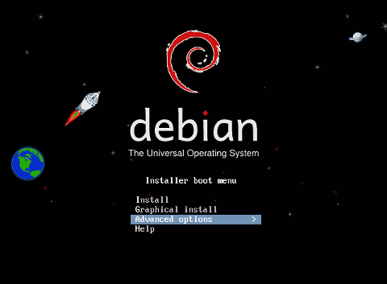

======================================================
Make an old netbook or laptop into a Linux home server
======================================================

:date: 2011-12-08 01:23:00
:tags: netbook, network, debian, linux
:slug: linux-home-server

Running your own Linux home server is a fun learning experience and offers several advantages.

It is cheap if you already have a spare machine. Or grab a second-hand netbook off Craigslist for <$100. An old netbook or laptop - retired in favour of more current and powerful machines - can still deliver plenty of oomph for running a personal server. Netbooks are frugal with power and come equipped with their own built-in UPS/battery!

A more stable, well-tested Linux distribution can be installed on the server and provide ongoing services such as printing, hosting torrents or websites or backups. `Debian GNU/Linux <http://www.debian.org/>`_ has over 30,000+ packages ready to install and lots of room for customization.

Privacy may be important to you. Hosting your own server running your own services gives more control over your data.

My setup uses an Asus 900HA netbook with 1GB RAM and 320GB hard drive (replacing the original 160GB drive) running the Debian ``stable`` release.

This is how I did it ...

Step 0 - Start
==============

`Download <http://www.debian.org/distrib/>`_ one of the many versions of the Debian installation images. For my netbook I select ``i386`` as my target architecture and I use the small ``businesscard.iso``: `Torrent <http://cdimage.debian.org/debian-cd/current/i386/bt-cd/debian-6.0.3-i386-businesscard.iso.torrent>`_ | `Direct download <http://cdimage.debian.org/debian-cd/current/i386/iso-cd/debian-6.0.3-i386-businesscard.iso>`_ .

Step 1 - Prepare a USB stick
============================

USB sticks are my Linux install media of choice because I have configured several devices like this Asus netbook that do not include an optical drive. Plug the USB stick into your Linux host machine and leave the stick unmounted. Run the ``dmesg`` command and note the USB device ID (``sdb``, ``sdc``, ...).

.. role:: warning

:warning:`WARNING!` Make sure to record the correct USB device ID. The following procedure **wipes out** all data on the USB stick. On my system the device shows up as *sdb* but it will possibly be different on your system.

Copy the iso to the USB stick ...

.. code-block:: bash

    $ sudo cat debian-6.0.3-i386-businesscard.iso > /dev/sdX 
    $ sudo sync

Step 2 - Debian installer
=========================

Plug the freshly prepared USB stick into the target box. Power up. Either the device is pre-configured in the BIOS to recognize a USB stick as the first choice for boot or hit the device hotkey (ESC key on my netbook) to enter the boot menu. Select the USB stick and launch the Debian installer ``Advanced Options -> Expert install``.

Mostly I stick with the default selections presented by the Debian installer .. with a few exceptions noted below.

Choose a mirror of the Debian archive
-------------------------------------

Debian's ``businesscard`` installer allows a choice of Debian versions - ``stable``, ``testing``, or ``unstable``. ``Stable`` is a good choice for configuring a server ...

.. code-block:: bash

    Debian version to install:
    squeeze - stable

Configure the network
---------------------

A server machine that provides services to the network needs a stable IP address so that other machines can locate and connect to its ports. Choose to configure a *static IP* ...

.. code-block:: bash

    Auto-configure network with DHCP?
    <No>

Partition disks 
---------------

Select the ``Manual`` option to partition the drive. For a home server layout - space permitting - my chosen partition layout is:

.. code-block:: bash

    sda1 - 10GB - root partition - filesystem: ext4, noatime
    sda2 - 1GB - swap partition - filesystem: swap
    sda3 - remaining space - home partition - filesystem: ext4, noatime, reserved blocks: 1%

I create a large home partition because I use the server as backup storage for my desktop home partition ... and placing root on a separate partition allows the flexibility of re-installing the operating system at a later date without overwriting ``/home``.

Install the base system
-----------------------

No need to include every driver under the sun. Just let the system load what is needed ...

.. code-block:: bash

    Drivers to include in the initrd:
    targeted: only include drivers needed for this system

Software selection
------------------

A lean, mean server machine starts as a *minimal* machine. *Un-select* all the software choices *except* for the standard system utilities ...

.. code:: bash

    Choose software to install:
    [*] Standard system utilities

Finish setting up a lightweight base Debian installation. Reboot.

Step 3 - Configure
==================

Fix time (if necessary)
-----------------------

.. code-block:: bash

    # tzconfig
    # date MMDDHHmmCCYY 
    # hwclock --utc 
    # hwclock --systohc

Additional packages
-------------------

.. code:: bash

    # apt-get install htop rsync sudo sysv-rc-conf tmux vrms

`Tmux <http://tmux.sourceforge.net/>`_ is a ...

    terminal multiplexer: it enables a number of terminals (or windows), each running a separate program, to be created, accessed, and controlled from a single screen ... [then] detached from a screen and continue running in the background, then later reattached."* I love this program. Massive usefulness on a single remote connection to a server.

.. role:: warning

:warning:`WARNING!` Place your netbook or laptop with the lid open (many laptops radiate heat through the keyboard) in a well-ventilated location to prevent overheating and minimize wear-and-tear. My netbook sits on an elevated metal grate that leaves the bottom vents unblocked.

Step 4 - Services
=================

What can you do with a Linux home server? Here are some ideas ...

SSH
---

Install and configure SSH to allow remote login and management of your home server.

*On the client*

Install an SSH client and configure SSH *public key authentication* ...

.. code-block:: bash

    $ sudo apt-get install openssh-client ssh-askpass keychain rsync

Generate an RSA user-key pair ...

.. code-block:: bash

    $ mkdir ~/.ssh 
    $ cd ~/.ssh 
    $ ssh-keygen -v -t rsa -b 2048 -C USERNAME@HOSTNAME

Transfer the newly-generated public-key to your new home server. *Keychain* is a front-end to ``ssh-add`` that exists through an entire uptime across all sessions. To source ssh-keychain at startup edit ``~/.bashrc`` ...

.. code-block:: bash

    keychain ~/.ssh/id_rsa 
    . ~/.keychain/$HOSTNAME-sh

*On the server*

Install the SSH server package ``sudo apt-get install openssh-server``.

Restrict SSH login access to certain users by editing ``/etc/ssh/sshd_config`` ...

.. code-block:: bash

    PermitRootLogin no

    # permit only specified users ssh access
    AllowUsers yourUsername

Restart your SSH server after modifying and saving the configuration ``sudo /etc/init.d/ssh restart``.


Copy that newly-generated RSA public-key from your client machine into your user account on the server ...

.. code-block:: bash

    $ mkdir ~/.ssh
    $ touch ~/.ssh/authorized_keys
    $ cat id_rsa.pub >> ~/.ssh/authorized_keys

Logout and try logging back in to the server from a remote client machine. Once SSH is properly configured all further management of the server can be performed from the client. 

The netbook's LCD display is no longer needed. Save power by turning off the display backlight using ``vbetool`` ...

.. code-block:: bash

    $ sudo apt-get install vbetool
    $ vbetool dpms off

Backup
------

I use ``rsync`` to manually backup my main laptop's home partition to a designated folder on the netbook server. Scheduled backups can be configured on client machines by installing ``anacron``.
    
Web
---

Host `multiple domains from one IP address <http://www.circuidipity.com/hosting-multiple-domains-from-one-ip-address-using-apache.html>`_. Suitable for light traffic.

Bandwidth available for a home server can be limiting factor. Upload speeds provided by ISPs can be much slower than download speeds. Most things one might want to host on a personal home server can function just fine with this constraint ... but anything beyond light webhosting can quickly run into bandwidth and scalability issues.

After experimenting a bit I ended up moving the handwritten html pages, images, and bits of this website hosted on my netbook server to `Amazon S3 <http://www.circuidipity.com/host-website-on-amazon-s3.html>`_ .

Torrent
-------

`Rtorrent <http://libtorrent.rakshasa.no/>`_ is a console bittorrent application that can be left running inside a detached session of tmux ``sudo apt-get install rtorrent``.

Extras
------

`FreedomBox <http://freedomboxfoundation.org/>`_ is a Debian-sponsored project that promotes using free software deployed on personal home servers to allow users greater control over their personal information. A list of proprietary cloud services and their `free software alternatives <http://wiki.debian.org/FreedomBox/LeavingTheCloud>`_ .

A personal home server is a great start towards making *personal cloud computing*. Absorbing the FreedomBox documentation, presentations, and mailing list sparks many ideas that I would like to try. My little netbook has been given a new lease on life!
