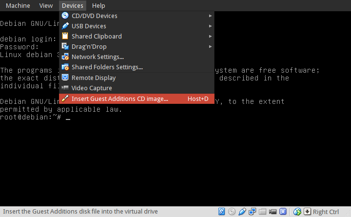
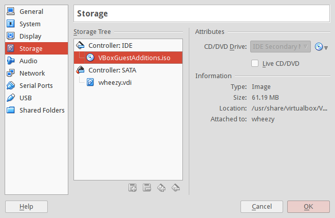

=====================================
Virtualbox with Debian HOST and GUEST
=====================================

:tags: virtual environments, linux, debian
:slug: virtualbox-install
:modified: 07 March 2014

`Virtualbox <https://www.virtualbox.org/>`_ is virtualization software that allows a Linux user to HOST multiple GUEST OSs as *virtual machines* (VMs). Its a cool tool for playing with different Linux distros and experimenting with configurations.

In this HOWTO I install Virtualbox on a 64-bit Debian HOST and create a 32-bit Debian GUEST virtual machine.

Step 0 - Install VirtualBox on HOST
===================================

.. code-block:: bash

    $ sudo apt-get install linux-headers-amd64
    $ sudo apt-get install dkms
    $ sudo apt-get install virtualbox virtualbox-dkms virtualbox-guest-additions-iso virtualbox-qt

Virtualbox kernel modules are built via *Dynamic Kernel Module Support* (`DKMS <http://en.wikipedia.org/wiki/Dynamic_Kernel_Module_Support>`_). After installing the virtualbox packages the ``vbox`` modules should be auto-built and -loaded ...

.. code-block:: bash

    $ lsmod | grep vbox
    vboxpci                19066  0 
    vboxnetadp             13155  0 
    vboxnetflt             23571  0 
    vboxdrv               190057  4 vboxnetflt,vboxnetadp,vboxpci

Add USERNAME to the ``vboxusers`` group ``sudo adduser USERNAME vboxusers``.

Step 1 - Create the Debian GUEST VM
===================================

The *Default Machine Folder* where VM images are stored is ``$HOME/Virtualbox VMs`` (this can be modified in ``File->Preferences->General``).

See the `User Manual <http://www.virtualbox.org/manual/UserManual.html>`_ for creating a GUEST VM. I use the `Debian mini installer <http://ftp.nl.debian.org/debian/dists/testing/main/installer-amd64/current/images/netboot/mini.iso>`_ to create a new VM with a minimal system configuration. The installer auto-detects it is being configured as a VM and prompts for permission to install the ``virtualbox-ose-guest-x11`` package. Go ahead and install.

After the new Debian guest VM is sucessfully created I *clone* the image ``Machine->Clone`` - preserving the fresh install image 'as is' - and go off to do all my experiments on the clone. Saves having to repeat the installation all over again.

Step 2 - GUEST VM Additions
===========================

*Guest Additions* are designed to be installed inside a guest VM after the operating system has been installed. `This video <https://www.youtube.com/watch?v=Q84boOmiPW8>`_ was helpful for setting it up. Some cool extra features they provide are the ability to tweak display settings and add a shared folder that can accessed by both HOST and GUEST machines.

Debian GUEST is a 32-bit VM. Install on GUEST ...

.. code-block:: bash

    $ sudo apt-get install linux-headers-486  # for a 486 kernel
    $ sudo apt-get install dkms
    $ sudo apt-get install virtualbox-guest-dkms virtualbox-guest-utils virtualbox-guest-x11

Add USERNAME to the ``vboxsf`` group.

Guest Additions CD
------------------

Earlier I installed Debian's ``virtualbox-guest-additions-iso`` package on HOST. Adding software from this image to GUEST often proves a bit wonky for me. Here is how I get it to work!

On GUEST edit ``/etc/fstab`` adding the ``exec`` permission to ``/dev/sr0`` ...

.. code-block:: bash

    /dev/sr0    /media/cdrom0    udf,iso9660    user,noauto,exec    0 0

On VirtualBox select ``Devices->Insert Guest Additions CD image...``

You can see that under ``Machine->Settings...`` the image is available in the virtual drive ...

... and usually I manually mount the image and run the ``VBoxLinuxAdditions.run`` install script ...

.. code-block:: bash

    $ sudo mount /dev/sr0
    $ sudo /media/cdrom0/VBoxLinuxAdditions.run

Reboot GUEST and ``vbox`` drivers should be loaded ...

.. code:: bash

    $ lsmod | grep vbox
    vboxguest
    vboxsf
    vboxvideo

Step 3 - GUEST VM Configuration
===============================

Tweak display settings by going to the VM ``Machine->Settings...->Display`` and move the slider to add more video memory and enable 3d acceleration.

.. image:: images/20121207-display.png
    :alt: Display Settings
    :width: 662px
    :height: 502px

With VirtualBox guest additions installed the display and resolution can be changed when running X ...

.. code-block:: bash

    $ ps aux | grep VBox
    /usr/sbin/VBoxService
    /usr/bin/VBoxClient --clipboard
    /usr/bin/VBoxClient --display
    /usr/bin/VBoxClient --seamless

If the VM does not use a graphical login manager to launch its desktop then modify ``$HOME/.xinitrc`` to start VBoxClient services ...

.. code-block:: bash

    VBoxClient --clipboard &
    VBoxClient --display &
    VBoxClient --seamless &

Next create a shared folder on HOST. Make it accessible to GUEST by going to ``Machine->Settings...->Shared Folders`` and click ``Add Shared Folder`` and ``Auto-Mount``.

.. image:: images/20121207-shared-folders.png
    :alt: Shared Folder Settings
    :width: 662px
    :height: 502px

Happy hacking!
