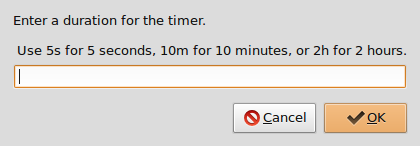
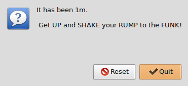

===============================================================
FunkyGoodTimer - A simple (but funky) graphical countdown timer
===============================================================

:tags: shell, programming, linux
:slug: funkygoodtimer
:modified: 2014-04-19 01:23:00

Learning to write shell scripts leads to sitting at your computer for long stretches of time. It is good for mind and body to take a break and get up and enjoy some *funky time movement* at regular intervals. But how do you remember to do so when you are oh so engrossed in coding? Why you write a shell script to remind you of course!

How about a simple popup reminder that you have been sitting much too long and its time to *shake it up*? The *popup* requirement leads to *Zenity* which provides a shell script with simple graphical boxes for user input, dialog and error messages, calendars, filename selection, and more. Cool and useful!

Largely inspired by this `tutorial <http://www.howtogeek.com/107537/how-to-make-simple-graphical-shell-scripts-with-zenity-on-linux/>`_ on Linux graphical shell scripts I created a countdown timer that would:

* ask for a time (seconds, minutes, hours)
* sleep for the specified time
* then `play something funky <https://www.youtube.com/watch?v=7OrOahkRgvA>`_
* offer the choice of timer reset or quit program

.. code-block:: bash

    #!/bin/bash
    #: VARIABLES
    Scriptname="FunkyGoodTimer"
    Description="A simple (but funky) graphical countdown timer"
    Synopsis="$Scriptname [-v|-h]"
    Version="0.X"
    # -------- #
    RequiredPrograms="zenity, {vorbis-tools,alsa-utils,mpg123}"
    #
    # UNCOMMENT: *one* of the Player entries:
    Player="/usr/bin/ogg123"	# OGG
    #Player="/usr/bin/aplay"	# WAV
    #Player="/usr/bin/mpg123"	# MP3
    #
    # CHANGE THIS: pick something FUNKY to play ...
    Funky="$HOME/.FunkyGoodTimer/you_been_sitting_much_too_long.ogg"

    #: FUNCTIONS
    VersionInfo()
    {
    cat << _EOF_
    $Scriptname, Version $Version
    _EOF_
    }

    HelpInfo()
    {
    cat << _EOF_
    Usage: $Synopsis
    ${Description}.

    Debian package requirements: $RequiredPrograms

    OPTIONS
    -v  display version
    -h  display help

    ${Scriptname}:
    * ask for a time (seconds, minutes, hours)
    * wait for the specified time
    * then plays something funky (YOU are the judge of that :-))
    * offer the choice of timer reset or quit program

    Requires zenity + a console audio player to be installed. To play OGG tracks with $Scriptname on Debian/Ubuntu:

    # apt-get install zenity vorbis-tools

    Optionally install the 'alsa-utils' and 'mpg123' packages to play WAV and MP3 tracks.
    _EOF_
    }

    PlayerTest()
    {
    if [[ -x "$Player" ]]
    then
		:
    else
		zenity --error --title="ERROR: Music Player Not Installed" \
				--text="'$Player' is missing on this box.\n\n Use your package manager to install this funky player."
		exit
    fi
    }

    FunkTest()
    {
    if [[ -e "$Funky" ]]
    then
		:
    else
		zenity --error --title="ERROR: No Funk" \
				--text="Track '$Funky' is missing on this box.\n\n Open this script in a text editor and select another piece of funkiness."
		exit
    fi
    }

    SetTime()
    {
    sleep $Time
    }

    NoTime()
    {
    zenity --question --title="TIME is UP" --ok-label="Quit" --cancel-label="Reset" \
	--text="It has been $Time.\n\n Get UP and SHAKE your RUMP to the FUNK!"
    }

    HitIt()
    {
    while :
    do
		$Player $Funky & NoTime
		if [[ $? -eq 0 ]]
		then
				killall $Player
				exit
		else
				killall $Player
				SetTime
		fi
    done    
    }

    #: LET'S ROLL ...
    # process any (optional) positional parameters
    if [[ $1 != "" ]]
    then
        while getopts “hv” OPTION
        do
                case $OPTION in
                        v )     VersionInfo
                                exit
                                ;;  
                        h )     HelpInfo
                                exit
                                ;;  
                        ? )     HelpInfo
                                exit 1
                                ;;  
                esac
        done
    fi

    # test for default music player and track selection
    PlayerTest
    FunkTest

    # set the countdown timer
    Time=$(zenity --entry --title="FunkyGoodTimer" \
		--text="Enter a duration for the timer.\n\n Use 5s for 5 seconds, 10m for 10 minutes, or 2h for 2 hours.")
    SetTime

    # countdown ends ... funk begins ... reset or quit?
    HitIt

The script requires zenity plus a console audio player to be installed ... I suggest ``ogg123`` for OGG tracks, ``mpg123`` for MP3, and ``aplay`` for WAV. On Debian install ...

.. code-block:: bash

    $ sudo apt-get install zenity vorbis-tools mpg123 alsa-utils

All set to set time! Run program and enter a time to countdown:

Time is UP. Get UP! Choose to reset the timer or quit.

Source: `funkyGoodTimer <https://github.com/vonbrownie/linux-home-bin/blob/master/funkyGoodTimer>`_
