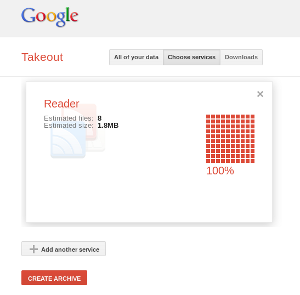
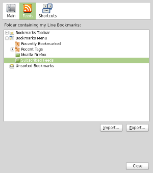
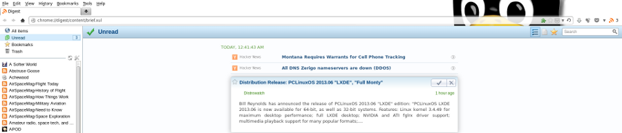

=====================
Firefox as RSS reader
=====================

:date: 2013-06-22 01:23:00
:tags: networks, mozilla
:slug: firefox-rss-reader

Google Reader is going dark at the end of this month and I need to find an alternative for consuming my RSS feeds. A `recent article in LWN <http://lwn.net/Articles/553761/>`_ explores the idea of using Firefox via extensions as an RSS reader and one of several options that caught my interest is *Digest*:

    `Digest <https://addons.mozilla.org/en-us/firefox/addon/digest/>`_ ... attempts to provide a more full-featured feed-reading experience than some of the other readers; it keeps a count of unread items for each feed, allows the user to "star" individual items or mark them as unread, and quite a few other features one would expect to find in a web service like Google Reader.

    As is the case with several other extensions, Digest stores feed subscriptions in a (selectable) bookmarks folder. However, it also downloads entries locally—allowing the user to choose how long old downloads are preserved (thankfully), which enables it to offer content search. It also renders its entire interface within the browser tab in HTML, unlike some of the competition. Digest is licensed as MPL 2.0, and is actively under development by its new maintainer `at GitHub <https://github.com/Tanriol/digest>`_. It can import (and export) OPML subscription files. 

Sounds good! I decided to give it a try.

Step 0 - Export list of subscriptions from Google Reader
========================================================

Navigate to the Google Reader settings, select the ``Import/Export`` tab and click ``Download your data through Takeout``. Click ``Create Archive`` and it bundles up your RSS feed subscriptions in a downloadable zip archive.

Step 1 - Add Digest to Firefox
==============================

Add Digest to Firefox and the extension's icon becomes visible on the Address bar. Right-click the icon and select ``Options->Feeds->Bookmarks Menu->Subscribed Feeds`` and click ``Import...``. Navigate to that unpacked zip archive and there will be a ``subscriptions.xml`` file (by default the app looks for OPML Files ... use the drop-down menu and select XML Files). Open it up and let Digest perform its Import magic.

Step 2 - Options and Sync
=========================

I like Digest's very clean interface running in a Firefox tab. Options include displaying article contents vs article titles and local storage timeouts.

Using Firefox Sync allows the user to share their RSS subscriptions and history between multiple devices running Firefox. I have not tried that feature myself yet and - while useful for sharing RSS between a laptop and a phone/tablet - it lacks the flexibility of storing the data on a remote server accessible (with appropriate permissions) by any device with web access.

Digest is great if you are a Firefox fan and want to get up and running with your RSS feeds with no fuss.
