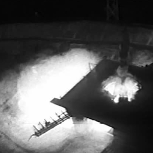

================================================
It is for those in the future to envy us our Joy
================================================

:tags: space, quote
:slug: sputnik

From the diary of **Dr. Valentin Vassilev**, Soviet Academy of Sciences:

    | Moments of farewell
    | the photographers are taking their last shots.
    | Our space rocket is ready in the centre of the Cosmodrome.
    | The countdown begins
    | now only a few moments remain
    | all eyes fix on the clock
    | 30 seconds
    | 10 seconds
    | the hand reaches vertical
    | a mighty roar
    | our rocket vibrates
    | white hot flame gushes downward
    | and the Great Beast
    | lifts slowly from the Earth.
    | We are about to create a new planet
    | that we will call
    | Sputnik.
    | It is small
    | this first satellite
    | but after it
    | we will launch others.
    | In the olden days
    | explorers like Vasco da Gama
    | and Columbus
    | had the good fortune to open up the terrestrial globe.
    | Now we have the good fortune
    | to open up Space
    | and it is for those in the future
    | to envy us
    | our Joy.
    |
    | - Humanity enters the Space Age, 4 October 1957
