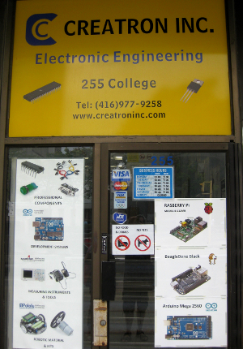

===============================================
Necessary Items Acquired and the Journey Begins
===============================================

:tags: electronics
:slug: make-electronics-ex00

A bit of research quickly points to Charles Platt's *Make: Electronics* as a highly-recommended resource for the complete electronics beginner. I purchased a copy and a quick perusal of contents reveals a generous amount of illustrations and dozens of hands-on experiments to practice skills. Good stuff!

In the Preface the author stresses that learning "by discovery means that you absolutely, positively have to do some hands-on work, and this in turn means that you have to buy some basic components and play with them." Time to outfit my electronics learning quest.

In downtown Toronto the best area for computer gear is the neighbourhood around College & Spadina Avenue and the hobbyist's favourite source of electronic components is `Creatron <http://www.creatroninc.com/index.php/contact-us>`_. The store is well-stocked and everything is clearly labelled (a blessing for the novice confronted with a tsunami of mysterious tech). I love checking out all the neat little parts and wondering how to put them to work. What I could not find for myself, Lawrence - the owner - and his wife were more than happy to help me out.

I now have everything required to start *making*!
