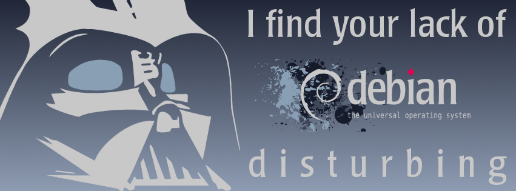
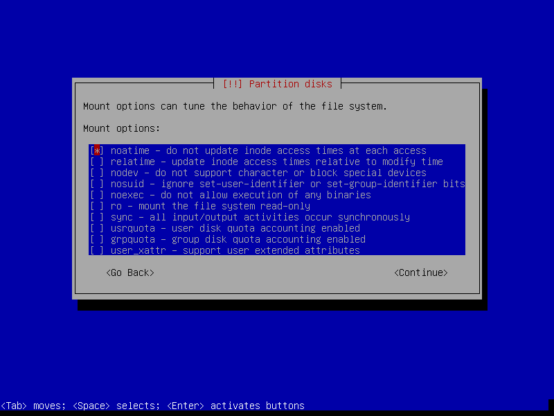
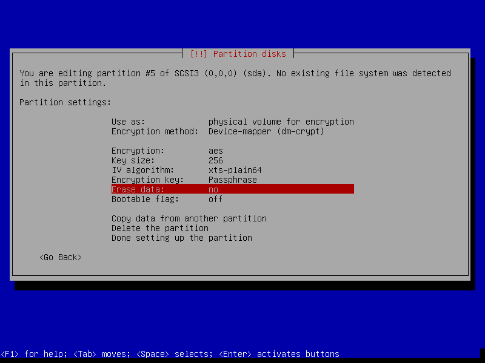
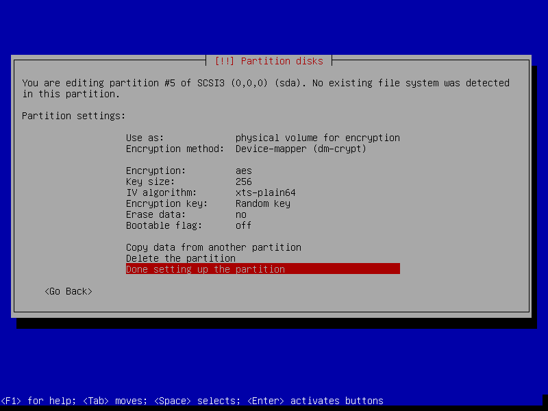
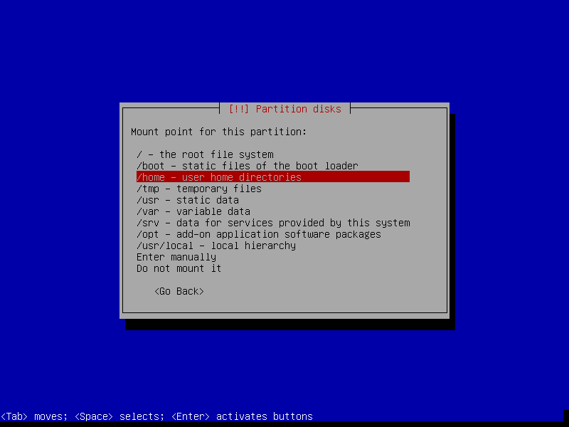
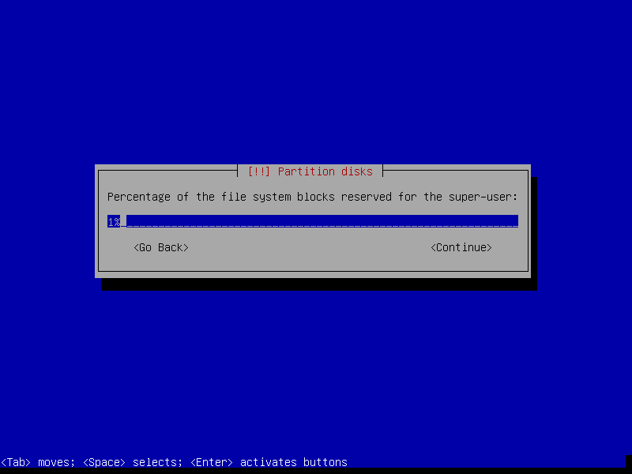
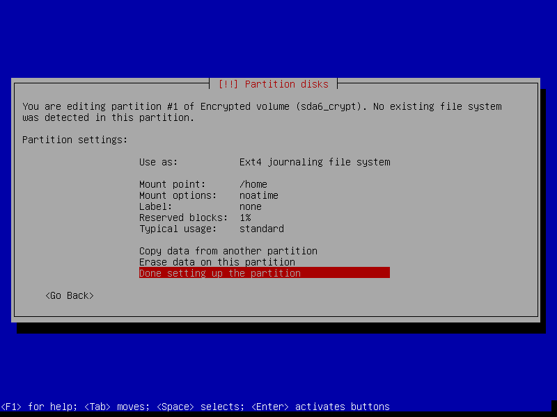
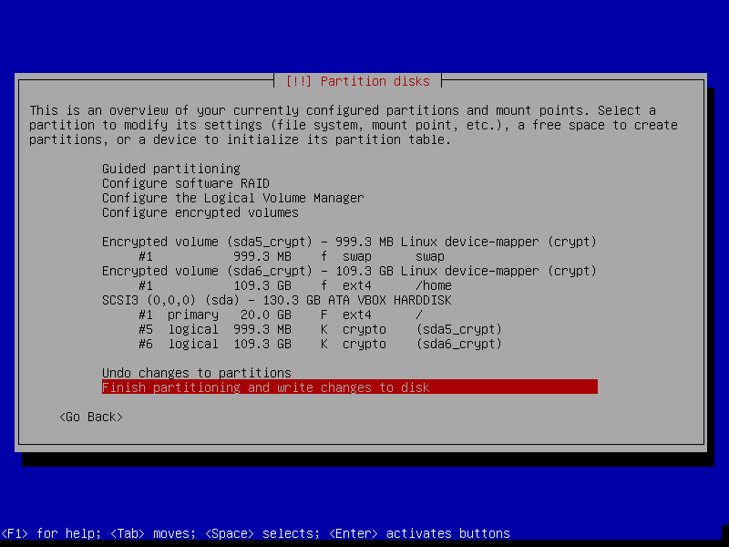

=============================
Debian Wheezy Minimal Install
=============================

:tags: debian, linux
:slug: install-debian-wheezy-screenshot-tour
:modified: 06 August 2014

    [Image: Debian Vader, courtesy `jschild <http://jschild.deviantart.com/art/Facebook-cover-debian-Darth-Vader-380351614>`_].

`Debian GNU/Linux <http://www.debian.org>`_ is an operating system created by volunteers of one of the largest and longest-running free software projects in the world. More than a hundred other Linux distributions like `Ubuntu <http://www.circuidipity.com/ubuntu-trusty-install.html>`_ build their edifices on solid Debian *awesomesauce*.

There are 3 **release branches** - ``stable``, ``testing``, and ``unstable`` - and the current stable branch goes by the name **wheezy**. I use Debian's `minimal install image <http://www.circuidipity.com/multi-boot-usb.html>`_ to create a **lightweight, console-only** base configuration that can be customized for various tasks and desktops.

Below is a visual walk-through of a sample Debian setup that makes use of an entire storage device divided into 3 partitions: an unencrypted **root** and `LUKS <https://en.wikipedia.org/wiki/Linux_Unified_Key_Setup>`_ encrypted **home** + **swap**.

Step 0 - Installer
==================

Download a `64bit <http://ftp.nl.debian.org/debian/dists/testing/main/installer-amd64/current/images/netboot/mini.iso>`_  (`32bit <http://ftp.nl.debian.org/debian/dists/testing/main/installer-i386/current/images/netboot/mini.iso>`_ for older machines) Debian **mini.iso** and burn the image to a CD or `prepare a USB boot device <http://www.circuidipity.com/multi-boot-usb.html>`_.

Step 1 - Go!
============

.. image:: images/screenshot/wheezyInstall/011.png
    :align: center
    :alt: Install
    :width: 800px
    :height: 600px

.. image:: images/screenshot/wheezyInstall/02.png
    :align: center
    :alt: Select Language
    :width: 800px
    :height: 600px

.. image:: images/screenshot/wheezyInstall/03.png
    :alt: Select Location
    :align: center
    :width: 800px
    :height: 600px

.. image:: images/screenshot/wheezyInstall/04.png
    :alt: Configure Keyboard
    :align: center
    :width: 800px
    :height: 600px

.. image:: images/screenshot/wheezyInstall/05.png
    :alt: Hostname
    :align: center
    :width: 800px
    :height: 600px

.. image:: images/screenshot/wheezyInstall/06.png
    :alt: Domain
    :align: center
    :width: 800px
    :height: 600px

.. image:: images/screenshot/wheezyInstall/07.png
    :alt: Mirror Country
    :align: center
    :width: 800px
    :height: 600px

.. image:: images/screenshot/wheezyInstall/08.png
    :alt: Mirror archive
    :align: center
    :width: 800px
    :height: 600px

.. image:: images/screenshot/wheezyInstall/09.png
    :alt: Mirror Directory
    :align: center
    :width: 800px
    :height: 600px

.. image:: images/screenshot/wheezyInstall/10.png
    :alt: Proxy
    :align: center
    :width: 800px
    :height: 600px

.. image:: images/screenshot/wheezyInstall/11.png
    :alt: Root password
    :align: center
    :width: 800px
    :height: 600px

.. image:: images/screenshot/wheezyInstall/12.png
    :alt: Verify password
    :align: center
    :width: 800px
    :height: 600px

.. image:: images/screenshot/wheezyInstall/13.png
    :alt: Full Name
    :align: center
    :width: 800px
    :height: 600px

.. image:: images/screenshot/wheezyInstall/14.png
    :alt: Username
    :align: center
    :width: 800px
    :height: 600px

.. image:: images/screenshot/wheezyInstall/15.png
    :alt: User password
    :align: center
    :width: 800px
    :height: 600px

.. image:: images/screenshot/wheezyInstall/16.png
    :alt: Verify password
    :align: center
    :width: 800px
    :height: 600px

.. image:: images/screenshot/wheezyInstall/17.png
    :alt: Select time zone
    :align: center
    :width: 800px
    :height: 600px

Step 2 - Partitions
===================

In the example below I create 3 partitions on the disk:

* sda1 is a 20GB ``root`` partition 
* sda5 is a 1GB LUKS encrypted ``swap`` partition using a **random key**
* sda6 uses the remaining space as a LUKS encrypted ``home`` partition using a **passphrase**

.. image:: images/screenshot/wheezyInstall/18.png
    :alt: Partitioning method
    :align: center
    :width: 800px
    :height: 600px

.. image:: images/screenshot/wheezyInstall/19.png
    :alt: Partition disks
    :align: center
    :width: 800px
    :height: 600px

.. image:: images/screenshot/wheezyInstall/20.png
    :alt: Partition table
    :align: center
    :width: 800px
    :height: 600px

.. image:: images/screenshot/wheezyInstall/21.png
    :alt: Free space
    :align: center
    :width: 800px
    :height: 600px

.. image:: images/screenshot/wheezyInstall/22.png
    :alt: New Partition
    :align: center
    :width: 800px
    :height: 600px

.. image:: images/screenshot/wheezyInstall/23.png
    :alt: Partition size
    :align: center
    :width: 800px
    :height: 600px

.. image:: images/screenshot/wheezyInstall/24.png
    :alt: Primary partition
    :align: center
    :width: 800px
    :height: 600px

.. image:: images/screenshot/wheezyInstall/25.png
    :alt: Beginning
    :align: center
    :width: 800px
    :height: 600px

.. note::

    Setting *Mount options* to *noatime* decreases write operations and boosts drive speed.

.. image:: images/screenshot/wheezyInstall/25.1.png
    :alt: Mount options
    :align: center
    :width: 800px
    :height: 600px

.. image:: images/screenshot/wheezyInstall/26.png
    :alt: Done setting up partition
    :align: center
    :width: 800px
    :height: 600px

.. image:: images/screenshot/wheezyInstall/27.png
    :alt: Free space
    :align: center
    :width: 800px
    :height: 600px

.. image:: images/screenshot/wheezyInstall/28.png
    :alt: New partition
    :align: center
    :width: 800px
    :height: 600px

.. image:: images/screenshot/wheezyInstall/29.png
    :alt: Partition size
    :align: center
    :width: 800px
    :height: 600px

.. image:: images/screenshot/wheezyInstall/30.png
    :alt: Logical partition
    :align: center
    :width: 800px
    :height: 600px

.. image:: images/screenshot/wheezyInstall/31.png
    :alt: Beginning
    :align: center
    :width: 800
    :height: 600px

.. image:: images/screenshot/wheezyInstall/31.1.png
    :alt: Use as
    :align: center
    :width: 800px
    :height: 600px

.. image:: images/screenshot/wheezyInstall/32.png
    :alt: Encrypt volume
    :align: center
    :width: 800px
    :height: 600px

.. image:: images/screenshot/wheezyInstall/33.png
    :alt: Random key
    :align: center
    :width: 800px
    :height: 600px

.. note::

    If the hard disk has not been securely wiped prior to installing Debian (using a utility like `DBAN <http://www.circuidipity.com/multi-boot-usb.html>`_) you may want to configure **Erase data** as **yes**. Note, however, that depending on the size of the disk this operation can last several hours.

.. image:: images/screenshot/wheezyInstall/34.png
    :alt: Free space
    :align: center
    :width: 800px
    :height: 600px

.. image:: images/screenshot/wheezyInstall/35.png
    :alt: New partition
    :align: center
    :width: 800px
    :height: 600px

.. image:: images/screenshot/wheezyInstall/36.png
    :alt: Partition size
    :align: center
    :width: 800px
    :height: 600px

.. image:: images/screenshot/wheezyInstall/30.png
    :alt: Logical partition
    :align: center
    :width: 800px
    :height: 600px

.. image:: images/screenshot/wheezyInstall/31.1.png
    :alt: Use as
    :align: center
    :width: 800px
    :height: 600px

.. image:: images/screenshot/wheezyInstall/38.png
    :alt: Encrypt volume
    :align: center
    :width: 800px
    :height: 600px

.. image:: images/screenshot/wheezyInstall/39.png
    :alt: Passphrase
    :align: center
    :width: 800px
    :height: 600px
  
.. image:: images/screenshot/wheezyInstall/39.1.png
    :alt: Erase data
    :align: center
    :width: 800px
    :height: 600px

.. image:: images/screenshot/wheezyInstall/39.2.png
    :alt: Done setting up the partition
    :align: center
    :width: 800px
    :height: 600px

.. image:: images/screenshot/wheezyInstall/40.png
    :alt: Configure encrypted volumes
    :align: center
    :width: 800px
    :height: 600px

.. image:: images/screenshot/wheezyInstall/41.png
    :alt: Write changes to disk
    :align: center
    :width: 800px
    :height: 600px

.. image:: images/screenshot/wheezyInstall/42.png
    :alt: Create encrypted volumes
    :align: center
    :width: 800px
    :height: 600px

.. image:: images/screenshot/wheezyInstall/43.png
    :alt: Devices to encrypt
    :align: center
    :width: 800px
    :height: 600px

.. image:: images/screenshot/wheezyInstall/44.png
    :alt: Finish encrypt
    :align: center
    :width: 800px
    :height: 600px

.. image:: images/screenshot/wheezyInstall/45.png
    :alt: Encryption passphrase
    :align: center
    :width: 800px
    :height: 600px

.. image:: images/screenshot/wheezyInstall/46.png
    :alt: Verify passphrase
    :align: center
    :width: 800px
    :height: 600px

.. image:: images/screenshot/wheezyInstall/47.png
    :alt: Configure encrypted volume
    :align: center
    :width: 800px
    :height: 600px

.. image:: images/screenshot/wheezyInstall/48.png
    :alt: Mount point
    :align: center
    :width: 800px
    :height: 600px

.. image:: images/screenshot/wheezyInstall/49.png
    :alt: Mount options
    :align: center
    :width: 800px
    :height: 600px

.. note::

    **Reserved blocks** can be used by privileged system processes to write to disk - useful if a full filesystem blocks users from writing - and reduce disk fragmentation. On large, non-root partitions extra space can be gained by reducing the 5% reserve set aside by Debian to 1%.

.. image:: images/screenshot/wheezyInstall/49.1.png
    :alt: Reserved blocks
    :align: center
    :width: 800px
    :height: 600px

.. image:: images/screenshot/wheezyInstall/50.png
    :alt: Write changes to disk
    :align: center
    :width: 800px
    :height: 600px

Step 3 - Install packages and finish up
=======================================

.. image:: images/screenshot/wheezyInstall/51.png
    :alt: Popularity-contest
    :align: center
    :width: 800px
    :height: 600px

.. note::

    Select only **[*] Standard system utilities** if you wish to start with a minimal, console-only base configuration ready for further customization. The task menu can be accessed post-install by running ``tasksel``.
    
.. image:: images/screenshot/wheezyInstall/52.png
    :alt: Software selection
    :align: center
    :width: 800px
    :height: 600px

.. image:: images/screenshot/wheezyInstall/53.png
    :alt: GRUB
    :align: center
    :width: 800px
    :height: 600px

.. image:: images/screenshot/wheezyInstall/54.png
    :alt: Finish install
    :align: center
    :width: 800px
    :height: 600px

.. image:: images/screenshot/wheezyInstall/544.png
    :alt: GRUB menu
    :align: center
    :width: 800px
    :height: 600px

.. note::

    If an **encrypted home** partition was created in Step 2 the system will display a passphrase prompt to unlock the partition.

.. image:: images/screenshot/wheezyInstall/55.png
    :alt: Enter encrypt passphrase
    :align: center
    :width: 800px
    :height: 600px

.. image:: images/screenshot/wheezyInstall/56.png
    :alt: Login
    :align: center
    :width: 800px
    :height: 600px

I have created a `post-install shell script <https://github.com/vonbrownie/linux-post-install/blob/master/debian_post_install>`_ that can be used to configure tracking of Debian's stable or unstable branch with the option of installing the **Openbox** window manager + extra applications suitable for a desktop environment.

Happy hacking!
