=====================================
Install Debian Wheezy Screenshot Tour
=====================================

:tags: debian, linux
:slug: install-debian-wheezy-screenshot-tour

`Debian GNU/Linux <http://www.debian.org>`_ is an operating system created by volunteers of one of the largest and longest-running free software projects in the world. More than a hundred other Linux distributions like Ubuntu build their edifices on solid Debian *awesomesauce*.

There are 3 *release branches* - ``stable``, ``testing``, and ``unstable`` - and the current stable branch goes by the name ``wheezy``. Below is a visual walk-through of a Debian installation that features:

* separate root, encrypted home and swap partitions
* a minimal foundation for any type of Linux configuration (server, desktop, `rolling release <http://wiki.debian.org/DebianUnstable>`_)

Step 0 - Installer
==================

Download a `64-bit <http://ftp.nl.debian.org/debian/dists/testing/main/installer-amd64/current/images/netboot/mini.iso>`_  (or `32-bit <http://ftp.nl.debian.org/debian/dists/testing/main/installer-i386/current/images/netboot/mini.iso>`_ for older machines) Debian mini installer and burn the image to a CD or `prepare a USB boot device <http://www.circuidipity.com/multi-boot-usb.html>`_).

Step 1 - Go!
============

.. image:: images/screenshot/wheezyInstall/011.png
    :align: center
    :alt: Install
    :width: 800px
    :height: 600px

.. image:: images/screenshot/wheezyInstall/02.png
    :align: center
    :alt: Select Language
    :width: 800px
    :height: 600px

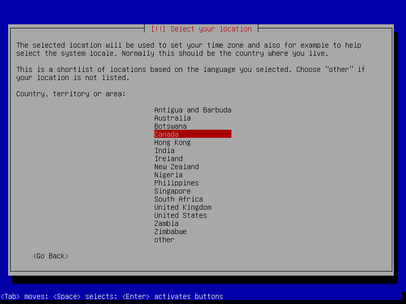

.. image:: images/screenshot/wheezyInstall/04.png
    :alt: Configure Keyboard
    :align: center
    :width: 800px
    :height: 600px

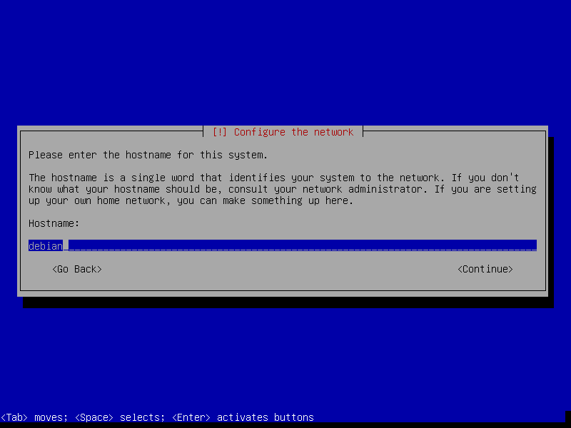

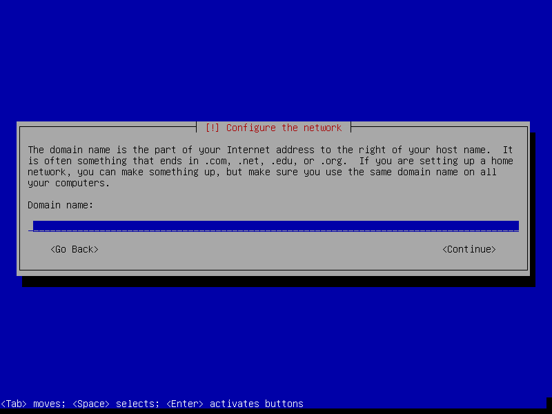

.. image:: images/screenshot/wheezyInstall/07.png
    :alt: Mirror Country
    :align: center
    :width: 800px
    :height: 600px

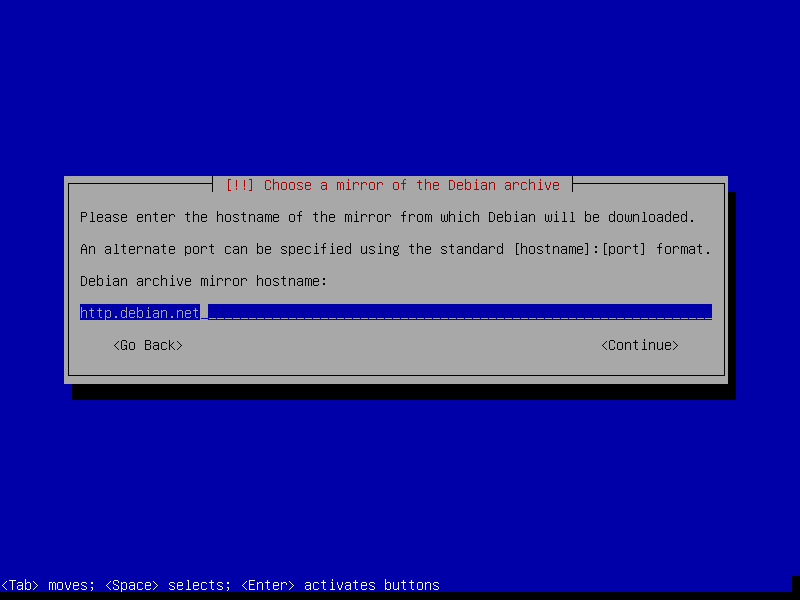

.. image:: images/screenshot/wheezyInstall/09.png
    :alt: Mirror Directory
    :align: center
    :width: 800px
    :height: 600px

.. image:: images/screenshot/wheezyInstall/10.png
    :alt: Proxy
    :align: center
    :width: 800px
    :height: 600px

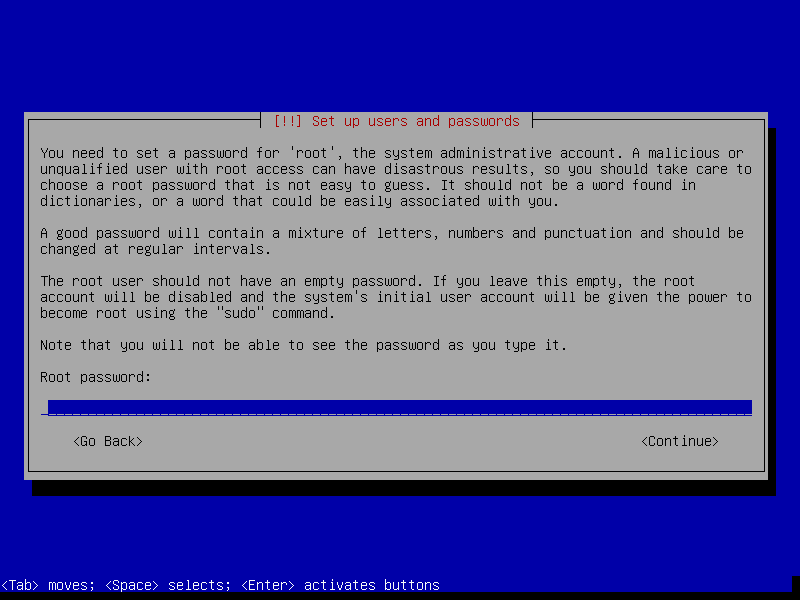

.. image:: images/screenshot/wheezyInstall/12.png
    :alt: Verify password
    :align: center
    :width: 800px
    :height: 600px

.. image:: images/screenshot/wheezyInstall/13.png
    :alt: Full Name
    :align: center
    :width: 800px
    :height: 600px

.. image:: images/screenshot/wheezyInstall/14.png
    :alt: Username
    :align: center
    :width: 800px
    :height: 600px

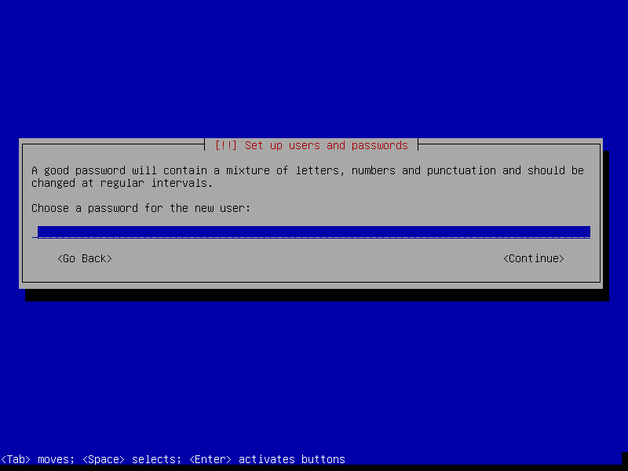

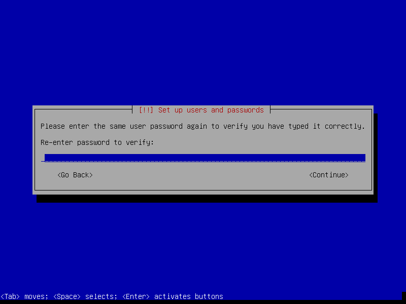

.. image:: images/screenshot/wheezyInstall/17.png
    :alt: Select time zone
    :align: center
    :width: 800px
    :height: 600px

Step 2 - Partitions
===================

In the example below we create 3 partitions on the disk:

* sda1 is a 20GB ``root`` partition 
* sda2 is a 1GB ``swap`` partition *encrypted* with a *random key* (double the RAM <= 2GB is a good rule of thumb for sizing swap)
* sda3 uses the remaining space as a ``home`` partition *encrypted* with a *passphrase*

.. image:: images/screenshot/wheezyInstall/18.png
    :alt: Partitioning method
    :align: center
    :width: 800px
    :height: 600px

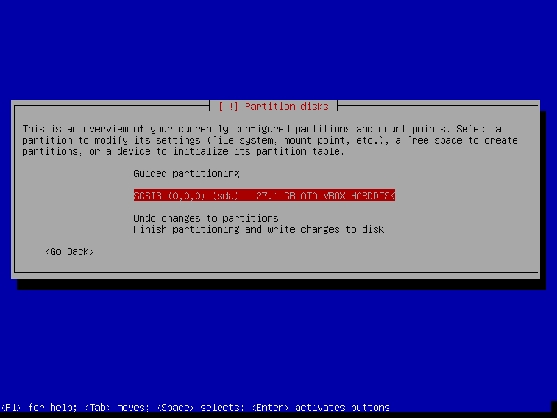

.. image:: images/screenshot/wheezyInstall/20.png
    :alt: Partition table
    :align: center
    :width: 800px
    :height: 600px

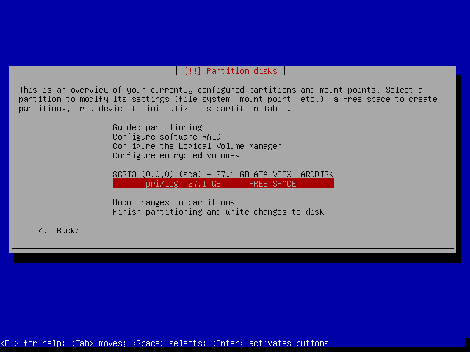

.. image:: images/screenshot/wheezyInstall/22.png
    :alt: New Partition
    :align: center
    :width: 800px
    :height: 600px

.. image:: images/screenshot/wheezyInstall/23.png
    :alt: Partition size
    :align: center
    :width: 800px
    :height: 600px

.. image:: images/screenshot/wheezyInstall/24.png
    :alt: Primary partition
    :align: center
    :width: 800px
    :height: 600px

.. image:: images/screenshot/wheezyInstall/25.png
    :alt: Beginning
    :align: center
    :width: 800px
    :height: 600px

.. note::

    Setting *Mount options* to *noatime* decreases write operations and boosts drive speed.

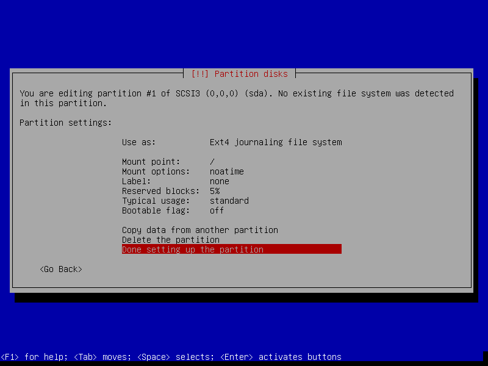

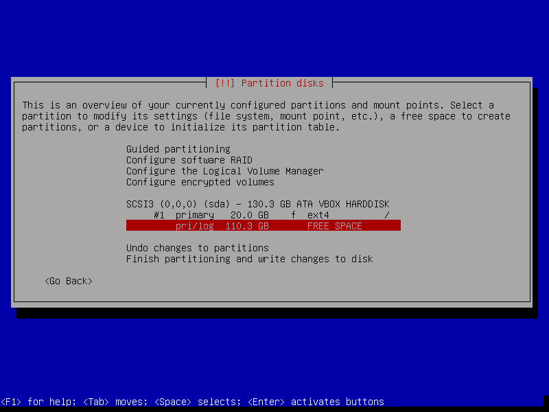

.. image:: images/screenshot/wheezyInstall/28.png
    :alt: New partition
    :align: center
    :width: 800px
    :height: 600px

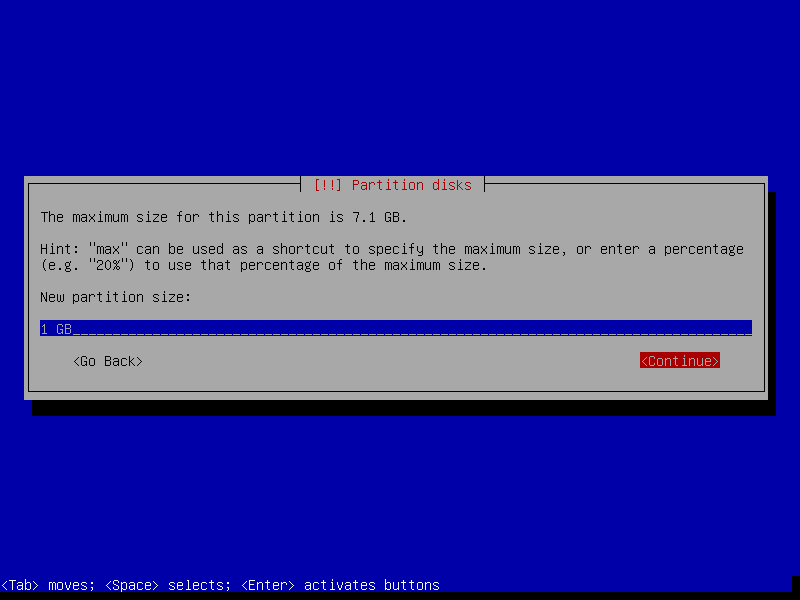

.. image:: images/screenshot/wheezyInstall/30.png
    :alt: Primary partition
    :align: center
    :width: 800px
    :height: 600px

.. image:: images/screenshot/wheezyInstall/31.png
    :alt: Beginning
    :align: center
    :width: 800
    :height: 600px

.. image:: images/screenshot/wheezyInstall/32.png
    :alt: Encrypt volume
    :align: center
    :width: 800px
    :height: 600px

.. note::

    If the hard disk has not been securely wiped prior to installing Debian (using a utility like `DBAN <http://www.circuidipity.com/multi-boot-usb.html>`_) you may want to configure *Erase data* as *yes*. Note, however, that depending on the size of the disk this operation can last several hours.

.. image:: images/screenshot/wheezyInstall/33.png
    :alt: Random key
    :align: center
    :width: 800px
    :height: 600px

.. image:: images/screenshot/wheezyInstall/34.png
    :alt: Free space
    :align: center
    :width: 800px
    :height: 600px

.. image:: images/screenshot/wheezyInstall/35.png
    :alt: New partition
    :align: center
    :width: 800px
    :height: 600px

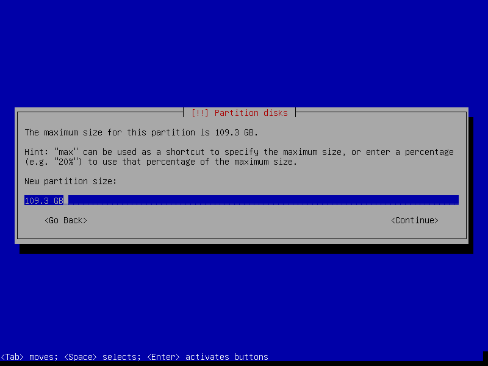

.. image:: images/screenshot/wheezyInstall/37.png
    :alt: Primary partition
    :align: center
    :width: 800px
    :height: 600px

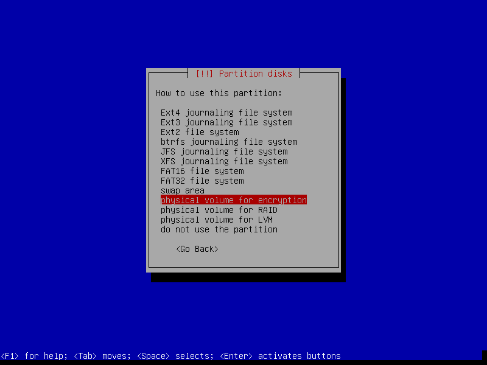

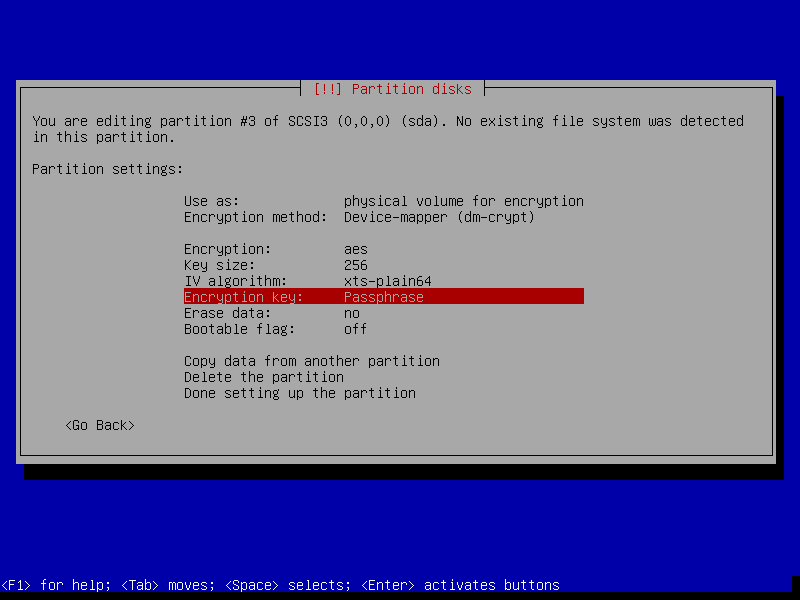

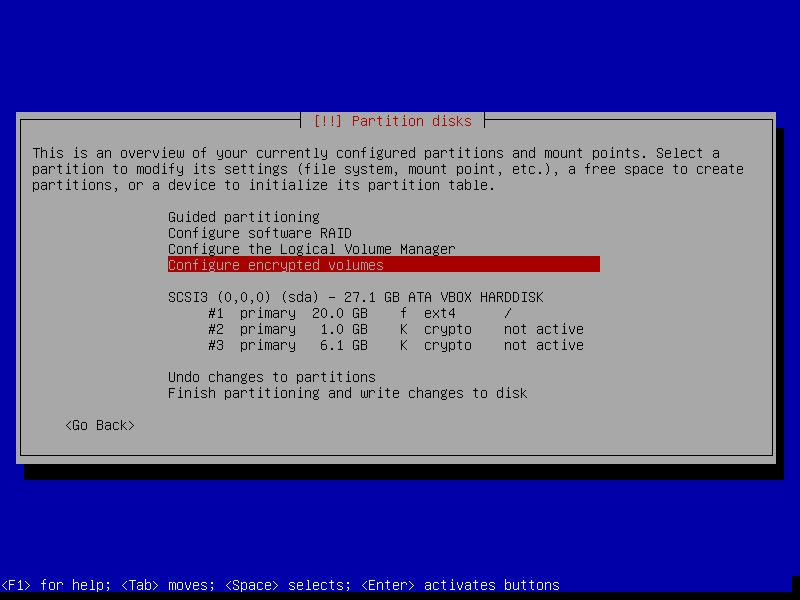

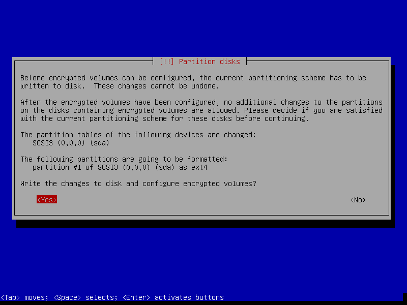

.. image:: images/screenshot/wheezyInstall/42.png
    :alt: Create encrypted volumes
    :align: center
    :width: 800px
    :height: 600px

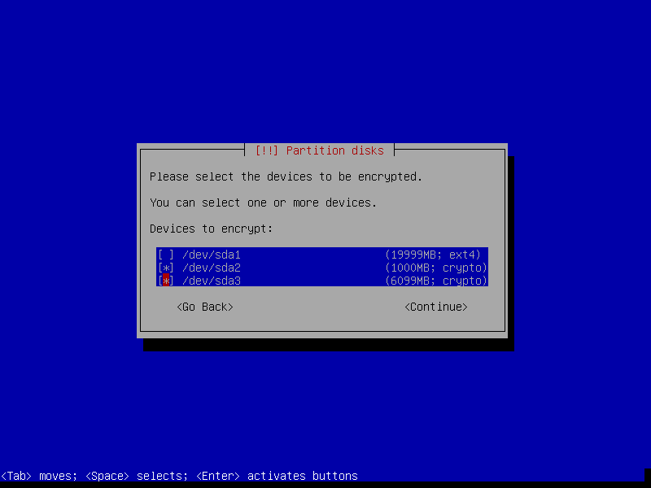

.. image:: images/screenshot/wheezyInstall/44.png
    :alt: Finish encrypt
    :align: center
    :width: 800px
    :height: 600px

.. image:: images/screenshot/wheezyInstall/45.png
    :alt: Encryption passphrase
    :align: center
    :width: 800px
    :height: 600px

.. image:: images/screenshot/wheezyInstall/46.png
    :alt: Verify passphrase
    :align: center
    :width: 800px
    :height: 600px

.. image:: images/screenshot/wheezyInstall/47.png
    :alt: Configure encrypted volume
    :align: center
    :width: 800px
    :height: 600px

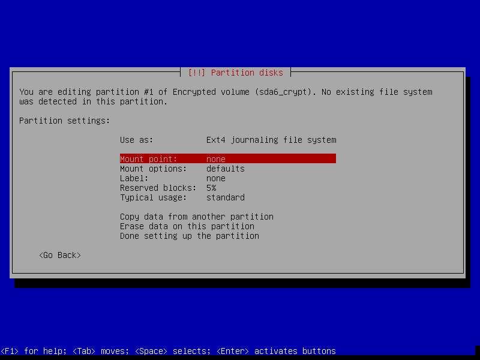

.. image:: images/screenshot/wheezyInstall/49.png
    :alt: Finish partitioning
    :align: center
    :width: 800px
    :height: 600px

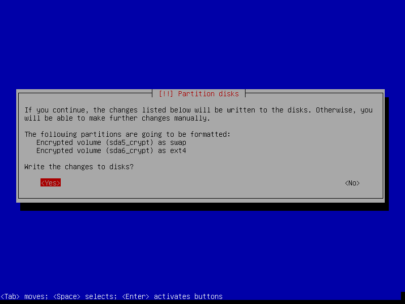

Step 3 - Install packages and finish up
=======================================

.. image:: images/screenshot/wheezyInstall/51.png
    :alt: Popularity-contest
    :align: center
    :width: 800px
    :height: 600px

.. note::

    Select only [*] *Standard system utilities* if you want to start with a minimal foundation (no desktop) to build your own post-install custom Debian configuration.

.. image:: images/screenshot/wheezyInstall/52.png
    :alt: Software selection
    :align: center
    :width: 800px
    :height: 600px

.. image:: images/screenshot/wheezyInstall/53.png
    :alt: GRUB
    :align: center
    :width: 800px
    :height: 600px

.. image:: images/screenshot/wheezyInstall/54.png
    :alt: Finish install
    :align: center
    :width: 800px
    :height: 600px

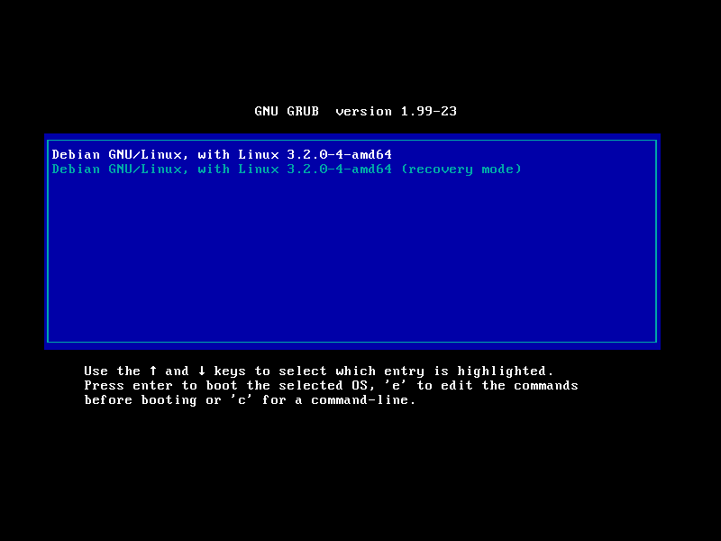

.. note::

    If an encrypted *home* partition was created in Step 2 the system will display a passphrase prompt to unlock the partition.

.. image:: images/screenshot/wheezyInstall/55.png
    :alt: Enter encrypt passphrase
    :align: center
    :width: 800px
    :height: 600px

.. image:: images/screenshot/wheezyInstall/56.png
    :alt: Login
    :align: center
    :width: 800px
    :height: 600px

Enjoy your fresh Debian!

Add extra packages, stick with ``stable`` or move to ``testing`` or ``unstable`` or maybe setup a `home server <http://www.circuidipity.com/linux-home-server.html>`_?
