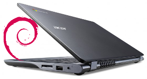

==========================
From Chromebook to Sidbook
==========================

:slug: c720-sidbook
:template: article-project
:tags: chromebook, debian, linux
:modified: 27 August 2014

Replace ChromeOS permanently with the *sid* (unstable) branch of **Debian Linux** on the **Acer C720 Chromebook**.

Running a full-featured Linux on this little laptop is a delight: lightweight, several hours battery life, inexpensive, and snappy performance using `Openbox <http://openbox.org/>`_ window manager.

There are a few different configurations of this device... mine is the `C720-2848 <http://us.acer.com/ac/en/US/content/model-datasheet/NX.SHEAA.002>`_ non-touchscreen model with 2GB RAM and 16GB SSD.

Let's go!

Step 0 - Recovery Image
=======================

Create a recovery image of Chrome OS (my C720 is model ``PEPPY C6A-N3C-A7O``) to enable restoring the Chromebook to its default configuration. This will require a spare USB stick of 2GB or better:

* Log into the Chromebook and let it auto update, as there sometimes are firmware updates... check the updating status in the browser at ``chrome://help``
* Insert the USB stick, enter ``chrome://imageburner`` and follow the directions to generate a recovery image

Source: `Create a Chromebook recovery image <https://support.google.com/chromebook/answer/1080595?hl=en>`_ (support.google.com)

Step 1 - Debian Installer
=========================

Prepare the Debian installation media. I use `GRML 2014.03 <http://grml.org/>`_ installed on a USB stick.

Sources: Creating a `USB stick with multiple Linux installers <http://www.circuidipity.com/multi-boot-usb.html>`_ and `installing Debian using grml-debootstrap <http://www.circuidipity.com/grml-debootstrap.html>`_

Step 2 - SeaBIOS
================

`SeaBIOS <http://www.coreboot.org/SeaBIOS>`_ in combination with **coreboot** provides an open-source legacy BIOS that enables access to the MBR and the ability to install an alternative OS on the Chromebook. All this good stuff involves jumping through a few simple hoops and not trembling in fear at the "scary white screen" that pops up at power up stating that the boot loader detects something is **very very wrong** with the Chromebook and helpfully suggests pressing the spacebar to begin recovery. **Do not press the spacebar** or the Debian installation will be wiped from disk!

There are 2 different methods for configuring SeaBIOS in preparation for installing Debian. The first method uses a few simple commands in the ChromeOS shell to place the Chromebook into **developer mode** and allow booting the USB install media and replacing ChromeOS with Debian. The drawback is that scary screen appears at every boot and you must press ``CTRL+L`` to boot to legacy-mode and onward to GRUB and Debian (and **ignore** the helpful prompt to press spacebar and inadvertently begin the adventure of wiping clean the SSD).

The second method involves setting new flags for the write-protected **Google Binary Block** (GBB) in the device firmware. Delay at the boot screen can be reduced to a one second timeout and the legacy-mode BIOS set as the system default (no key combo required). Pressing the spacebar is disabled from doing any harm to Debian (the Chromebook just beeps). The drawback is that it involves the (very simple) removal of the device's bottom cover and the temporary removal of the **write-protect screw** from the motherboard to permit flashing new flags to the GBB... and this may void the Chromebook's warranty (one of the case screws lies underneath a sticker declaring the warranty void if disturbed).

Experimenting with alternate OS installs on the Chromebook I first employed the developer mode method followed by the write-protect screw removal. I prefer configuring the device to default to legacy-mode BIOS but I have employed both methods successfully and describe their respective steps below.

**No guarantees**, though... Hopefully you enjoy equal success!

2.1 Write-Protect Screw Method
------------------------------

Disconnect power. Turn the Chromebook over facing bottom up and remove the 13 screws (not missing the one hidden under the warranty sticker). Gently pry the case off starting with the seam where the display connects to device. It comes away pretty easy.

This is what you see...

.. figure:: images/c720-chromebook-annotated-innards.png
    :alt: C720 annotated innards
    :width: 800px
    :height: 558px

    [Image: The battery lock screw is #6 and the write-protect screw is #7, courtesy `Chromium <http://www.chromium.org/chromium-os/developer-information-for-chrome-os-devices/acer-c720-chromebook#TOC-Firmware>`_].

* Remove the write-protect screw (this will **wipe out** whatever is installed on the SSD)
* Close back cover using only the battery lock screw to hold in place
* Re-connect power, boot chromebook and wait until it displays...                                 
                                                                                
.. code-block:: bash
    
    Chrome OS is missing or damaged.                                            
    Please insert a recovery USB stick or SD card.                              

* Insert USB recovery media prepared in Step 0 and it will proceed to restore ChromeOS and reboot
* At default ChromeOS "Welcome!" screen open a terminal ``CTRL+ALT+F2`` (Right-arrow)
* Login as ``chronos`` (no password), then enter ``sudo su`` for superuser access

Set new GBB flags using the ``set_gbb_flags.sh`` script in ChromeOS. To enable short **developer mode** screen (1 second timeout) followed by **default legacy mode** boot use these flags...

.. code-block:: bash

    GBB_FLAG_DEV_SCREEN_SHORT_DELAY 0×00000001
    GBB_FLAG_FORCE_DEV_SWITCH_ON 0×00000008
    GBB_FLAG_FORCE_DEV_BOOT_LEGACY 0×00000080
    GBB_FLAG_DEFAULT_DEV_BOOT_LEGACY 0×00000400

... which adds up to running in the shell...

.. code-block:: bash

    set_gbb_flags.sh 0x489

Shutdown with ``shutdown -h now`` and disconnect the power:

* Remove the bottom cover again and reinstall the write-lock screw to protect the BIOS
* Close cover and reinstall all the case screws

Re-connect the power, insert the USB stick prepared in Step 1, and power up the Chromebook.

.. note::

    Whenever you remove battery power to the Chromebook (like opening up the case) the hardware clock on the motherboard resets to a future year (mine travelled to 2040). Providing a network connection is up during the Debian installation the system should fetch a correct time from a NTP server... otherwise fix the `fallout from an incorrect clock <https://blogs.fsfe.org/the_unconventional/2014/04/20/acer-c720-chromebook-debian-gnu-linux/>`_ by re-mounting partitions read-only and correct filesystem timestamps using ``fsck``.

Sources: `Useful GBB flags <http://www.coreboot.org/pipermail/coreboot/2014-January/077083.html>`_ (coreboot.org) for `another new free software machine <https://blogs.fsfe.org/the_unconventional/2014/04/20/acer-c720-chromebook-debian-gnu-linux/>`_ (fsfe.org)

2.2 Developer Mode Method
-------------------------

The alternative to removing the write-protect screw above is to place the Chromebook into developer mode using the ChromeOS shell before booting the USB install media:

* With the Chromebook off... Hold down ``ESC+F3`` (Refresh) keys and power on the device
* Invoke Recovery, and at the Recovery screen press ``Ctrl+D``
* Device will prompt for confirmation, press ``ENTER`` and the system reboots into developer mode
* Scary white boot screen appears and you need to press ``Ctrl+D`` to continue boot

.. note::

    Switching between developer and normal (non-developer) modes will remove user accounts and their associated information from your Chromebook.

Enable the **USB Boot** and **Legacy BIOS** modes by opening the shell with ``Ctrl+Alt+T`` and enter ``shell``. Set ``dev_boot_usb`` and ``dev_boot_legacy`` to active...

.. code-block:: bash

    $ sudo crossystem dev_boot_usb=1
    $ sudo dev_boot_legacy=1

Insert the USB stick prepared in Step 1, reboot the Chromebook and press ``CTRL+L`` at the boot screen to enter legacy boot mode.

Source: `Chromium OS <http://www.chromium.org/chromium-os>`_ developer information for the `Acer C720 Chromebook <http://www.chromium.org/chromium-os/developer-information-for-chrome-os-devices/acer-c720-chromebook>`_ (chromium.org)

Step 3 - Install Debian
=======================

My `grml-debootstrap instructions <http://www.circuidipity.com/grml-debootstrap.html>`_ for installing Debian Wheezy, configuring **TRIM** support for the SSD, and my `post-install script <https://github.com/vonbrownie/linux-post-install/blob/master/c720-sidbook-post-install-main.sh>`_ for upgrading and configuring Debian's unstable branch. 

Source: `linux-post-install <https://github.com/vonbrownie/linux-post-install>`_ (github.com/vonbrownie)

Step 4 - Touchpad
=================

After installing Debian the C720 touchpad is non-functional and requires compiling new kernel modules and creating a **synaptic touchpad** config file:

* Compile new kernel modules using the `c720-kernel-mods.sh <https://github.com/vonbrownie/linux-post-install/blob/master/extra/c720_sidbook/scripts/c720-kernel-mods.sh>`_ script... Confirmed **working** in kernel ``3.13.10`` and **not working** in ``3.14.x``
* Create touchpad config `50-c720-touchpad.conf <https://github.com/vonbrownie/linux-post-install/blob/master/extra/c720_sidbook/etc/X11/xorg.conf.d/50-c720-touchpad.conf>`_ in ``/etc/X11/xorg.conf.d`` ...

.. code-block:: bash

    $ sudo mkdir /etc/X11/xorg.conf.d
    $ sudo cp /usr/share/X11/xorg.conf.d/50-synaptics.conf /etc/X11/xorg.conf.d/50-c720-touchpad.conf

Modify this file to adjust timeouts, add tap-mouse actions (2-finger tap = right-click, 3-finger tap = middle-click), and 2-finger scrolling.

Sources: `Touchpad Synaptics <https://wiki.archlinux.org/index.php/Touchpad_Synaptics>`_ and `C720 configuration <https://wiki.archlinux.org/index.php/Acer_C720_Chromebook#configuration>`_ (wiki.archlinux.org)

Step 5 - Suspend
================

Enable suspend|resume under **systemd** (for sysv-init see *Helpful Resources* at bottom):

* Create `cros-sound-suspend.sh <https://github.com/vonbrownie/linux-post-install/blob/master/extra/c720_sidbook/lib/systemd/system-sleep/cros-sound-suspend.sh>`_ (make it executable) in ``/lib/systemd/system-sleep`` and...
* ... `cros-acpi-wakeup.conf <https://github.com/vonbrownie/linux-post-install/blob/master/extra/c720_sidbook/etc/tmpfiles.d/cros-acpi-wakeup.conf>`_ in ``/etc/tmpfiles.d`` to restore sound and touchpad after suspend
* Configure ``GRUB_CMDLINE_LINUX_DEFAULT`` setting in ``/etc/default/grub``...

.. code-block:: bash

    GRUB_CMDLINE_LINUX_DEFAULT="quiet splash add_efi_memmap boot=local noresume noswap i915.modeset=1 tpm_tis.force=1 tpm_tis.interrupts=0 nmi_watchdog=panic,lapic"

... and update the grub config...

.. code-block:: bash

    $ sudo update-grub

Sources: `Chrubuntu resume fix <https://plus.google.com/+PedroLarroy/posts/6CgQypQukMa>`_ (plus.google.com/+PedroLarroy), `Acer C720 thread <https://bbs.archlinux.org/viewtopic.php?pid=1364521#p1364521>`_ (bbs.archlinux.org), and `systemctl user controls <https://wiki.archlinux.org/index.php/Allow_users_to_shutdown>`_ (wiki.archlinux.org)

Step 6 - Keyboard Shortcuts
===========================

The top row on the keyboard with the shortcut icons (brightness, volume, etc.) identify in Linux as the ``F1-F10`` keys and the Search key (in the ``CapsLk`` position) acts as the ``Super`` (Windows) modifier key.

Create keyboard shortcuts by first installing:

* pulseaudio-utils - manage sound with *pactl*
* xbacklight - set backlight level using RandR
* xdotool - simulate keyboard/mouse input
* xbindkeys - associate keys to shell commands

.. code-block:: bash

    $ sudo apt-get install pulseaudio-utils xbacklight xdotool xbindkeys

6.1 Function keys
-----------------

Enable the function keys to modify the sound and brightness settings by creating ``~/.xbindkeysrc`` ...

.. code-block:: bash

    "xdotool keyup F1; xdotool key alt+Left"
    F1
    "xdotool keyup F2; xdotool key alt+Right"
    F2
    "xdotool keyup F5; xdotool key alt+Tab"
    F5
    "xdotool keyup F3; xdotool key ctrl+r"
    F3
    "xdotool keyup F4; xdotool key F11"
    F4
    "xdotool keyup F6; xbacklight -dec 10"
    F6
    "xdotool keyup F7; xbacklight -inc 10"
    F7
    "xdotool keyup shift+BackSpace; xdotool key Delete; xdotool keydown shift"
    shift+BackSpace
    "xdotool keyup F8; pactl set-sink-mute alsa_output.pci-0000_00_1b.0.analog-stereo toggle"
    F8
    "xdotool keyup F9; pactl set-sink-volume alsa_output.pci-0000_00_1b.0.analog-stereo -- -10%"
    F9
    "xdotool keyup F10; pactl set-sink-volume alsa_output.pci-0000_00_1b.0.analog-stereo -- +10%"
    F10

Source: `xbindkeysrc <https://github.com/codestarterorg/ubuntu-chromebook-installer/blob/master/profiles/default/system/etc/skel/.xbindkeysrc>`_ (github.com/codestarterorg)

6.2 Page-Up, Page-Down, Home, End
---------------------------------

Create keybindings for Openbox in ``$HOME/.config/openbox/rc.xml`` ...

.. code-block:: bash

    <!-- Keybindings for Page-Up, Page-Down, Home, End -->
   <keybind key="A-Up">
      <action name="Execute">
        <command>xdotool key --clearmodifiers Page_Up</command>
      </action>
    </keybind>
    <keybind key="A-Down">
      <action name="Execute">
          <command>xdotool key --clearmodifiers Page_Down</command>
      </action>
    </keybind>
    <keybind key="C-A-Up">
      <action name="Execute">
        <command>xdotool key --clearmodifiers Home</command>
      </action>
    </keybind>
    <keybind key="C-A-Down">
      <action name="Execute">
        <command>xdotool key --clearmodifiers End</command>
      </action>
    </keybind>

6.3 Power Key
-------------

The power key ignores any configuration in the window manager and triggers poweroff without delay when pressed (easy to do by accident as its positioned next to ``backspace``).

If you want to disable the power key... modify ``/etc/systemd/logind.conf`` and set ``HandlePowerKey=ignore``.

Step 7 - Helpful Resources
==========================

.. raw:: html

    
<a href="https://github.com/vonbrownie/linux-post-install/tree/master/extra/c720_sidbook">My personal C720 configurations</a> (github.com/vonbrownie) 
    Configuring the Chromebook and the output of <em>lshw</em>, <em>lspci</em>, and <em>lsusb</em>

    
<a href="https://github.com/liangcj/AcerC720CrunchBang">CrunchBang Linux on the Acer C720 Chromebook</a> (github.com/liangcj) 
    Guide for wiping ChromeOS and installing CrunchBang

    
<a href="https://wiki.archlinux.org/index.php/Acer_C720_Chromebook">Acer C720 Chromebook</a> (wiki.archlinux.org) 
    Arch Linux installation with useful post-install details applicable to any Linux distro

    
<a href="http://www.reddit.com/r/chrubuntu/comments/1rsxkd/list_of_fixes_for_xubuntu_1310_on_the_acer_c720/">List of fixes for Xubuntu 13.10 on the Acer C720</a> (reddit.com/r/chrubuntu) 
    Ongoing discussion thread about Chromebook configuration for a Debian/Ubuntu-based install

    
<a href="http://blog.codestarter.org/post/93985346780/how-we-turn-199-chromebooks-into-ubuntu-based-code">Turn Chromebooks into Ubuntu-based code learning machines for kids</a> (blog.codestarter.org) 
    Configure the C720 to dual-boot ChromeOS and Ubuntu using open-source install script

Happy hacking!
