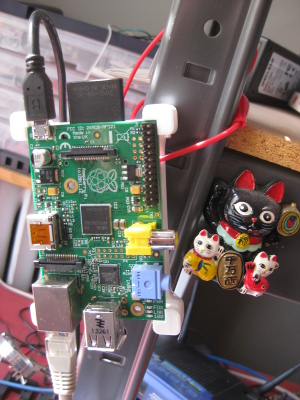

==================
Raspberry Pi Plate
==================

:date: 2014-07-03 01:23:00
:slug: pi-plate
:tags: raspberry pi, 3D printing, electronics

    
My new **Raspberry Pi** attached to a bottom `Pi Plate <http://www.thingiverse.com/thing:24096>`_ I generated using my local library's 3D printer!

The `Toronto Public Library <http://www.torontopubliclibrary.ca/using-the-library/computer-services/innovation-spaces/3D-design-print.jsp>`_ recently installed MakerBot `3D printers <https://store.makerbot.com/replicator2>`_ at two locations for public use. 
