============================
Ubuntu 14.04 Minimal Install
============================

:date: 2014-07-07 01:23:00
:tags: ubuntu, lubuntu, linux
:slug: ubuntu-trusty-install
:modified: 2014-10-25 23:25:00

**Ubuntu 14.04 "Trusty Tahr"** is a `Long Term Support (LTS) <https://wiki.ubuntu.com/Releases>`_ release of the popular Linux operating system. I use Ubuntu's `minimal install image <https://help.ubuntu.com/community/Installation/MinimalCD>`_ to create a **lightweight, console-only base configuration** that can be customized for various tasks and alternate desktops.

Below is a visual walk-through of a sample Ubuntu setup that makes use of an entire storage device divided into 3 partitions: a ``root`` partition, and `LUKS <https://en.wikipedia.org/wiki/Linux_Unified_Key_Setup>`_ encrypted ``swap`` + ``home``. 

Let's go!
=========

0. Prepare install media
------------------------

Download the `64-bit trusty minimal installer <http://archive.ubuntu.com/ubuntu/dists/trusty/main/installer-amd64/current/images/netboot/mini.iso>`_ (`32-bit <http://archive.ubuntu.com/ubuntu/dists/trusty/main/installer-i386/current/images/netboot/mini.iso>`_ for older machines) and burn to CD or `flash the image <https://help.ubuntu.com/community/Installation/FromUSBStick>`_ to a USB stick. An alternative (my choice) is adding the image to a `USB stick with multiple Linux installers <http://www.circuidipity.com/multi-boot-usb.html>`_. Using the minimal console installer vs. the graphical installer provides more options during setup [1]_.

1. Configure
------------

Connect the USB stick and boot the installer:

.. image:: images/screenshot/trustyInstall/100.png
    :align: center
    :alt: Install
    :width: 800px
    :height: 600px

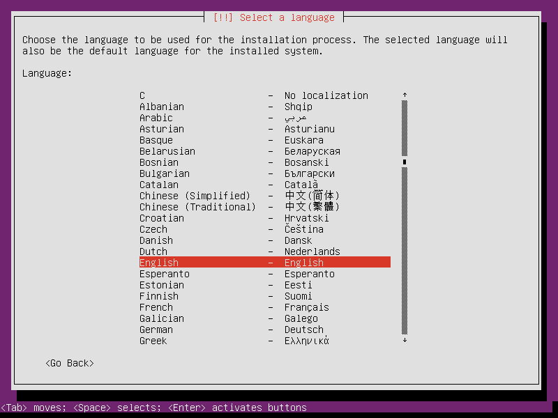

.. image:: images/screenshot/trustyInstall/102.png
    :alt: Select Location
    :align: center
    :width: 800px
    :height: 600px

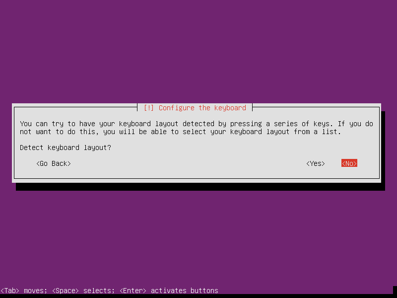

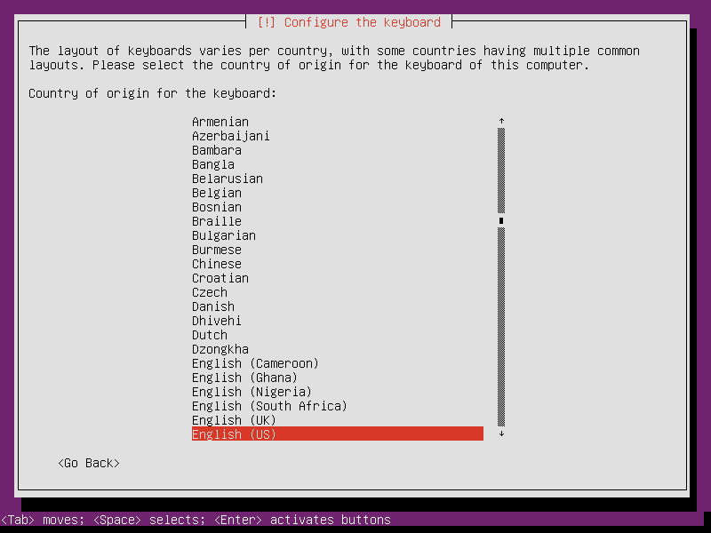

.. image:: images/screenshot/trustyInstall/105.png
    :alt: Configure Keyboard
    :align: center
    :width: 800px
    :height: 600px

.. image:: images/screenshot/trustyInstall/106.png
    :alt: Hostname
    :align: center
    :width: 800px
    :height: 600px

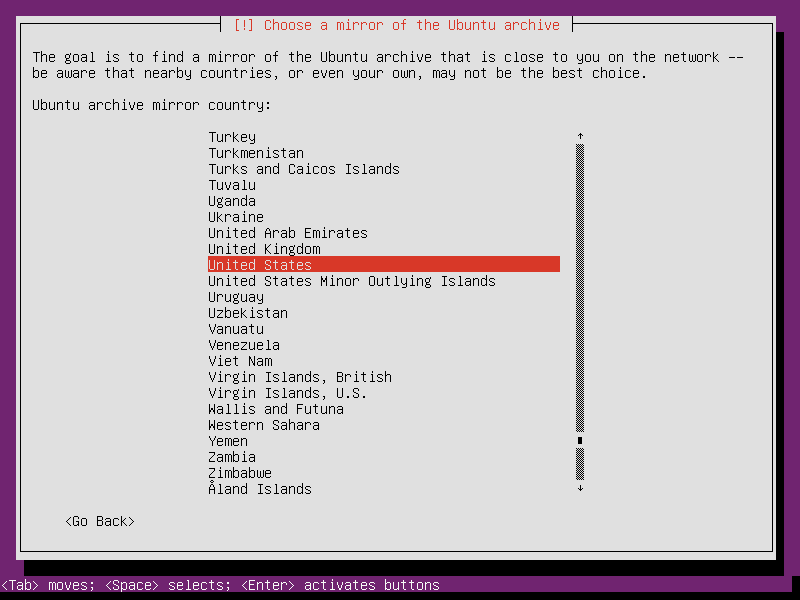

.. image:: images/screenshot/trustyInstall/108.png
    :alt: Mirror archive
    :align: center
    :width: 800px
    :height: 600px

.. image:: images/screenshot/trustyInstall/109.png
    :alt: Proxy
    :align: center
    :width: 800px
    :height: 600px

.. image:: images/screenshot/trustyInstall/110.png
    :alt: Full Name
    :align: center
    :width: 800px
    :height: 600px

.. image:: images/screenshot/trustyInstall/111.png
    :alt: Username
    :align: center
    :width: 800px
    :height: 600px

.. image:: images/screenshot/trustyInstall/112.png
    :alt: User password
    :align: center
    :width: 800px
    :height: 600px

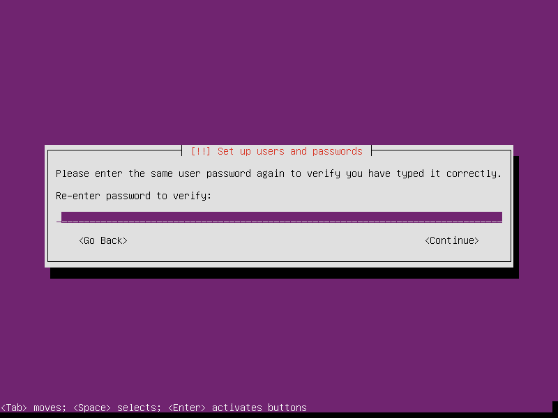

.. image:: images/screenshot/trustyInstall/114.png
    :alt: Encrypt home
    :align: center
    :width: 800px
    :height: 600px

.. image:: images/screenshot/trustyInstall/115.png
    :alt: Configure clock
    :align: center
    :width: 800px
    :height: 600px

.. image:: images/screenshot/trustyInstall/116.png
    :alt: Select time zone
    :align: center
    :width: 800px
    :height: 600px

2. Partitions
-------------

In the example below I create 3 partitions on the disk:

* sda1 is a 20GB ``root`` partition 
* sda2 is a 1GB LUKS encrypted ``swap`` partition using a **random key**
* sda3 uses the remaining space as a LUKS encrypted ``home`` partition using a **passphrase**

.. image:: images/screenshot/trustyInstall/200.png
    :alt: Partitioning method
    :align: center
    :width: 800px
    :height: 600px

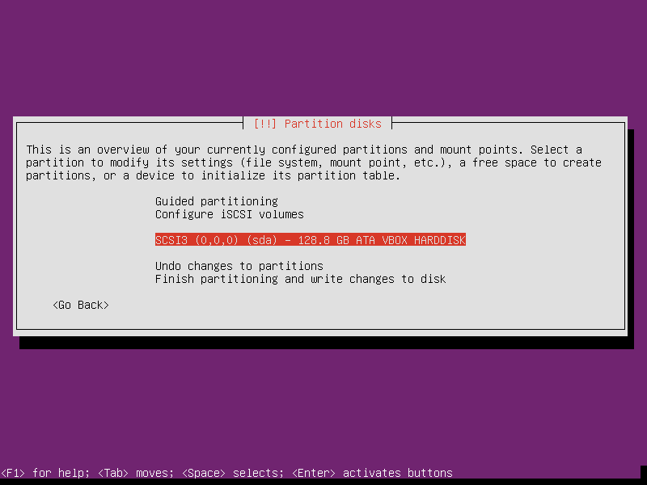

.. image:: images/screenshot/trustyInstall/202.png
    :alt: Partition table
    :align: center
    :width: 800px
    :height: 600px

.. image:: images/screenshot/trustyInstall/204.png
    :alt: New Partition
    :align: center
    :width: 800px
    :height: 600px

.. image:: images/screenshot/trustyInstall/205.png
    :alt: Partition size
    :align: center
    :width: 800px
    :height: 600px

.. image:: images/screenshot/trustyInstall/206.png
    :alt: Primary partition
    :align: center
    :width: 800px
    :height: 600px

.. image:: images/screenshot/trustyInstall/207.png
    :alt: Beginning
    :align: center
    :width: 800px
    :height: 600px

Setting ``Mount options: noatime`` decreases write operations and boosts drive speed:

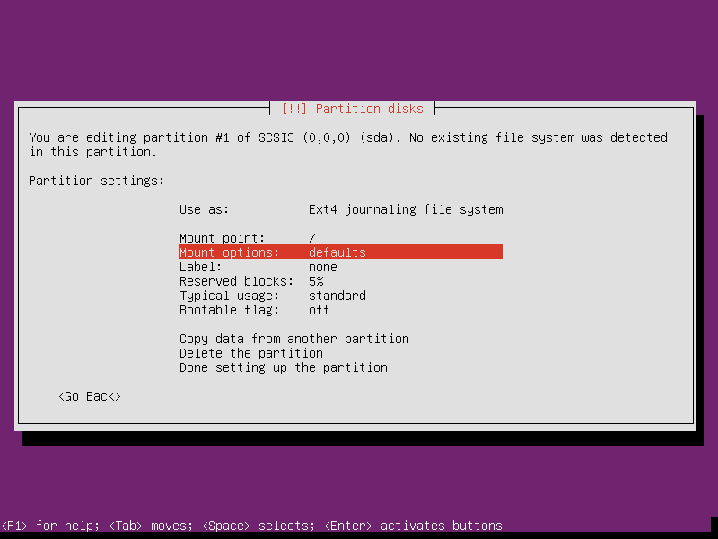

.. image:: images/screenshot/trustyInstall/209.png
    :alt: Mount options
    :align: center
    :width: 800px
    :height: 600px

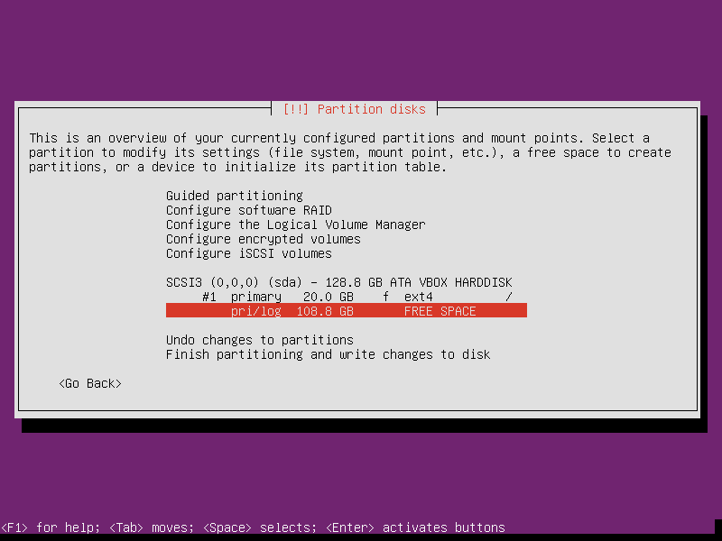

.. image:: images/screenshot/trustyInstall/212.png
    :alt: New partition
    :align: center
    :width: 800px
    :height: 600px

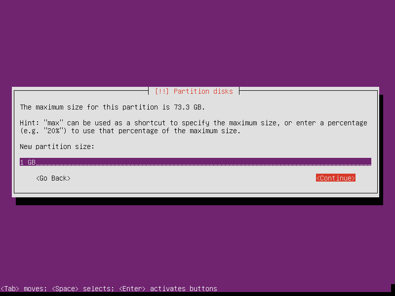

.. image:: images/screenshot/trustyInstall/214-1.png
    :alt: Primary partition
    :align: center
    :width: 800px
    :height: 600px

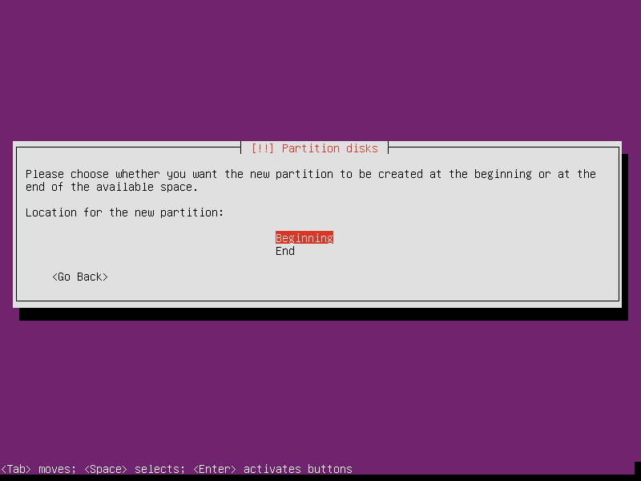
    
.. image:: images/screenshot/trustyInstall/215.png
    :alt: Use as
    :align: center
    :width: 800px
    :height: 600px

.. image:: images/screenshot/trustyInstall/216.png
    :alt: Encrypt volume
    :align: center
    :width: 800px
    :height: 600px

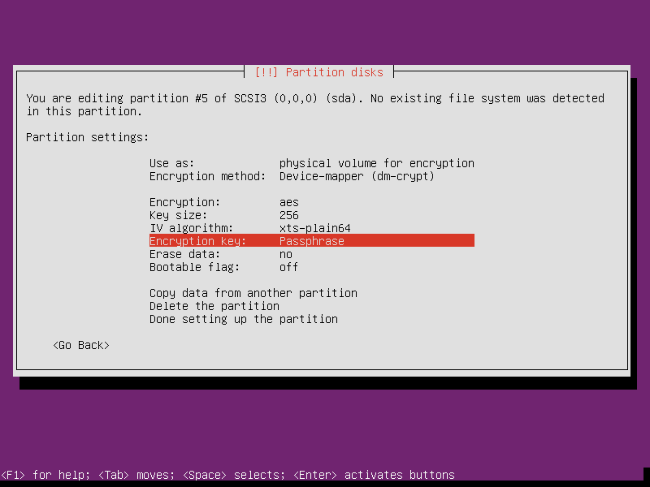

.. image:: images/screenshot/trustyInstall/218.png
    :alt: Random key
    :align: center
    :width: 800px
    :height: 600px

If the hard disk has not been securely wiped prior to installing Ubuntu (using a utility like `DBAN <http://www.circuidipity.com/multi-boot-usb.html>`_) you may want to configure ``Erase data: yes``. Note, however, that depending on the size of the disk this operation can last several hours:

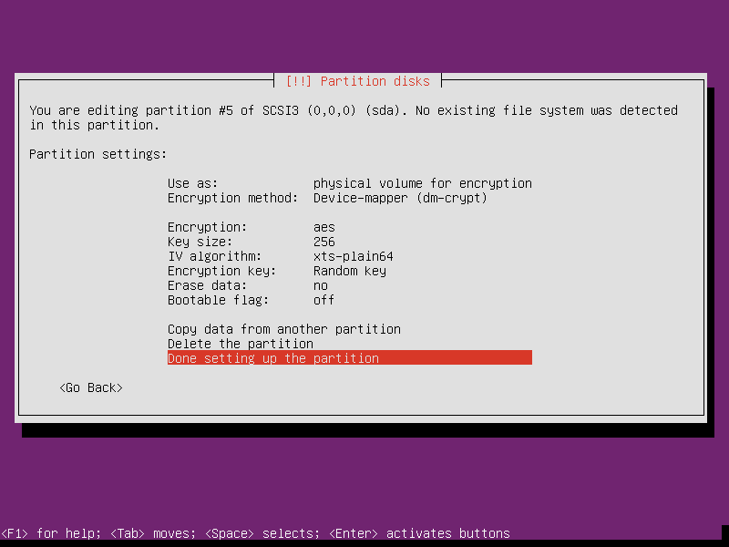

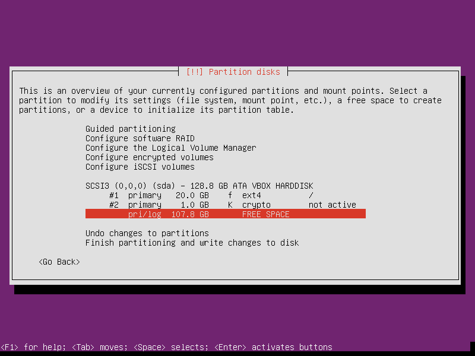

.. image:: images/screenshot/trustyInstall/221.png
    :alt: New partition
    :align: center
    :width: 800px
    :height: 600px

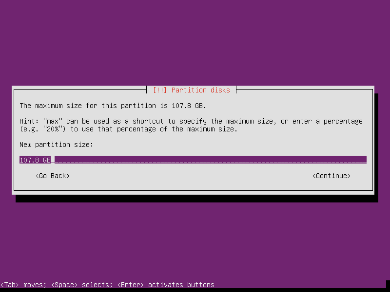

.. image:: images/screenshot/trustyInstall/223.png
    :alt: Primary partition
    :align: center
    :width: 800px
    :height: 600px

.. image:: images/screenshot/trustyInstall/224-1.png
    :alt: Beginning
    :align: center
    :width: 800px
    :height: 600px

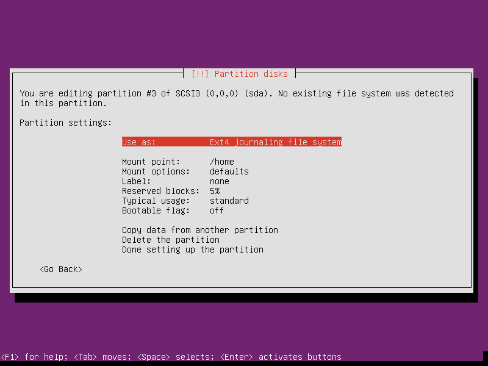

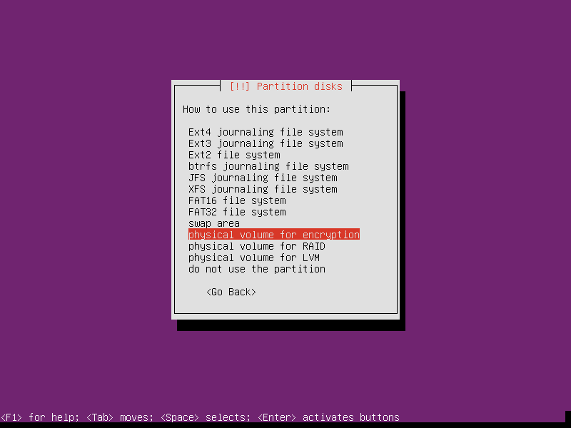

 

.. image:: images/screenshot/trustyInstall/228.png
    :alt: Write changes
    :align: center
    :width: 800px
    :height: 600px

.. image:: images/screenshot/trustyInstall/229.png
    :alt: Create encrypted volumes
    :align: center
    :width: 800px
    :height: 600px

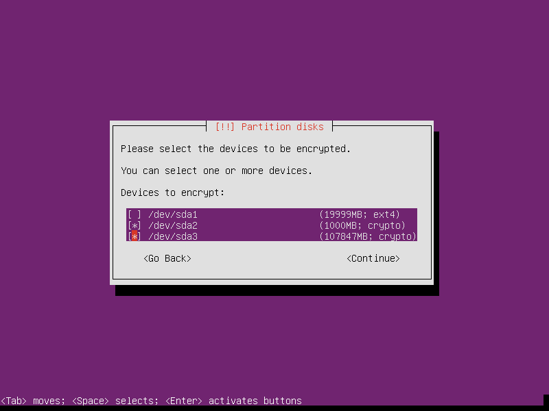

.. image:: images/screenshot/trustyInstall/231.png
    :alt: Finish
    :align: center
    :width: 800px
    :height: 600px

.. image:: images/screenshot/trustyInstall/232.png
    :alt: Encrypt passphrase
    :align: center
    :width: 800px
    :height: 600px

.. image:: images/screenshot/trustyInstall/233.png
    :alt: Verify passphrase
    :align: center
    :width: 800px
    :height: 600px

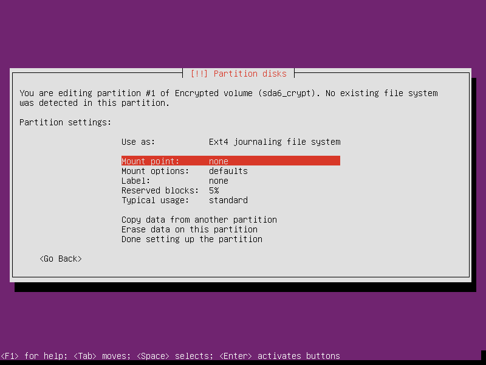

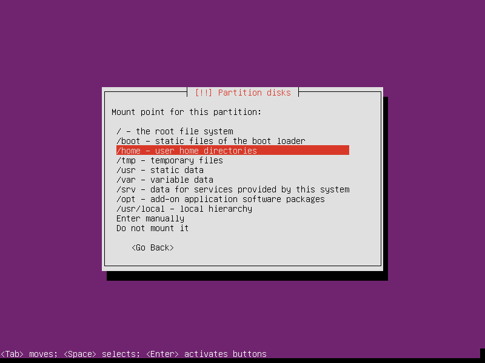

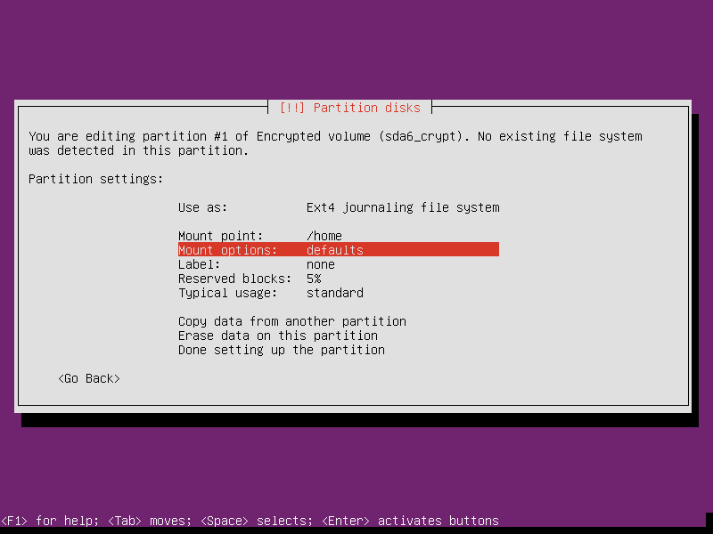

.. image:: images/screenshot/trustyInstall/238.png
    :alt: Mount options
    :align: center
    :width: 800px
    :height: 600px

**Reserved blocks** can be used by privileged system processes to write to disk - useful if a full filesystem blocks users from writing - and reduce disk fragmentation. On large, non-root partitions extra space can be gained by reducing the ``5%`` default reserve set by Ubuntu to ``1%``:

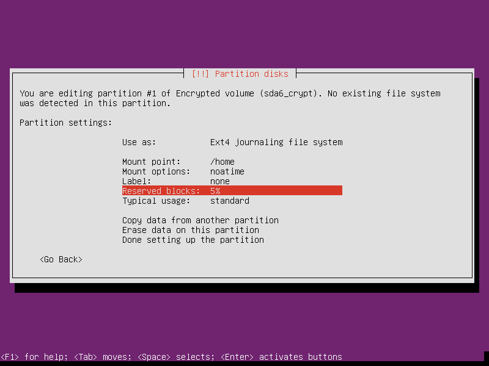

.. image:: images/screenshot/trustyInstall/240.png
    :alt: Percent reserved
    :align: center
    :width: 800px
    :height: 600px

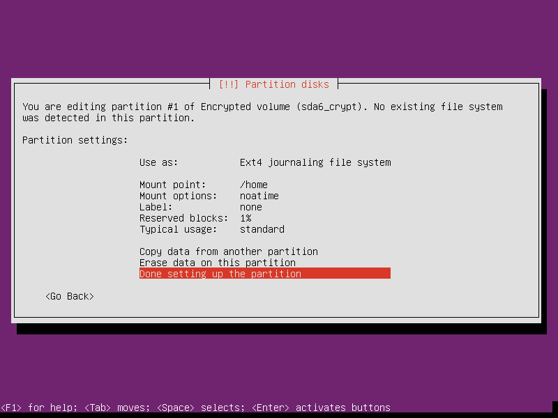

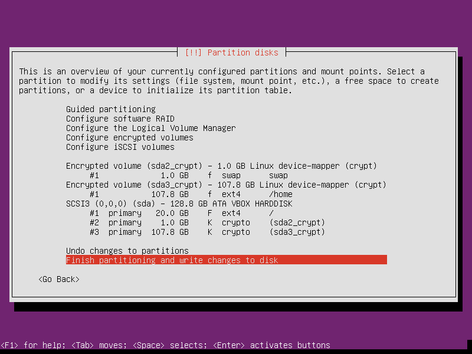

.. image:: images/screenshot/trustyInstall/243.png
    :alt: Write changes
    :align: center
    :width: 800px
    :height: 600px

3. Install packages and finish up
---------------------------------

.. image:: images/screenshot/trustyInstall/300.png
    :alt: No automatic updates
    :align: center
    :width: 800px
    :height: 600px

Leave all tasks unmarked if you wish to start with a minimal, console-only base configuration ready for further customization. This task menu can be accessed post-install by running:

.. code-block:: bash

    $ sudo tasksel

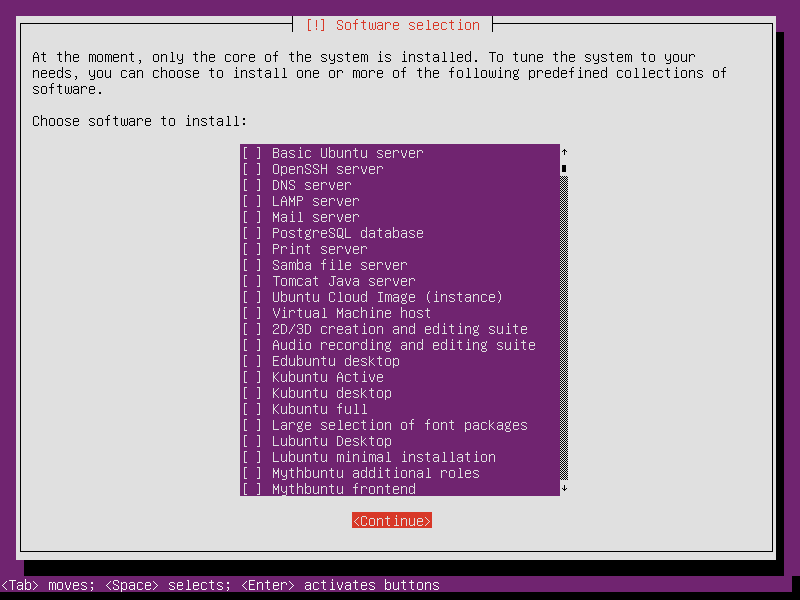

Or get started making a Linux home server:

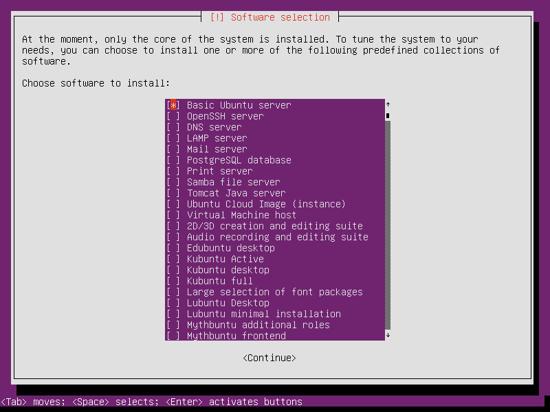

Perhaps install a lightweight desktop? I like `Lubuntu (Ubuntu + LXDE desktop) <http://www.circuidipity.com/tag-lubuntu.html>`_:

.. image:: images/screenshot/trustyInstall/301-2.png
    :alt: Software selection
    :align: center
    :width: 800px
    :height: 600px

More packages are downloaded and the installer makes its finishing touches:

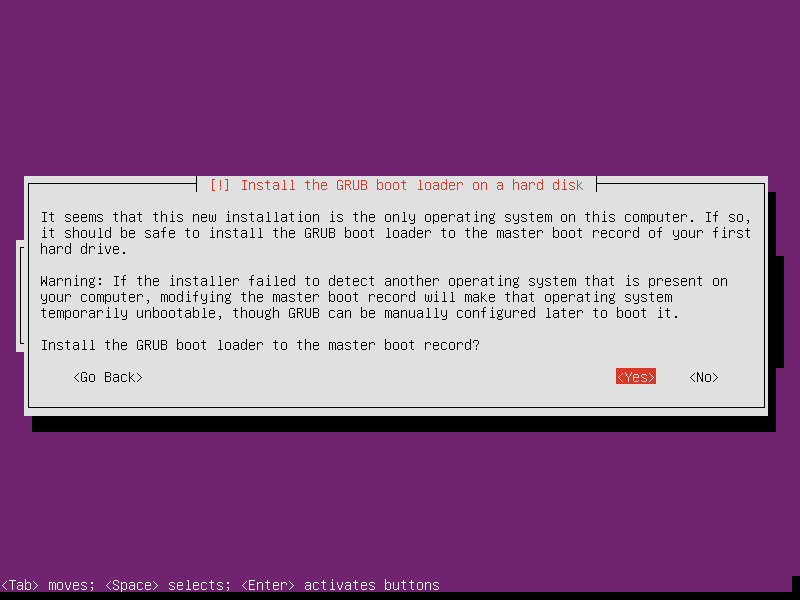

.. image:: images/screenshot/trustyInstall/303.png
    :alt: UTC
    :align: center
    :width: 800px
    :height: 600px

.. image:: images/screenshot/trustyInstall/304.png
    :alt: Finish install
    :align: center
    :width: 800px
    :height: 600px

System will display a passphrase prompt to unlock encrypted ``home`` partition:

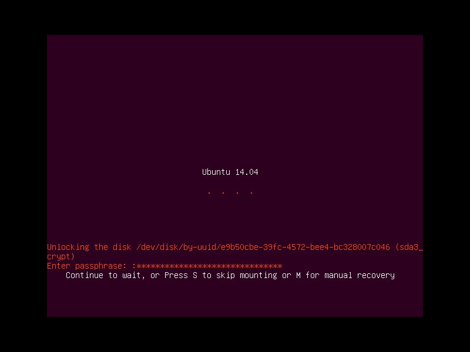

.. image:: images/screenshot/trustyInstall/306.png
    :alt: Login
    :align: center
    :width: 800px
    :height: 600px

Happy hacking!

Notes
-----

.. [1] Specifically in this instance, the Ubuntu console installer provides a random key option for the encrypted swap partition.
