============================
Ubuntu 14.04 Minimal Install
============================

:date: 2014-07-07 01:23:00
:tags: ubuntu, linux
:slug: ubuntu-trusty-install

.. image:: images/ubuntuTrusty.png
    :alt: Ubuntu Trusty Tahr
    :align: left
    :width: 100px
    :height: 100px

`Ubuntu 14.04 "Trusty Tahr" <http://www.ubuntu.com/desktop>`_ is a *long-term support* release (till 2019) of the popular Linux operating system. I use Ubuntu's `minimal install image <https://help.ubuntu.com/community/Installation/MinimalCD>`_ to create a *lightweight, console-only* base configuration that can be customized for various tasks and alternate desktops.

Below is a visual walk-through of a sample Ubuntu setup that makes use of an entire storage device divided into 3 partitions: unencrypted ``root`` and `LUKS <https://en.wikipedia.org/wiki/Linux_Unified_Key_Setup>`_ encrypted ``home`` + ``swap``. 

Step 0 - Installer
==================

Download a `64-bit <http://archive.ubuntu.com/ubuntu/dists/trusty/main/installer-amd64/current/images/netboot/mini.iso>`_ (`32-bit <http://archive.ubuntu.com/ubuntu/dists/trusty/main/installer-i386/current/images/netboot/mini.iso>`_ for older machines) Ubuntu *mini.iso* and burn the image to a CD or `prepare a USB boot device <http://www.circuidipity.com/multi-boot-usb.html>`_.

Step 1 - Go!
============

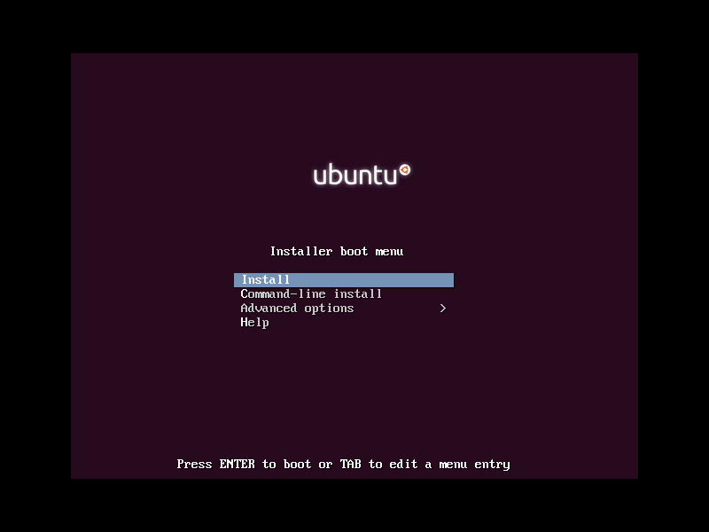

.. image:: images/screenshot/trustyInstall/02.png
    :align: center
    :alt: Select Language
    :width: 800px
    :height: 600px

.. image:: images/screenshot/trustyInstall/03.png
    :alt: Select Location
    :align: center
    :width: 800px
    :height: 600px

.. image:: images/screenshot/trustyInstall/04.png
    :alt: Configure Keyboard
    :align: center
    :width: 800px
    :height: 600px

.. image:: images/screenshot/trustyInstall/041.png
    :alt: Configure Keyboard
    :align: center
    :width: 800px
    :height: 600px

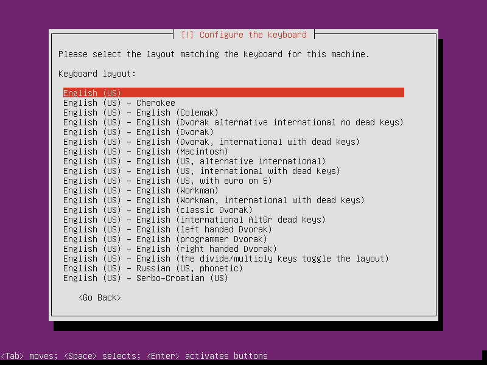

.. image:: images/screenshot/trustyInstall/05.png
    :alt: Hostname
    :align: center
    :width: 800px
    :height: 600px

.. image:: images/screenshot/trustyInstall/06.png
    :alt: Mirror Country
    :align: center
    :width: 800px
    :height: 600px

.. image:: images/screenshot/trustyInstall/07.png
    :alt: Mirror archive
    :align: center
    :width: 800px
    :height: 600px

.. image:: images/screenshot/trustyInstall/08.png
    :alt: Proxy
    :align: center
    :width: 800px
    :height: 600px

.. image:: images/screenshot/trustyInstall/09.png
    :alt: Full Name
    :align: center
    :width: 800px
    :height: 600px

.. image:: images/screenshot/trustyInstall/10.png
    :alt: Username
    :align: center
    :width: 800px
    :height: 600px

.. image:: images/screenshot/trustyInstall/11.png
    :alt: User password
    :align: center
    :width: 800px
    :height: 600px

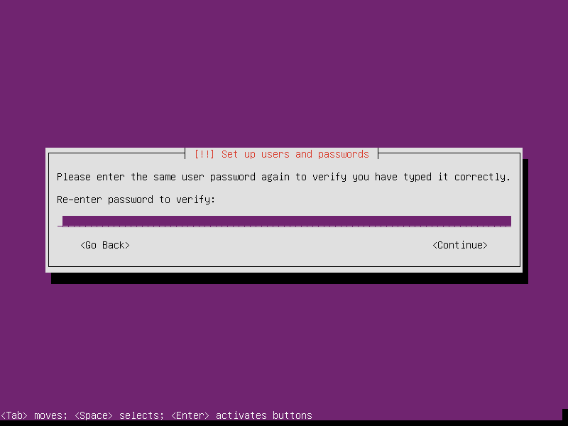

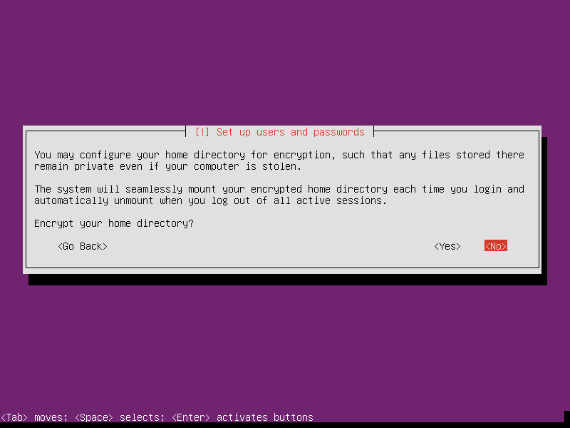

.. image:: images/screenshot/trustyInstall/14.png
    :alt: Configure clock
    :align: center
    :width: 800px
    :height: 600px

.. image:: images/screenshot/trustyInstall/15.png
    :alt: Select time zone
    :align: center
    :width: 800px
    :height: 600px

Step 2 - Partitions
===================

In the example below we create 3 partitions on the disk:

* sda1 is a 16GB ``root`` partition 
* sda5 is a 1GB LUKS encrypted ``swap`` partition using a *random key*
* sda6 uses the remaining space as a LUKS encrypted ``home`` partition using a *passphrase*

.. image:: images/screenshot/trustyInstall/16.png
    :alt: Partitioning method
    :align: center
    :width: 800px
    :height: 600px

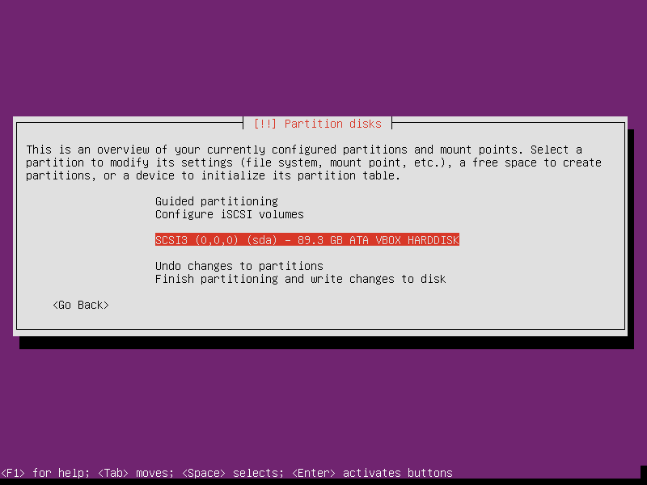

.. image:: images/screenshot/trustyInstall/18.png
    :alt: Partition table
    :align: center
    :width: 800px
    :height: 600px

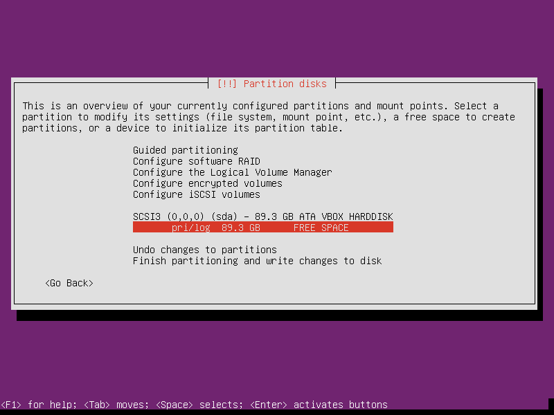

.. image:: images/screenshot/trustyInstall/20.png
    :alt: New Partition
    :align: center
    :width: 800px
    :height: 600px

.. image:: images/screenshot/trustyInstall/22.png
    :alt: Primary partition
    :align: center
    :width: 800px
    :height: 600px

.. image:: images/screenshot/trustyInstall/23.png
    :alt: Beginning
    :align: center
    :width: 800px
    :height: 600px

Setting **Mount options** to ``noatime`` decreases write operations and boosts drive speed.

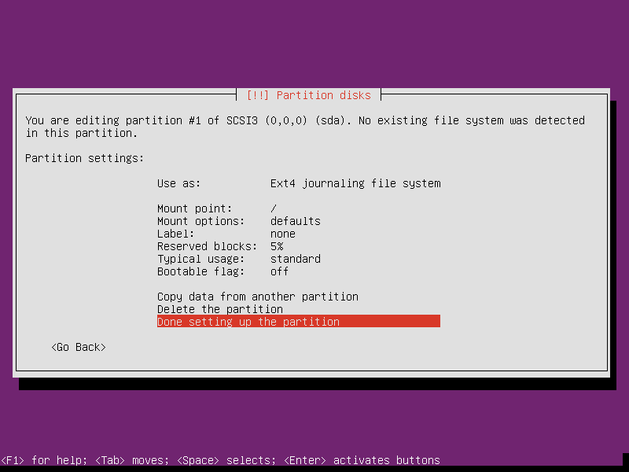

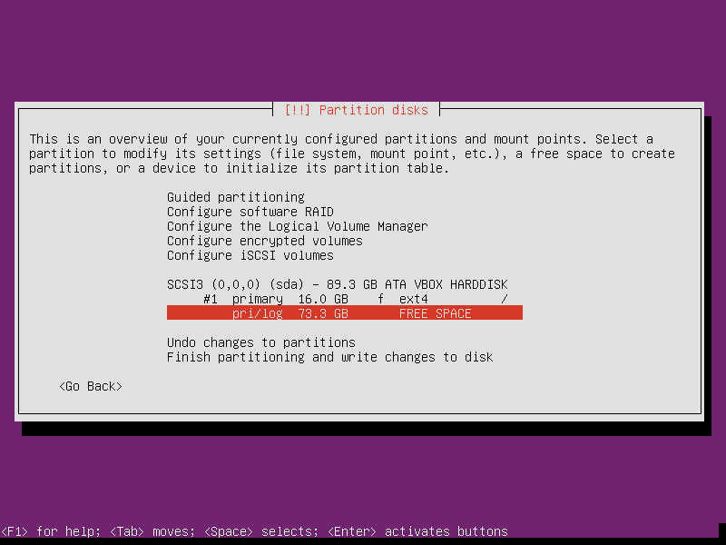

.. image:: images/screenshot/trustyInstall/26.png
    :alt: New partition
    :align: center
    :width: 800px
    :height: 600px

.. image:: images/screenshot/trustyInstall/27.png
    :alt: Partition size
    :align: center
    :width: 800px
    :height: 600px

.. image:: images/screenshot/trustyInstall/28.png
    :alt: Logical partition
    :align: center
    :width: 800px
    :height: 600px

.. image:: images/screenshot/trustyInstall/29.png
    :alt: Beginning
    :align: center
    :width: 800px
    :height: 600px

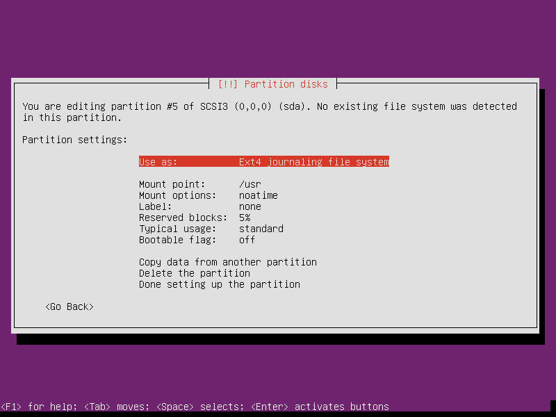

.. image:: images/screenshot/trustyInstall/31.png
    :alt: Encrypt volume
    :align: center
    :width: 800px
    :height: 600px

If the hard disk has not been securely wiped prior to installing Ubuntu (using a utility like `DBAN <http://www.circuidipity.com/multi-boot-usb.html>`_) you may want to configure *Erase data* as *yes*. Note, however, that depending on the size of the disk this operation can last several hours.

.. image:: images/screenshot/trustyInstall/32.png
    :alt: Encryption key
    :align: center
    :width: 800px
    :height: 600px

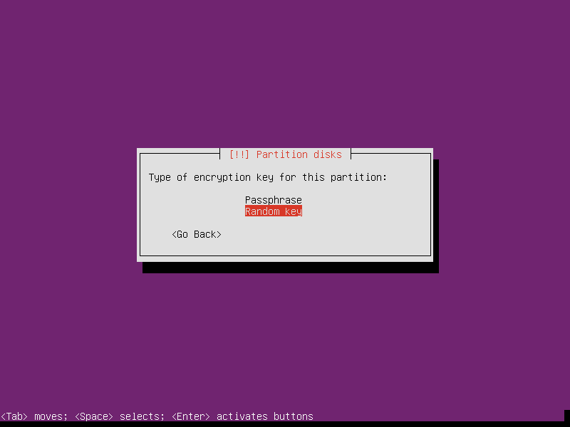

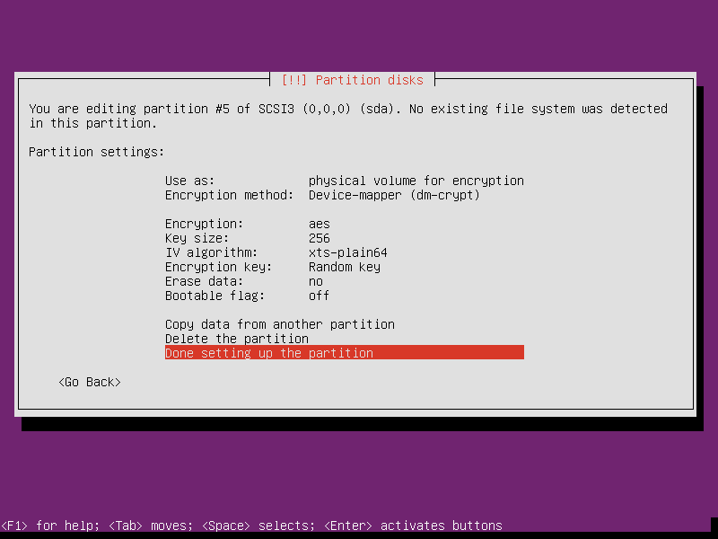

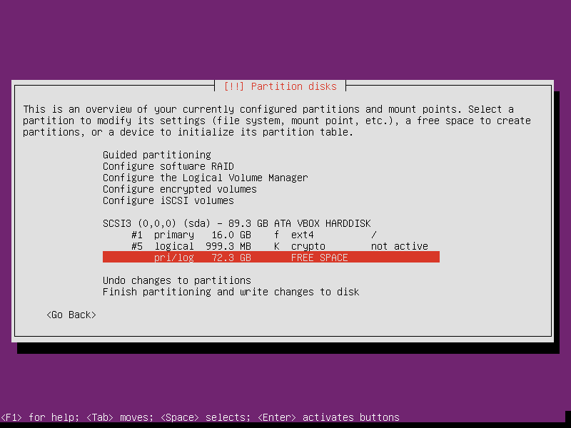

.. image:: images/screenshot/trustyInstall/36.png
    :alt: New partition
    :align: center
    :width: 800px
    :height: 600px

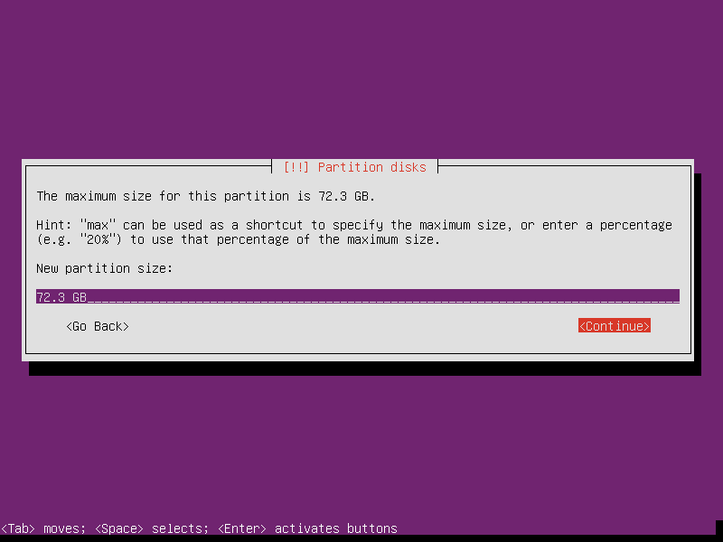

.. image:: images/screenshot/trustyInstall/38.png
    :alt: Logical partition
    :align: center
    :width: 800px
    :height: 600px

.. image:: images/screenshot/trustyInstall/40.png
    :alt: Encrypt volume
    :align: center
    :width: 800px
    :height: 600px

 
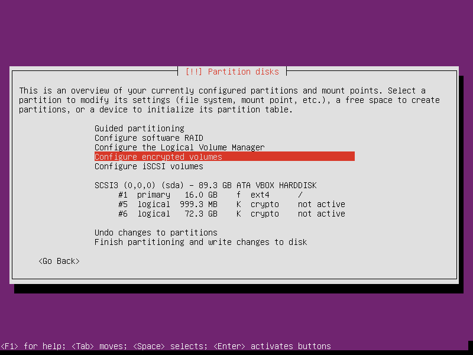

.. image:: images/screenshot/trustyInstall/43.png
    :alt: Write changes to disk
    :align: center
    :width: 800px
    :height: 600px

.. image:: images/screenshot/trustyInstall/44.png
    :alt: Create encrypted volumes
    :align: center
    :width: 800px
    :height: 600px

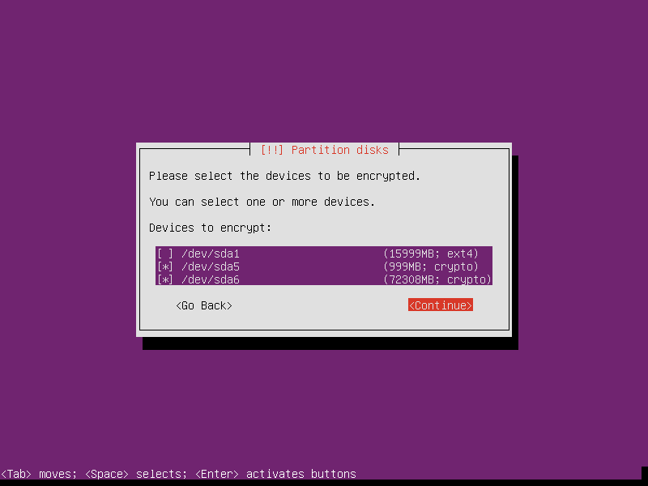

.. image:: images/screenshot/trustyInstall/46.png
    :alt: Finish encrypt
    :align: center
    :width: 800px
    :height: 600px

.. image:: images/screenshot/trustyInstall/47.png
    :alt: Encryption passphrase
    :align: center
    :width: 800px
    :height: 600px

.. image:: images/screenshot/trustyInstall/48.png
    :alt: Verify passphrase
    :align: center
    :width: 800px
    :height: 600px

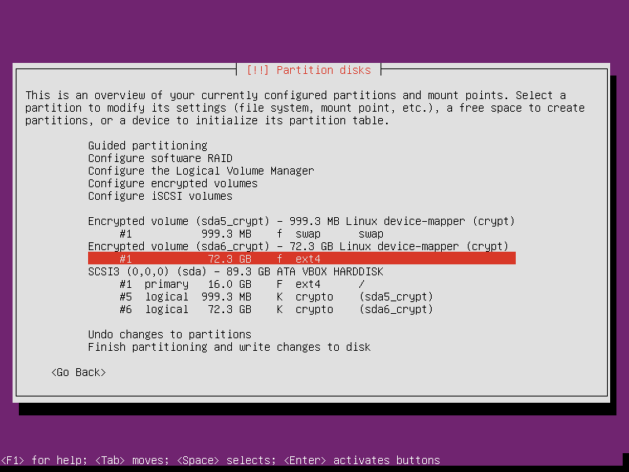

.. image:: images/screenshot/trustyInstall/50.png
    :alt: Mount point
    :align: center
    :width: 800px
    :height: 600px

.. image:: images/screenshot/trustyInstall/51.png
    :alt: Mount home
    :align: center
    :width: 800px
    :height: 600px

.. image:: images/screenshot/trustyInstall/52.png
    :alt: Mount options
    :align: center
    :width: 800px
    :height: 600px

.. image:: images/screenshot/trustyInstall/53.png
    :alt: noatime
    :align: center
    :width: 800px
    :height: 600px

**Reserved blocks** can be used by privileged system processes to write to disk - useful if a full filesystem blocks users from writing - and reduce disk fragmentation. On large, non-root partitions extra space can be gained by reducing the 5% reserve set aside by Ubuntu to 1%.

.. image:: images/screenshot/trustyInstall/54.png
    :alt: Reserved blocks
    :align: center
    :width: 800px
    :height: 600px

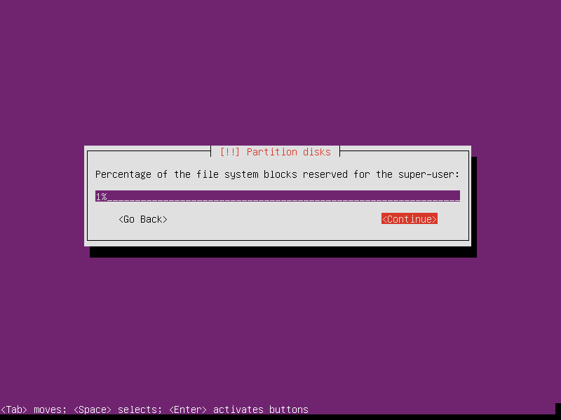

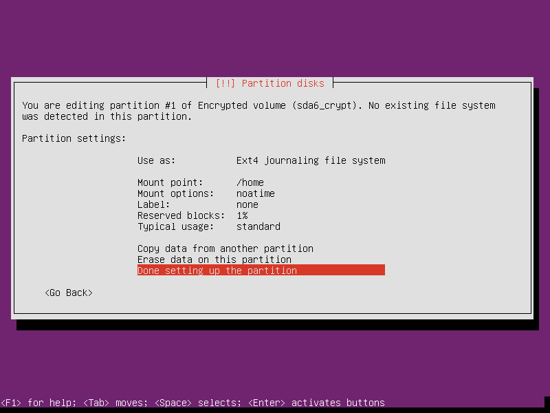

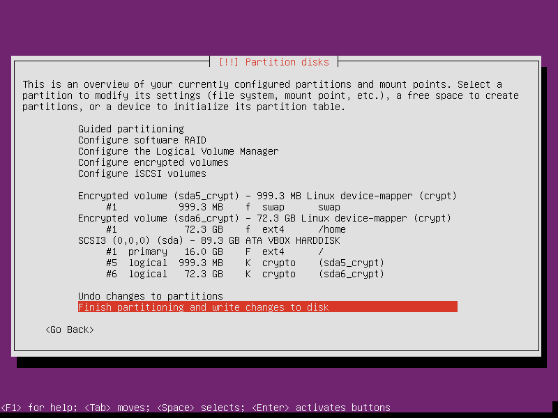

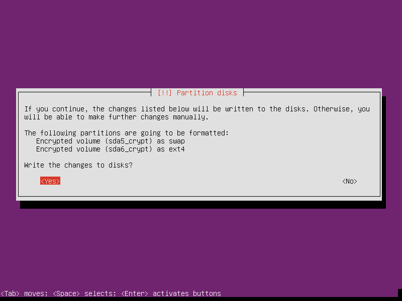

Step 3 - Install packages and finish up
=======================================

.. image:: images/screenshot/trustyInstall/59.png
    :alt: No automatic updates
    :align: center
    :width: 800px
    :height: 600px

Leave all tasks unmarked if you wish to start with a minimal, console-only base configuration ready for further customization. The task menu can be accessed post-install by running ``sudo tasksel``.

.. image:: images/screenshot/trustyInstall/60.png
    :alt: Software selection
    :align: center
    :width: 800px
    :height: 600px

.. image:: images/screenshot/trustyInstall/61.png
    :alt: GRUB
    :align: center
    :width: 800px
    :height: 600px

.. image:: images/screenshot/trustyInstall/62.png
    :alt: UTC
    :align: center
    :width: 800px
    :height: 600px

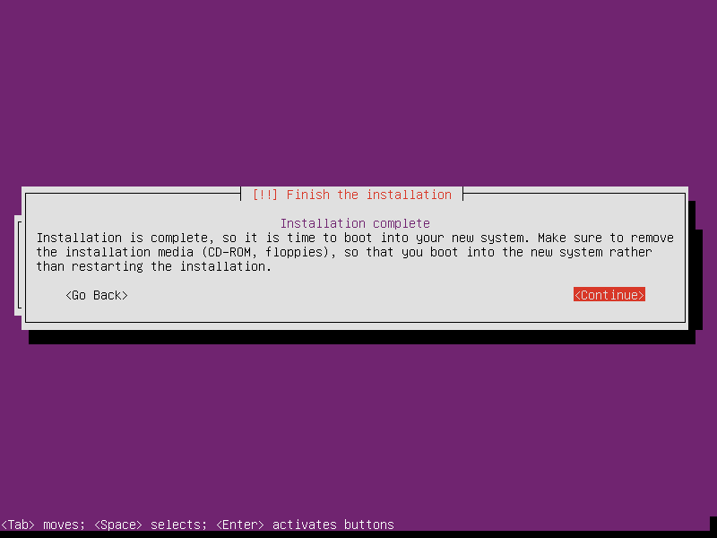

If an encrypted ``home`` partition was created in Step 2 the system will display a passphrase prompt to unlock the partition.

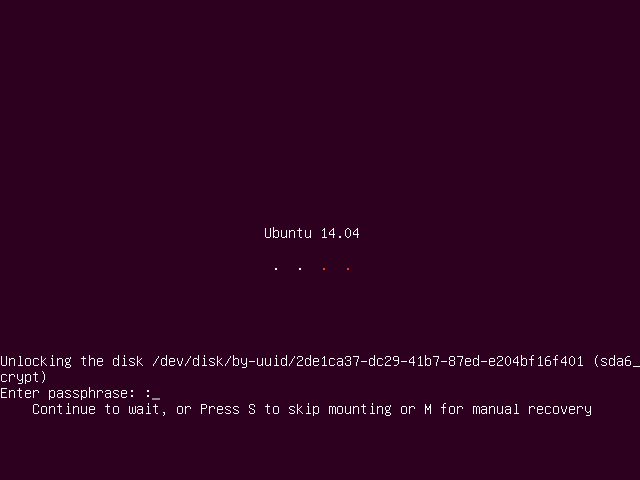

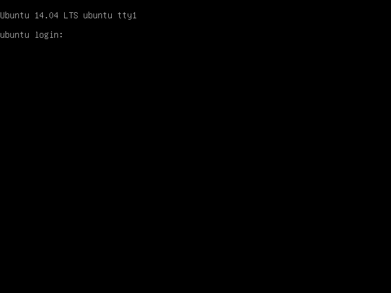

Happy hacking!
