===========================
Ping Parade #1 -- Repurpose
===========================

:slug: pingparade1
:tags: network, debian, linux
:template: article-project-pingparade

**Give new life to an old netbook or laptop as a Linux home server.**

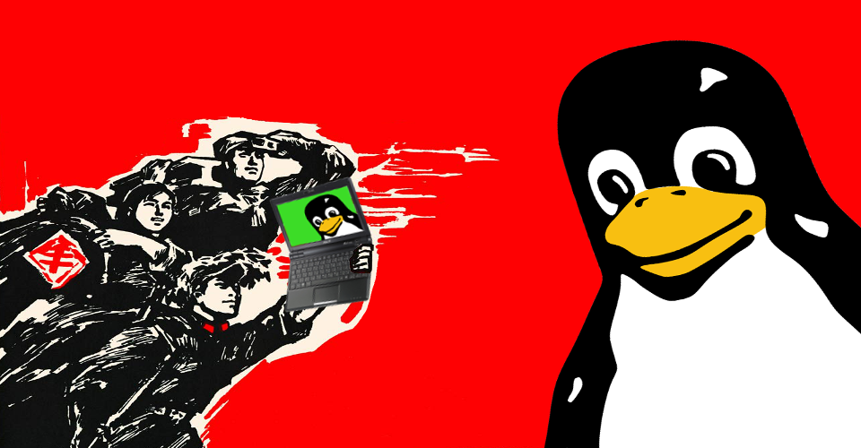

Running your own Linux home server is a fun learning experience and offers several advantages.

It is cheap if you already have a spare machine. Or search for inexpensive, second-hand netbooks now that the short-lived craze for these lightweight devices has well and truly passed. An old netbook or laptop - retired in favour of more current and powerful machines - can still deliver plenty of *oomph* for running a personal server. Netbooks are frugal with power and come equipped with multiple network interfaces and their own built-in UPS/battery! I have been using an Asus 900HA netbook equipped with 1GM RAM and (user-replaced) 500GB hard drive for the past few years as a 24/7 home server.

A stable Linux distribution can be installed on the device and provide ongoing services such as printing, hosting torrents or websites, and file backups. `Debian GNU/Linux <http://www.debian.org>`_ is an operating system created by volunteers of one of the largest and longest-running free software projects in the world. More than a hundred other Linux distributions like `Ubuntu <http://www.circuidipity.com/ubuntu-trusty-install.html>`_ build their edifices on solid Debian *awesomesauce*.

There are 3 Debian **release branches** - ``stable``, ``testing``, and ``unstable`` - and the current stable branch goes by the name **wheezy**. I use the `minimal install image <http://www.circuidipity.com/multi-boot-usb.html>`_ to create a **lightweight, console-only** base configuration that can be customized for various tasks.

Below is a visual walk-through of a sample Debian home server setup that makes use of an entire storage device divided into ``root`` + ``swap`` + ``home`` partitions.

Step 0 - Installer
==================

Download a `32bit <http://ftp.us.debian.org/debian/dists/stable/main/installer-i386/current/images/netboot/mini.iso>`_ Debian **mini.iso** and burn the image to a CD or `prepare a USB boot device <http://www.circuidipity.com/multi-boot-usb.html>`_.

Step 1 - Go!
============

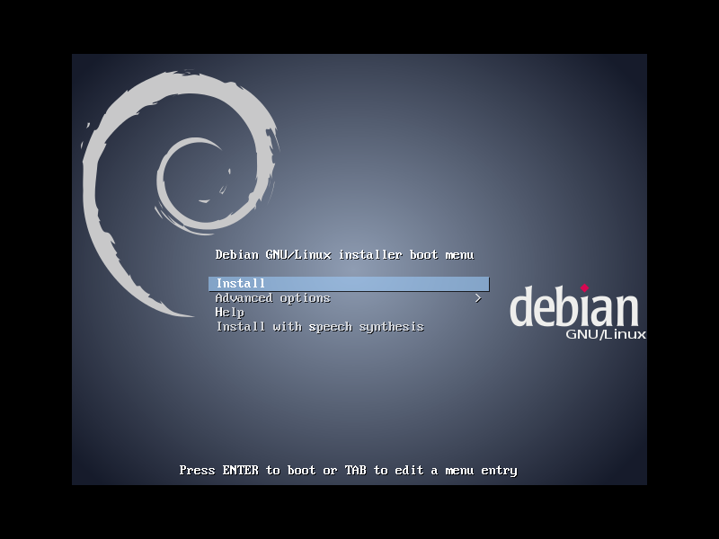

.. image:: images/screenshot/netbookServer/02.png
    :align: center
    :alt: Select Language
    :width: 800px
    :height: 600px

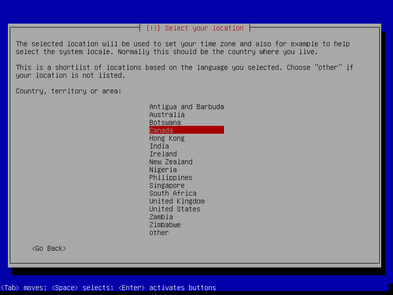

.. image:: images/screenshot/netbookServer/04.png
    :alt: Configure Keyboard
    :align: center
    :width: 800px
    :height: 600px

.. image:: images/screenshot/netbookServer/05.png
    :alt: Hostname
    :align: center
    :width: 800px
    :height: 600px

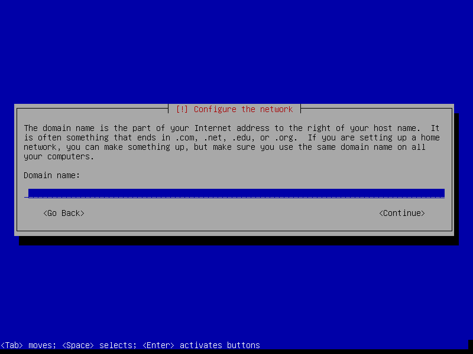

.. image:: images/screenshot/netbookServer/07.png
    :alt: Mirror Country
    :align: center
    :width: 800px
    :height: 600px

.. image:: images/screenshot/netbookServer/08.png
    :alt: Mirror archive
    :align: center
    :width: 800px
    :height: 600px

.. image:: images/screenshot/netbookServer/09.png
    :alt: Mirror Directory
    :align: center
    :width: 800px
    :height: 600px

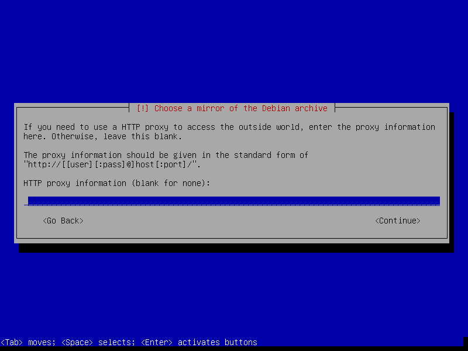

.. image:: images/screenshot/netbookServer/11.png
    :alt: Root password
    :align: center
    :width: 800px
    :height: 600px

.. image:: images/screenshot/netbookServer/12.png
    :alt: Verify password
    :align: center
    :width: 800px
    :height: 600px

.. image:: images/screenshot/netbookServer/13.png
    :alt: Full Name
    :align: center
    :width: 800px
    :height: 600px

.. image:: images/screenshot/netbookServer/14.png
    :alt: Username
    :align: center
    :width: 800px
    :height: 600px

.. image:: images/screenshot/netbookServer/15.png
    :alt: User password
    :align: center
    :width: 800px
    :height: 600px

.. image:: images/screenshot/netbookServer/16.png
    :alt: Verify password
    :align: center
    :width: 800px
    :height: 600px

.. image:: images/screenshot/netbookServer/17.png
    :alt: Select time zone
    :align: center
    :width: 800px
    :height: 600px

Step 2 - Partitions
===================

In the example below I create 3 partitions on the disk:

* sda1 is a 10GB ``root`` partition 
* sda5 is a 1GB ``swap`` partition
* sda6 uses remaining space as a ``home`` partition (useful backup location for user files)

.. image:: images/screenshot/netbookServer/18.png
    :alt: Partitioning method
    :align: center
    :width: 800px
    :height: 600px

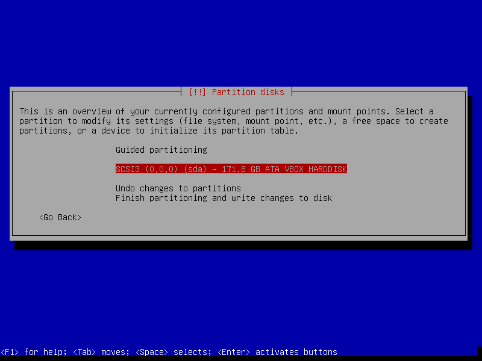

.. image:: images/screenshot/netbookServer/20.png
    :alt: Partition table
    :align: center
    :width: 800px
    :height: 600px

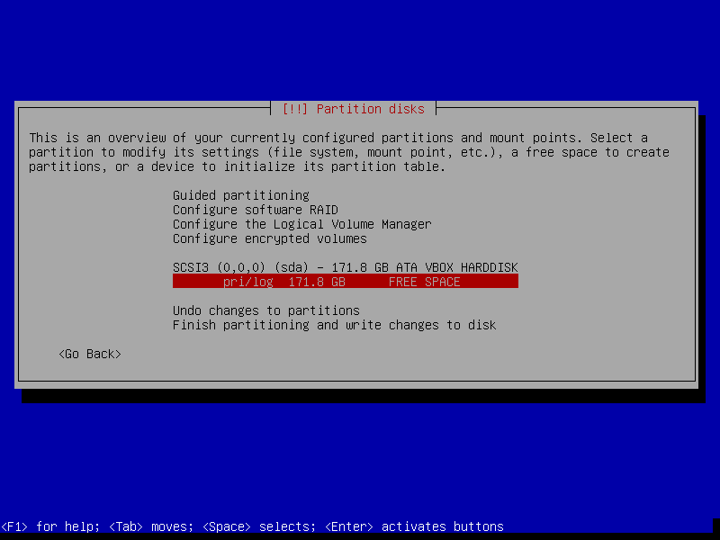

.. image:: images/screenshot/netbookServer/22.png
    :alt: New Partition
    :align: center
    :width: 800px
    :height: 600px

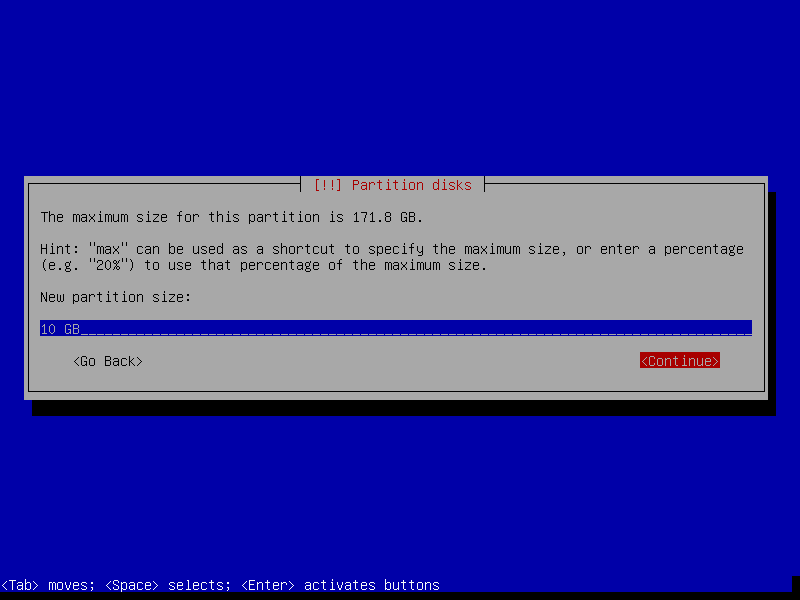

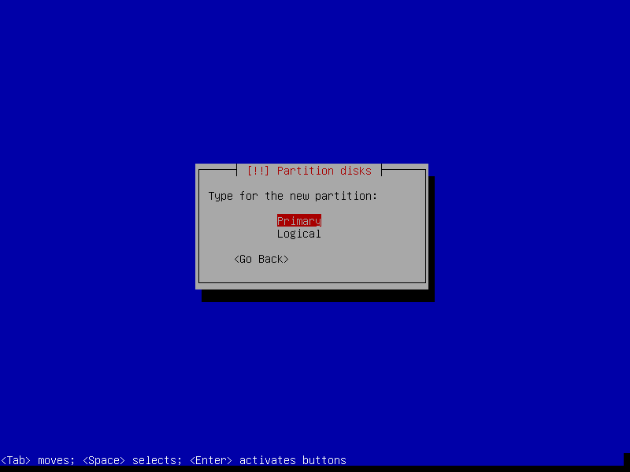

.. image:: images/screenshot/netbookServer/25.png
    :alt: Beginning
    :align: center
    :width: 800px
    :height: 600px

.. note::

    Setting *Mount options* to *noatime* decreases write operations and boosts drive speed.

.. image:: images/screenshot/netbookServer/26.png
    :alt: Mount options
    :align: center
    :width: 800px
    :height: 600px

.. image:: images/screenshot/netbookServer/27.png
    :alt: noatime
    :align: center
    :width: 800px
    :height: 600px

.. image:: images/screenshot/netbookServer/28.png
    :alt: Done setting up partition
    :align: center
    :width: 800px
    :height: 600px

.. image:: images/screenshot/netbookServer/29.png
    :alt: Free space
    :align: center
    :width: 800px
    :height: 600px

.. image:: images/screenshot/netbookServer/30.png
    :alt: New partition
    :align: center
    :width: 800px
    :height: 600px

.. image:: images/screenshot/netbookServer/32.png
    :alt: Logical partition
    :align: center
    :width: 800px
    :height: 600px

.. image:: images/screenshot/netbookServer/33.png
    :alt: Beginning
    :align: center
    :width: 800
    :height: 600px

.. image:: images/screenshot/netbookServer/34.png
    :alt: Use as
    :align: center
    :width: 800px
    :height: 600px

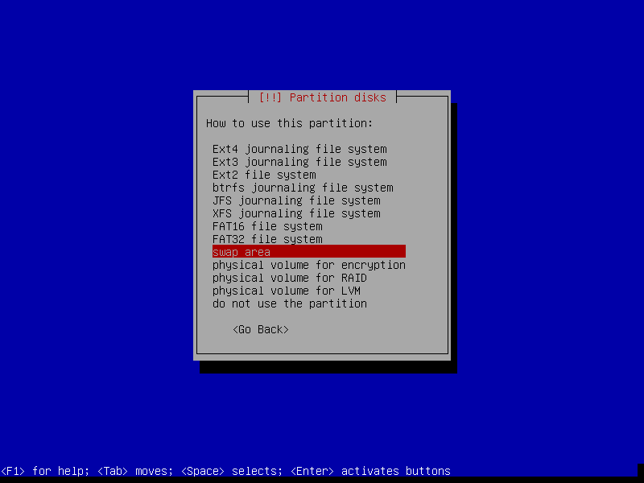

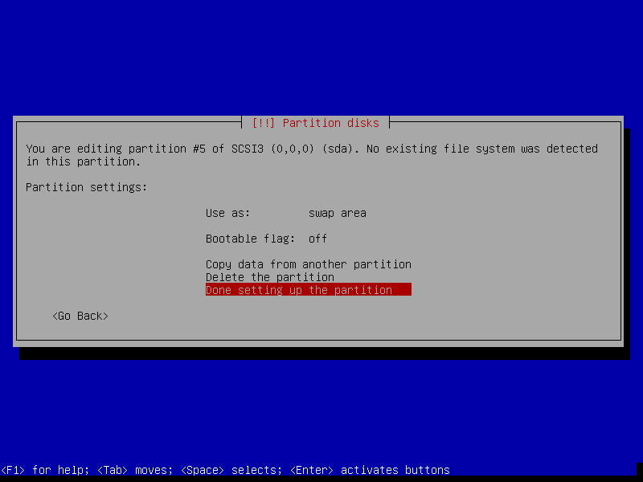

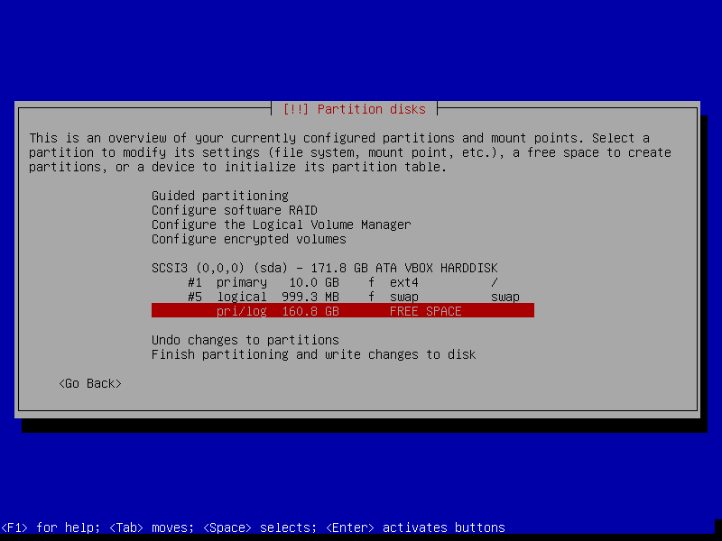

.. image:: images/screenshot/netbookServer/38.png
    :alt: New partition
    :align: center
    :width: 800px
    :height: 600px

.. image:: images/screenshot/netbookServer/40.png
    :alt: Logical partition
    :align: center
    :width: 800px
    :height: 600px

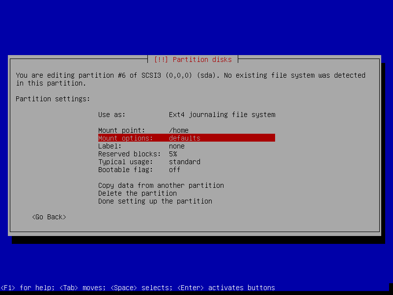

.. image:: images/screenshot/netbookServer/42.png
    :alt: noatime
    :align: center
    :width: 800px
    :height: 600px

.. note::

    **Reserved blocks** can be used by privileged system processes to write to disk - useful if a full filesystem blocks users from writing - and reduce disk fragmentation. On large, non-root partitions extra space can be gained by reducing the 5% reserve set aside by Debian to 1%.

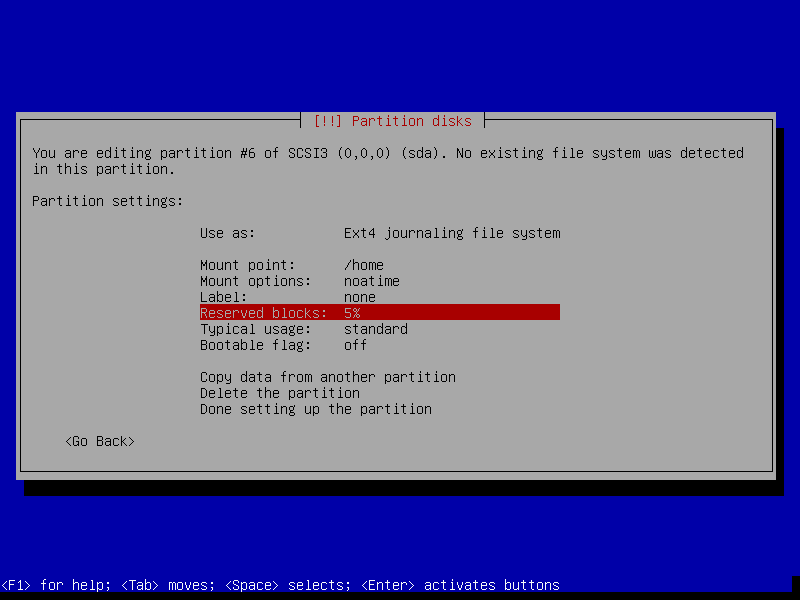

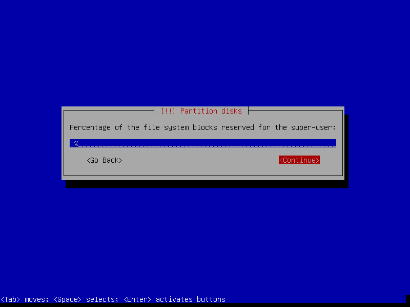

.. image:: images/screenshot/netbookServer/45.png
    :alt: Done setting up the partition
    :align: center
    :width: 800px
    :height: 600px

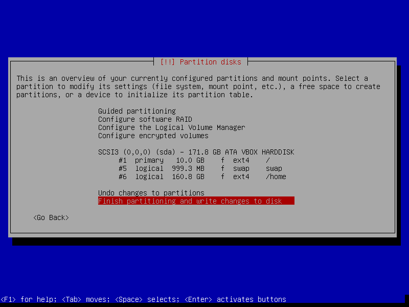

.. image:: images/screenshot/netbookServer/47.png
    :alt: Write changes to disk
    :align: center
    :width: 800px
    :height: 600px

Step 3 - Install packages and reboot
====================================

.. image:: images/screenshot/netbookServer/48.png
    :alt: Popularity-contest
    :align: center
    :width: 800px
    :height: 600px

.. note::

    Select only **[*] Standard system utilities** if you wish to start with a minimal, console-only base configuration ready for further customization. The task menu can be accessed post-install by running ``tasksel``.
    
.. image:: images/screenshot/netbookServer/49.png
    :alt: Software selection
    :align: center
    :width: 800px
    :height: 600px

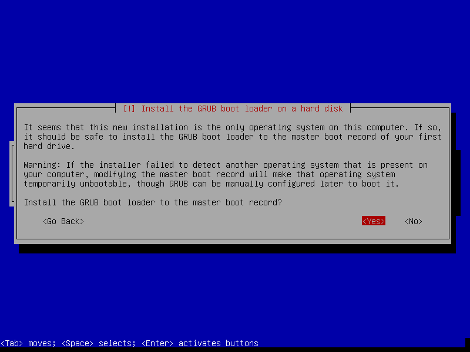

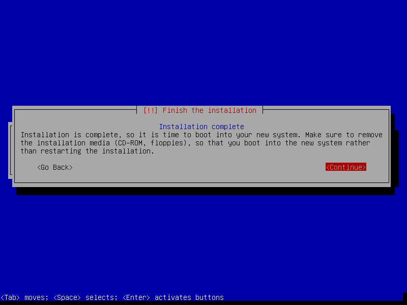

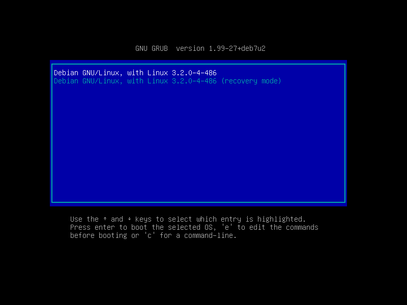

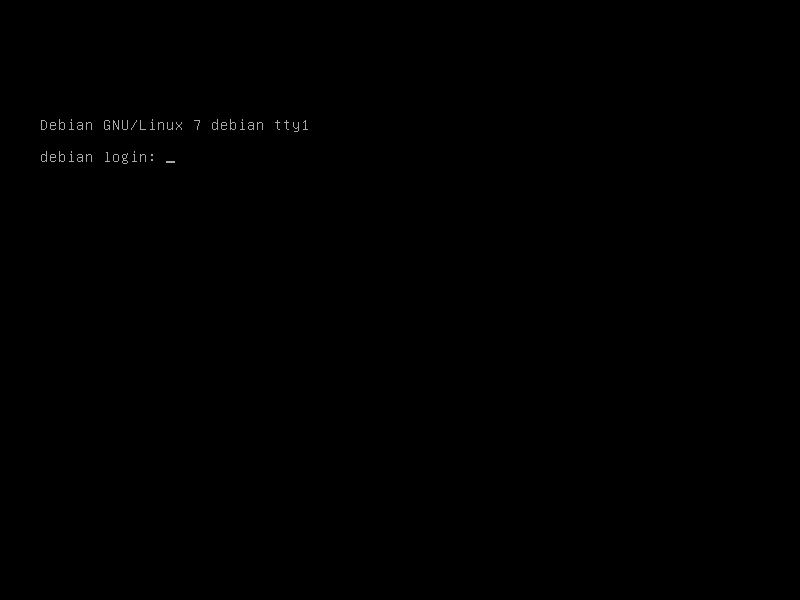

Step 4 - Static network interface
=================================

For a home server that is going to stay put in one location its a good idea to configure the device with a static network interface. Log in as root and run ``nano /etc/network/interfaces`` to configure (in example below) the ethernet port with a static address...

.. code-block:: bash

    # The loopback network interface
    auto lo
    iface lo inet loopback

    # The primary network interface
    auto eth0
    iface eth0 inet static
        address 192.168.1.2
        netmask 255.255.255.0
        gateway 192.168.1.1  # home router address

Step 5 - Post-install configuration
===================================

I have created a `post-install shell script <https://github.com/vonbrownie/linux-post-install/blob/master/debian-post-install-main.sh>`_ that can be used to configure tracking of Debian's stable, testing, or unstable branch with the option of installing the **Openbox** window manager or (more suitable for a server setup) sticking with a console-only environment.

Happy hacking!
