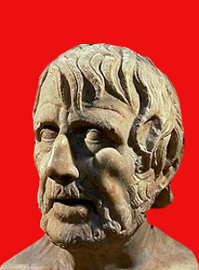

========================================================
He did not have a long voyage, just a long tossing about
========================================================

:date: 2014-09-21 13:14:00
:slug: 20140921
:tags: books, philosophy, quotes

In his book *On the Shortness of Life* the Roman statesman and philosopher **Seneca** makes his argument that the perceived shortness of a human life is an illusion:

    Everyone hustles his life along, and is troubled by a longing for the future and weariness of the present. But the man who... organizes every day as though it were his last, neither longs for nor fears the next day… Nothing can be taken from this life, and you can only add to it as if giving to a man who is already full and satisfied food which he does not want but can hold. So you must not think a man has lived long because he has white hair and wrinkles: he has not lived long, just existed long. For suppose you should think that a man had had a long voyage who had been caught in a raging storm as he left harbor, and carried hither and thither and driven round and round in a circle by the rage of opposing winds? He did not have a long voyage, just a long tossing about.

We reach the end of our days and discover that we have placed a low value on an irreplacable commodity - the time that has been alloted to us:

    No one will bring back the years; no one will restore you to yourself. Life will follow the path it began to take, and will neither reverse nor check its course. It will cause no commotion to remind you of its swiftness, but glide on quietly. It will not lengthen itself for a king’s command or a people’s favor... You have been preoccupied while life hastens on. Meanwhile death will arrive, and you have no choice in making yourself available for that.

The way out of this constricting existence, Seneca believes, is through the study of philosophy and the making of all worthy things are own. The life of the philosopher can contain *multitudes*:

    All the years that have passed before them are added to their own... By the toil of others we are led into presence of things which have been brought from darkness into light. We are excluded from no age, but we have access to them all; and if we are prepared in loftiness of mind to pass beyond the narrow confines of human weakness, there is a long period of time through which we can roam...

    We are in the habit of saying that it was not in our power to choose the parents who were allotted to us, that they were given to us by chance. But we can choose whose children we would like to be. There are households of the noblest intellects: choose the one into which you wish to be adopted, and you will inherit not only their name but their property too. Nor will this property need to be guarded meanly or grudgingly: the more it is shared out, the greater it will become. These will offer you a path to immortality and raise you to a point from which no one is cast down... So the life of the philosopher extends widely... Some time has passed: he grasps it in his recollection. Time is present: he uses it. Time is to come: he anticipates it. This combination of all times into one gives him a long life.
