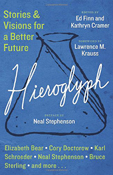

===========================================================================
"Hieroglyph", or ideas about getting Big Stuff Done in an incremental world
===========================================================================

:date: 2014-09-28 14:49:00
:slug: 20140928
:tags: quotes

**Neal Stephenson** laments in his preface to *Hieroglyph: Stories & Visions for a Better Future* that:

    Today's belief in ineluctable certainty is the true innovation killer of our age. In this environment, the best... [we] can do is to develop small improvements to existing systems - climbing the hill, as it were, toward a local maximum, trimming fat, eking out the occasional tiny innovation - like city planners painting bicycle lanes on the streets as a gesture toward solving our energy problems. Any strategy that involves crossing a valley - accepting short-term losses to reach a higher hill in the distance - will soon be brought to a halt by the demands of a system that celebrates short-term gains and tolerates stagnation, but condemns anything else as failure. In short, a world where big stuff can never get done.

Identifying the problem is the first step towards solving it, and `Project Hieroglyph <http://hieroglyph.asu.edu/>`_ has assembled a wonderful collection of ideas for a world where Big Stuff *Does* Get Done: starting with Stephenson's own tale of constructing a steel tower that reaches the stratosphere; **Kathleen Ann Goonan** on a revolutionary leap in neuroscience that heralds a new Age of Learning; **Cory Doctorow** puts 3-D printers on the Moon; **Karl Schroeder** shows Canada's First Nations making a radical realignment in the balance of power using group decision-making tools; **Gregory Benford** on entrepreneurs industrializing the solar system and reaching for the stars; and more.
