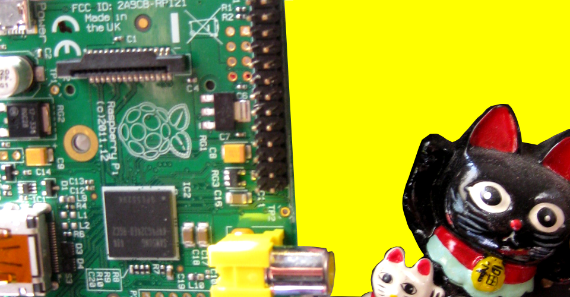
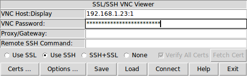
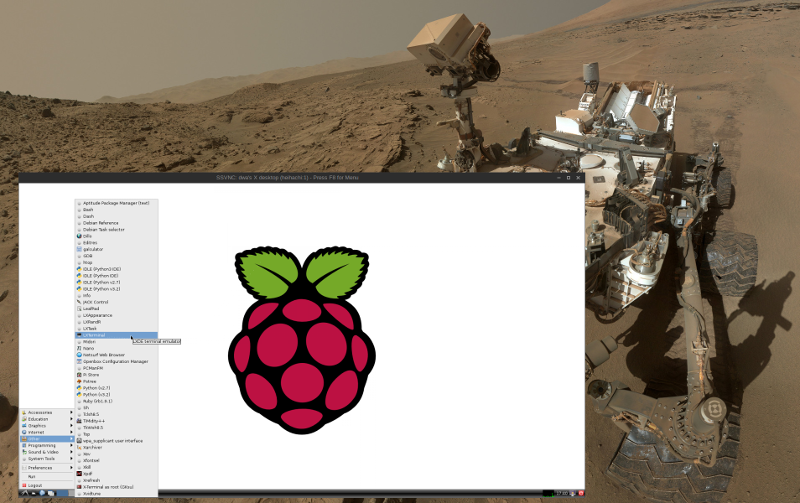

===========================
Ping Parade #5 -- Raspberry
===========================

:date: 2014-10-03 00:07:00
:slug: pingparade5
:tags: networks, vnc, raspberry pi, raspbian, linux
:template: article-project-pingparade

**Remote control a Linux desktop using Virtual Network Computing (VNC).**

`Raspberry Pi <http://www.raspberrypi.org/>`_ is a less-than-$50 credit card sized computer that delivers all the power and flexibility of Linux, tools to start programming, and the opportunity to `explore electronics <https://learn.adafruit.com/category/raspberry-pi>`_ courtesy of the onboard GPIO pins. There is an active community of Pi enthusiasts and plenty of resources to `help you get started <http://www.raspberrypi.org/help/>`_. I think this plucky little device has real potential as a `home server <http://www.circuidipity.com/pingparade1.html>`_!

One of the features I really like about the Pi is that the operating system runs off an SD card. Protecting the device's firmware from being mucked up makes it very easy to experiment with different Linux releases and configurations without any fear of bricking the device. I currently run `Raspbian Linux <http://www.raspbian.org/>`_ - the default recommendation - on a SanDisk 32GB microSD with adapter but there is an active and growing `list of alternatives <http://elinux.org/RPi_Distributions#Available_Distributions>`_.

The Pi has connectors for attaching an ethernet cable, USB peripherals such as keyboards and mice, and a monitor or TV permitting the device to serve as a complete standalone desktop computer. An alternative to dedicating input devices and a display to the Pi is to access the device via another computer using **Virtual Networking Computing**. VNC allows remote control of the Pi by transmitting all the display, keyboard, and mouse events to another computer.

To configure a VNC server and client:
=====================================

0. Server
---------

VNC enables a connection to a remote device display using two different methods: control an **existing** remote desktop attached to a physical display on a device running a VNC server (example: **x11vnc**); use a VNC server on the remote device to create a **new** desktop (example: `tightvnc <http://www.tightvnc.com/>`_) for display on the VNC client device. This second option is what I configure to enable running the Pi as a **headless** device (no attached display or peripherals).

Temporary access to a display and USB input devices makes the inital configuration of the Pi and VNC an easier task. The alternative is connecting to the Pi using `SSH <http://www.raspberrypi.org/documentation/remote-access/ssh/>`_.

Open or access a console on the Pi and install ``tightvncserver``:

.. code-block:: bash

    $ sudo apt-get update
    $ sudo apt-get install tightvncserver

The first time the VNC server is launched it will prompt the user to create a password to permit access to the desktop:

.. code-block:: bash

    $ vncserver                                                                    
    You will require a password to access your desktops.                           
                                                                               
    Password:                                                                      
    Warning: password truncated to the length of 8.                                
    Verify:                                                                        
    Would you like to enter a view-only password (y/n)? n                          
    xauth:  file /home/USERNAME/.Xauthority does not exist                              
                                                                               
    New 'X' desktop is HOSTNAME:1                                                  
                                                                               
    Creating default startup script /home/USERNAME/.vnc/xstartup                        
    Starting applications specified in /home/USRNAME/.vnc/xstartup                     
    Log file is /home/USERNAME/.vnc/HOSTNAME:1.log                                      
                                                                               
Default port on which vncserver runs is ``:1`` which corresponds to the TCP port on which the server is running (5900+n = port number)... therefore the first instance is running on **5901**. Running vncserver a second time will create a second instance running on the next free port, i.e ``:2`` or 5902.

1. Client
---------

Install a VNC client to connect with the newly-accessible remote Pi (example: `xtightvncviewer <http://www.tightvnc.com/>`_ is available for multiple platforms). On my Debian-powered laptop I install the `ssvnc <http://www.karlrunge.com/x11vnc/ssvnc.html>`_ (Unix only) client:

.. code-block:: bash

    $ sudo apt-get update
    $ sudo apt-get install ssvnc

Start the client and connect to the Pi by supplying its ``ADDRESS:VNC_DESKTOP`` and the VNC desktop password:
                                                                               

... and use it with the ``ssh`` option since I already run *openssh-server* on the Pi and have it setup for `ssh key authentication <http://www.circuidipity.com/pingparade2.html>`_.
 

When finished with the session just close the VNC client window and use the ``-kill`` switch on the Pi to shut down the VNC server:

.. code-block:: bash

    $ vncserver -kill :1                                                         

2. Optimize
-----------

On the Pi - create ``myVNCserver`` with desired vncserver settings and place in ``~/bin``:

.. code-block:: bash

    #!/bin/sh                                                                      
    vncserver -geometry 1800x1000 -depth 24 -dpi 96                                
                                                                               
Note that ``-geometry`` can be set to whatever is desired                  
                                                                               
With this setup VNC can be started and halted on demand. To have VNC auto-start at boot consult the `Pi documentation <http://www.raspberrypi.org/documentation/remote-access/vnc/>`_ for a sample ``/etc/init.d`` script. Since I plan to run my Pi as a headless server and rarely access the desktop I will just start VNC when I need it.                                               
                                                                               
VNC does not use the Pi graphics processor and its memory allocation can be altered to `assign more RAM to the CPU <http://www.circuidipity.com/pi-memory-split.html>`_ for running applications.
                                                                               
The desktop that vncserver puts up is controlled by ``~/.vnc/xstartup``. To load the lightweight **Openbox** window manager as an alternative to the default LXDE desktop environment, comment out the ``/etc/X11/Xsession`` line and replace with:                 

.. code-block:: bash

    exec ck-launch-session openbox-session

3. Helpful Resources
--------------------

* `Raspberry Pi VNC <http://www.raspberrypi.org/documentation/remote-access/vnc/>`_          
* `Connecting to a Pi over VNC using Linux <http://www.raspberrypi.org/documentation/remote-access/vnc/linux.md>`_          
* `Vncserver on the Arch Wiki <https://wiki.archlinux.org/index.php/Vncserver>`_           

Happy hacking!
