=================================================
Install Lubuntu 14.04 on the Acer C720 Chromebook
=================================================

:date: 2014-10-25 23:55:00
:slug: c720-lubuntubook-install
:tags: lubuntu, ubuntu, linux, chromebook

.. image:: images/ubuntuTrusty.png
    :alt: Ubuntu Trusty Tahr
    :align: left
    :width: 100px
    :height: 100px

**See:** `Chromebook to Lubuntubook <http://www.circuidipity.com/c720-lubuntubook.html>`_ for more details on replacing Chrome OS with a full-featured Linux on Chromebooks.

**Ubuntu 14.04 "Trusty Tahr"** is a `Long Term Support (LTS) <https://wiki.ubuntu.com/Releases>`_ release of the popular Linux operating system. I use Ubuntu's `minimal install image <https://help.ubuntu.com/community/Installation/MinimalCD>`_ to setup the lightweight `Lubuntu <http://lubuntu.net/>`_ (Ubuntu + LXDE desktop) distro on the **Acer C720 Chromebook**.

Below is a visual walk-through of a sample install that makes use of an entire storage device divided into 3 partitions: a ``boot`` partition, and `LUKS <https://en.wikipedia.org/wiki/Linux_Unified_Key_Setup>`_ encrypted ``swap`` + ``root``. 

Let's go!
=========

0. Prepare install media
------------------------

Download the `64-bit trusty minimal installer <http://archive.ubuntu.com/ubuntu/dists/trusty/main/installer-amd64/current/images/netboot/mini.iso>`_ and `flash the image <https://help.ubuntu.com/community/Installation/FromUSBStick>`_ to a USB stick. An alternative (my choice) is adding the image to a `USB stick with multiple Linux installers <http://www.circuidipity.com/multi-boot-usb.html>`_. Using the minimal console installer vs. the graphical `Lubuntu installer <https://help.ubuntu.com/community/Lubuntu/GetLubuntu>`_ provides more options during setup [1]_.

1. Configure
------------

Connect the USB stick and boot the installer [2]_:

.. image:: images/screenshot/trustyLubuntubookInstall/100.png
    :align: center
    :alt: Install
    :width: 800px
    :height: 600px

.. image:: images/screenshot/trustyLubuntubookInstall/101.png
    :align: center
    :alt: Select Language
    :width: 800px
    :height: 600px

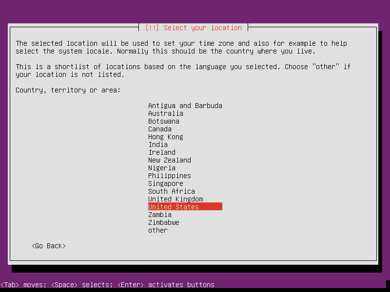

.. image:: images/screenshot/trustyLubuntubookInstall/103.png
    :alt: Configure Keyboard
    :align: center
    :width: 800px
    :height: 600px

.. image:: images/screenshot/trustyLubuntubookInstall/104.png
    :alt: Configure Keyboard
    :align: center
    :width: 800px
    :height: 600px

.. image:: images/screenshot/trustyLubuntubookInstall/105.png
    :alt: Configure Keyboard
    :align: center
    :width: 800px
    :height: 600px

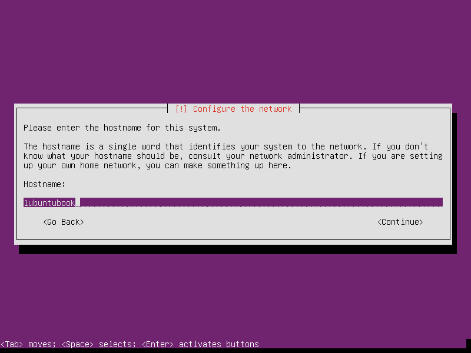

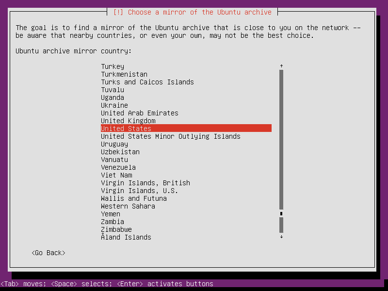

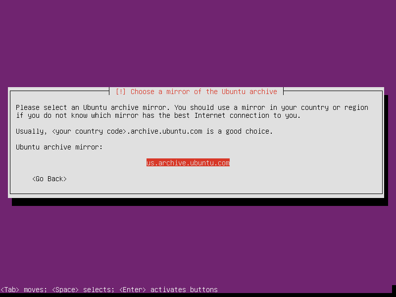

.. image:: images/screenshot/trustyLubuntubookInstall/109.png
    :alt: Proxy
    :align: center
    :width: 800px
    :height: 600px

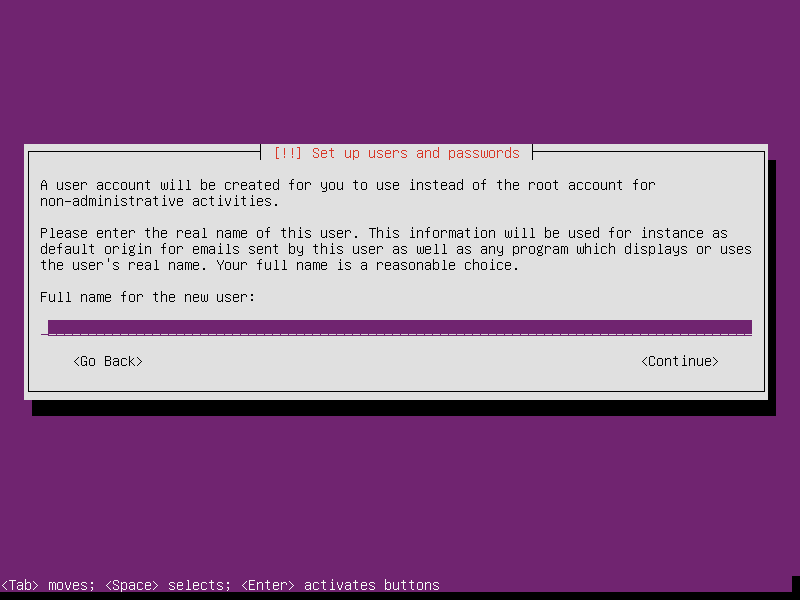

.. image:: images/screenshot/trustyLubuntubookInstall/111.png
    :alt: Username
    :align: center
    :width: 800px
    :height: 600px

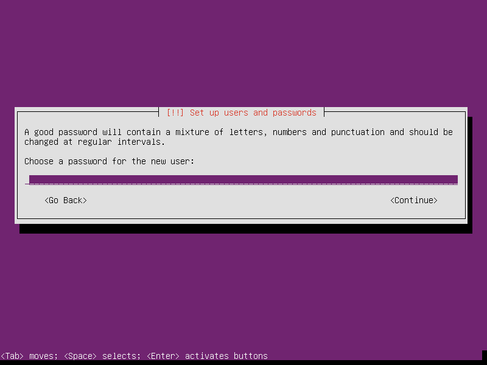

.. image:: images/screenshot/trustyLubuntubookInstall/113.png
    :alt: Verify password
    :align: center
    :width: 800px
    :height: 600px

.. image:: images/screenshot/trustyLubuntubookInstall/114.png
    :alt: Encrypt home
    :align: center
    :width: 800px
    :height: 600px

.. image:: images/screenshot/trustyLubuntubookInstall/115.png
    :alt: Configure clock
    :align: center
    :width: 800px
    :height: 600px

.. image:: images/screenshot/trustyLubuntubookInstall/116.png
    :alt: Select time zone
    :align: center
    :width: 800px
    :height: 600px

2. Partitions
-------------

In the example below we create 3 partitions on the disk:

* sda1 is a 300MB ``boot`` partition 
* sda2 is a 512MB LUKS encrypted ``swap`` partition using a **random key**
* sda3 uses the remaining space as a LUKS encrypted ``root`` partition using a **passphrase**

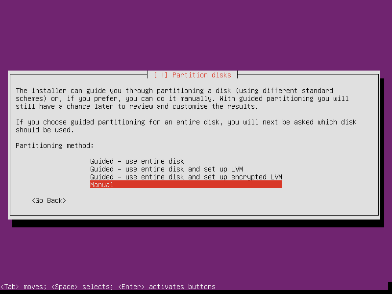

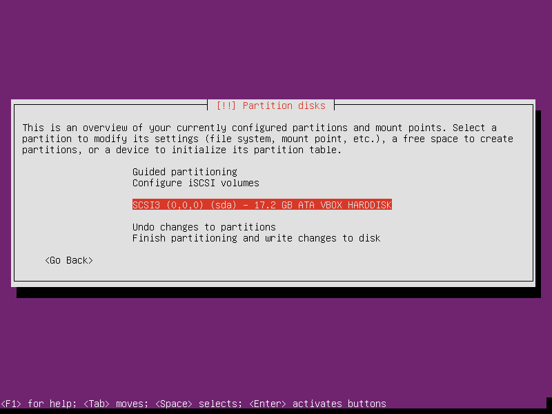

.. image:: images/screenshot/trustyLubuntubookInstall/202.png
    :alt: Partition table
    :align: center
    :width: 800px
    :height: 600px

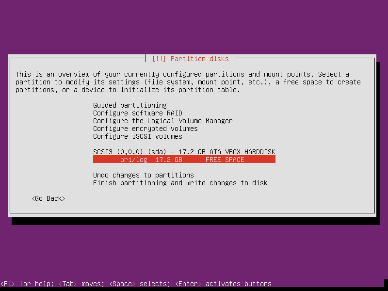

.. image:: images/screenshot/trustyLubuntubookInstall/204.png
    :alt: New partition
    :align: center
    :width: 800px
    :height: 600px

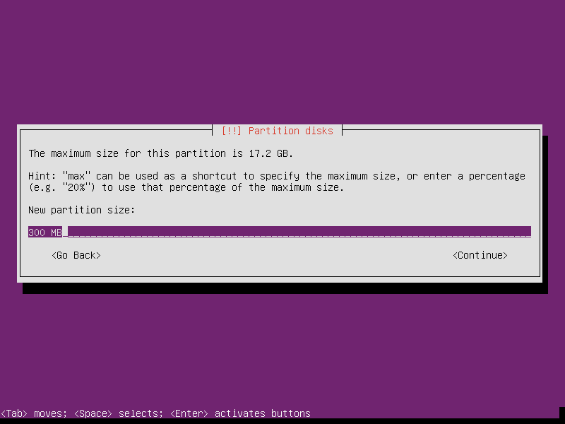

.. image:: images/screenshot/trustyLubuntubookInstall/206.png
    :alt: Primary partition
    :align: center
    :width: 800px
    :height: 600px

.. image:: images/screenshot/trustyLubuntubookInstall/207.png
    :alt: Beginning
    :align: center
    :width: 800px
    :height: 600px

.. image:: images/screenshot/trustyLubuntubookInstall/208-1.png
    :alt: Mount point
    :align: center
    :width: 800px
    :height: 600px

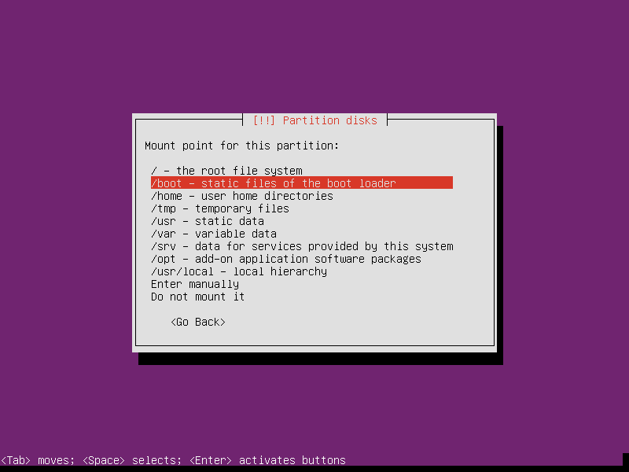

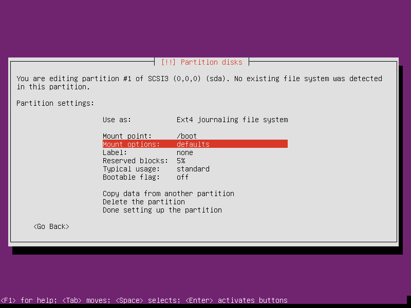

Setting ``Mount options`` to ``noatime`` decreases write operations and boosts drive speed:

.. image:: images/screenshot/trustyLubuntubookInstall/210.png
    :alt: Mount options
    :align: center
    :width: 800px
    :height: 600px

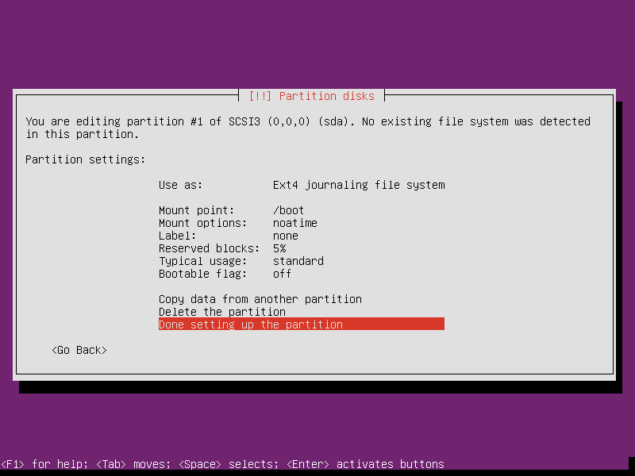

.. image:: images/screenshot/trustyLubuntubookInstall/212.png
    :alt: Free space
    :align: center
    :width: 800px
    :height: 600px

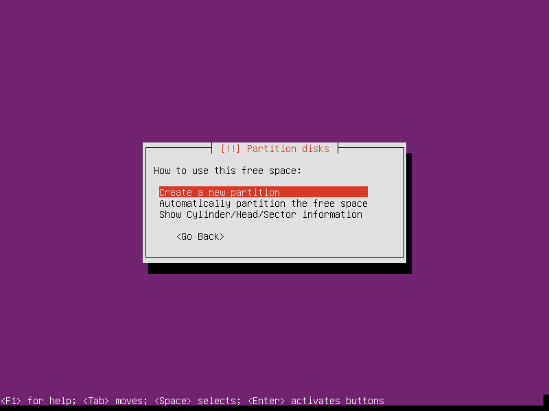

.. image:: images/screenshot/trustyLubuntubookInstall/214.png
    :alt: Partition size
    :align: center
    :width: 800px
    :height: 600px

.. image:: images/screenshot/trustyLubuntubookInstall/215.png
    :alt: Primary partition
    :align: center
    :width: 800px
    :height: 600px

.. image:: images/screenshot/trustyLubuntubookInstall/216.png
    :alt: Beginning
    :align: center
    :width: 800px
    :height: 600px

.. image:: images/screenshot/trustyLubuntubookInstall/218.png
    :alt: Encrypt volume
    :align: center
    :width: 800px
    :height: 600px

.. image:: images/screenshot/trustyLubuntubookInstall/219.png
    :alt: Encryption key
    :align: center
    :width: 800px
    :height: 600px

.. image:: images/screenshot/trustyLubuntubookInstall/220.png
    :alt: Random key
    :align: center
    :width: 800px
    :height: 600px

If the hard disk has not been securely wiped prior to installing Lubuntu (using a utility like `DBAN <http://www.circuidipity.com/multi-boot-usb.html>`_) you may want to configure ``Erase data: yes``. Note, however, that depending on the size of the disk this operation can last several hours:

.. image:: images/screenshot/trustyLubuntubookInstall/221.png
    :alt: Done setting up partition
    :align: center
    :width: 800px
    :height: 600px

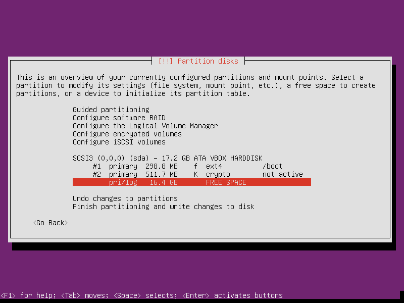

.. image:: images/screenshot/trustyLubuntubookInstall/223.png
    :alt: New partition
    :align: center
    :width: 800px
    :height: 600px

.. image:: images/screenshot/trustyLubuntubookInstall/224.png
    :alt: Partition size
    :align: center
    :width: 800px
    :height: 600px

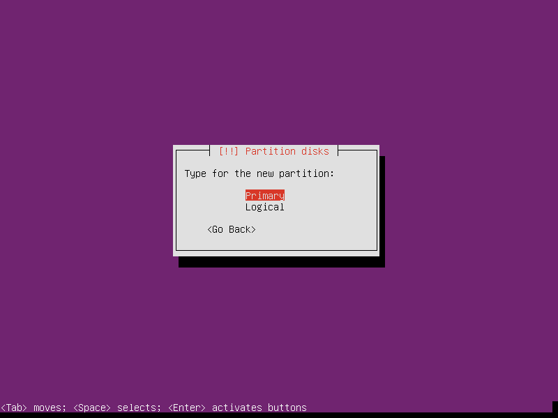

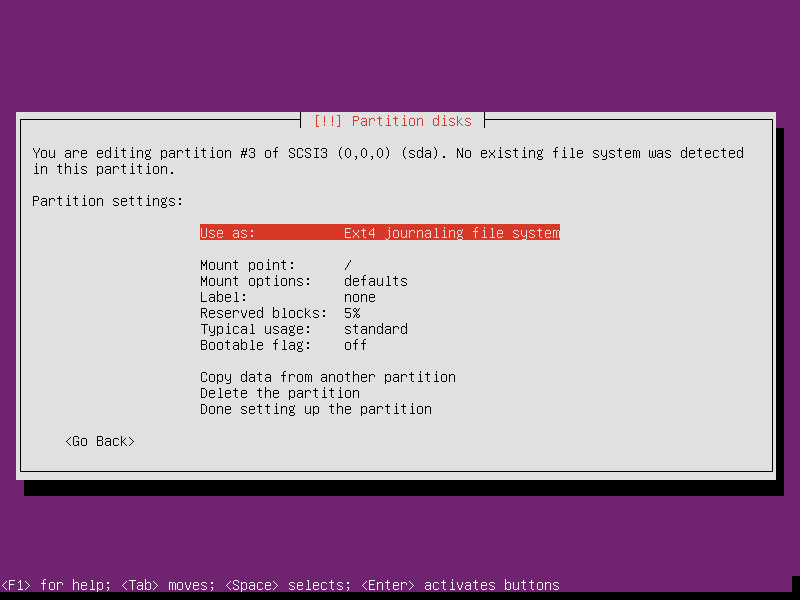

.. image:: images/screenshot/trustyLubuntubookInstall/227.png
    :alt: Encrypt volume
    :align: center
    :width: 800px
    :height: 600px

.. image:: images/screenshot/trustyLubuntubookInstall/228.png
    :alt: Done setting up partition
    :align: center
    :width: 800px
    :height: 600px
 
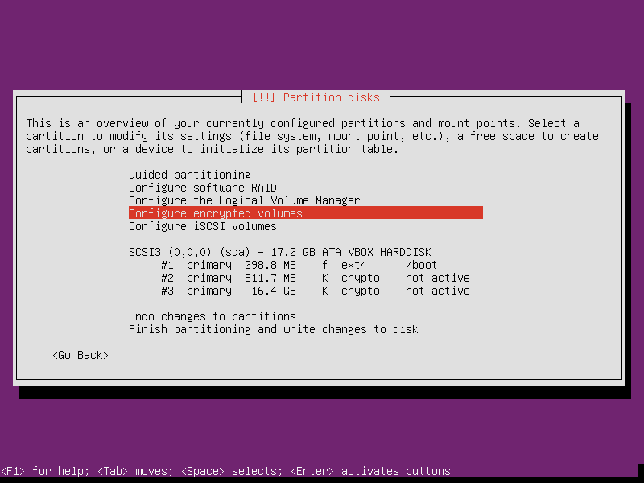

.. image:: images/screenshot/trustyLubuntubookInstall/230.png
    :alt: Write changes to disk
    :align: center
    :width: 800px
    :height: 600px

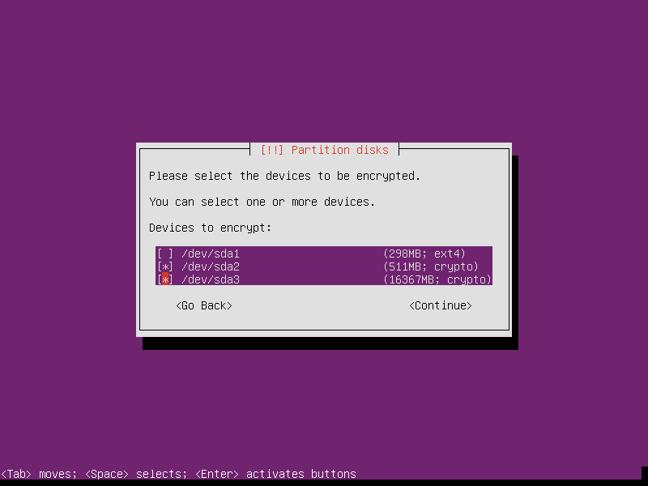

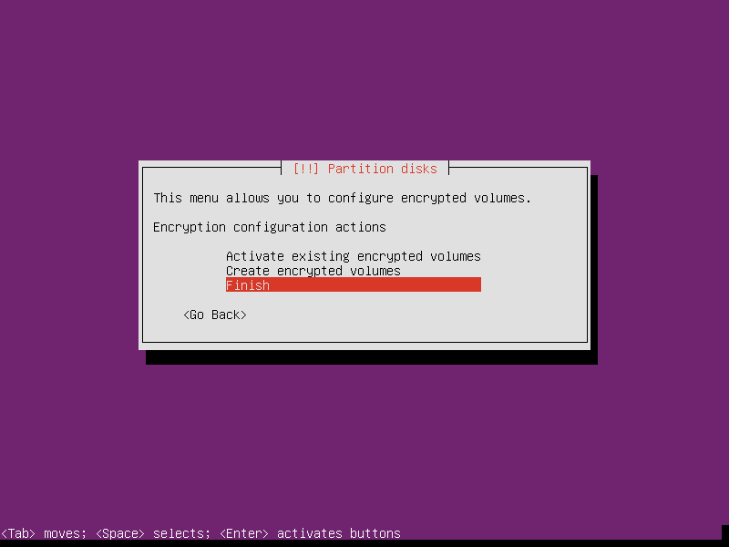

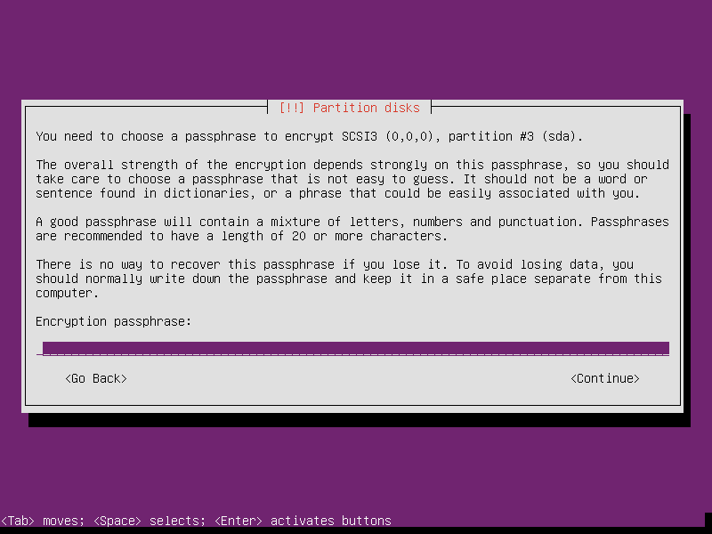

.. image:: images/screenshot/trustyLubuntubookInstall/235.png
    :alt: Verify passphrase
    :align: center
    :width: 800px
    :height: 600px

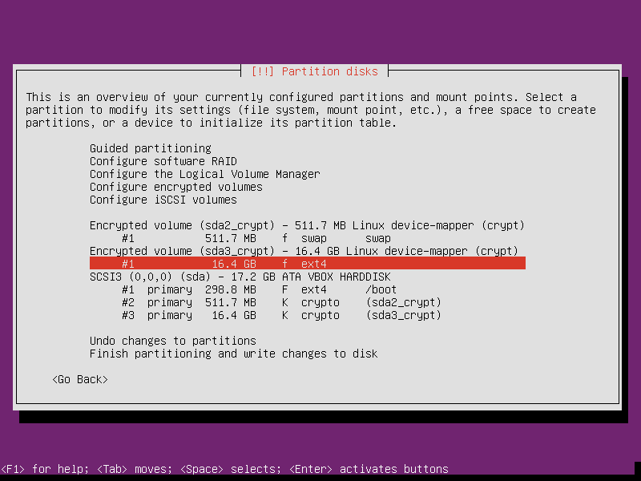

.. image:: images/screenshot/trustyLubuntubookInstall/237.png
    :alt: Mount point
    :align: center
    :width: 800px
    :height: 600px

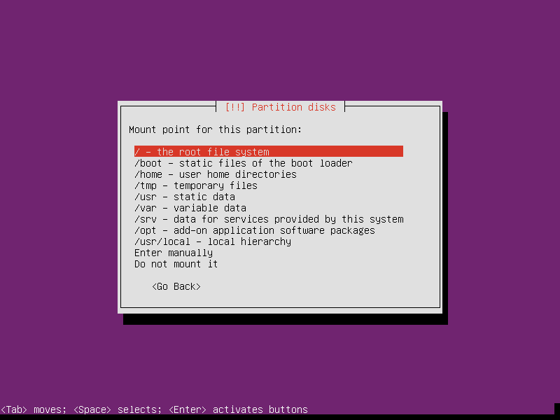

.. image:: images/screenshot/trustyLubuntubookInstall/239.png
    :alt: Mount options
    :align: center
    :width: 800px
    :height: 600px

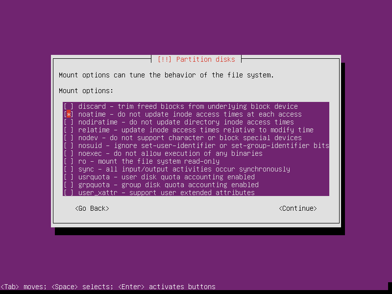

.. image:: images/screenshot/trustyLubuntubookInstall/241.png
    :alt: Done setting up partition
    :align: center
    :width: 800px
    :height: 600px

.. image:: images/screenshot/trustyLubuntubookInstall/242.png
    :alt: Write changes to disk
    :align: center
    :width: 800px
    :height: 600px

.. image:: images/screenshot/trustyLubuntubookInstall/243.png
    :alt: Confirm write
    :align: center
    :width: 800px
    :height: 600px

3. Install packages and finish up
---------------------------------

.. image:: images/screenshot/trustyLubuntubookInstall/300.png
    :alt: No automatic updates
    :align: center
    :width: 800px
    :height: 600px

Select ``Lubuntu Desktop``. This task menu can also be accessed post-install by running:

.. code-block:: bash

    $ sudo tasksel

.. image:: images/screenshot/trustyLubuntubookInstall/301-2.png
    :alt: Software selection
    :align: center
    :width: 800px
    :height: 600px

.. image:: images/screenshot/trustyLubuntubookInstall/302.png
    :alt: GRUB
    :align: center
    :width: 800px
    :height: 600px

.. image:: images/screenshot/trustyLubuntubookInstall/303.png
    :alt: UTC
    :align: center
    :width: 800px
    :height: 600px

.. image:: images/screenshot/trustyLubuntubookInstall/304.png
    :alt: Finish install
    :align: center
    :width: 800px
    :height: 600px

System will display a passphrase prompt to unlock encrypted ``root`` partition:

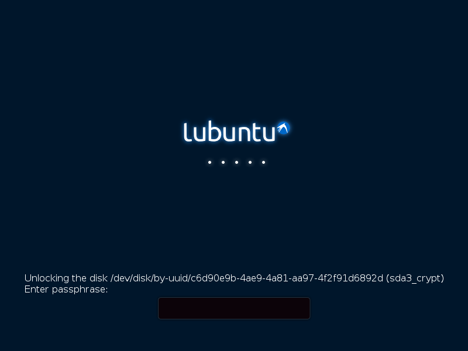

.. image:: images/screenshot/trustyLubuntubookInstall/306.png
    :alt: Login
    :align: center
    :width: 800px
    :height: 600px

Happy hacking!

Notes
-----

.. [1] Specifically in this instance, the Ubuntu console installer provides a random key option for the encrypted swap partition.

.. [2] Installer gets stuck at boot on ``Switched to clocksource tsc`` for a minute or so before resume. `This is fixed post-install <http://www.circuidipity.com/c720-lubuntubook.html>`_ by modifying ``/etc/default/grub`` with kernel option ``tpm_tis.force=1``.
