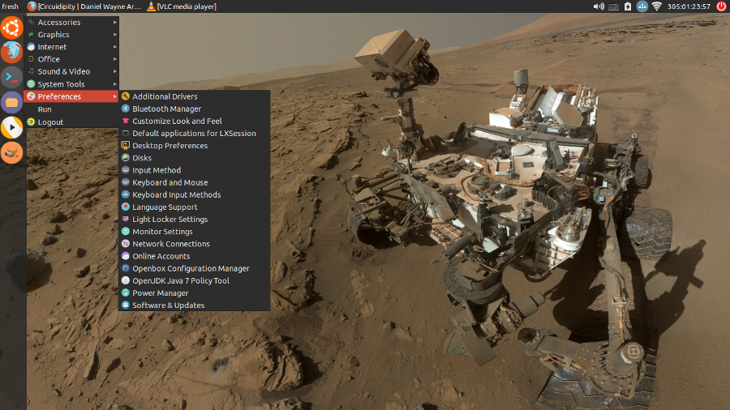

=============================================
20 small hacks after installing Lubuntu 14.04
=============================================

:slug: lubuntu-trusty-hacks
:template: article-project
:tags: lubuntu, ubuntu, linux, lxde
:modified: 2014-11-15 01:10:00

The combination of `Ubuntu <http://www.circuidipity.com/tag-ubuntu.html>`_  plus the `LXDE <http://www.circuidipity.com/tag-lxde.html>`_ desktop equals the lightweight and cheerful `Lubuntu <http://www.circuidipity.com/tag-lubuntu.html>`_. Its loosely coupled components create a friendly environment for swapping out bits and customizing the interface, and ongoing development of the next-generation `LXQt <http://lxqt.org/>`_ looks promising!

Here are a few small hacks I like to do to make a great OS even better. Modifications are made on a `fresh install of Lubuntu 14.04 <http://www.circuidipity.com/ubuntu-trusty-install.html>`_, which is a *Long Term Support* (LTS) release (till April 2017).

Let's go!
=========

0. Update kernel
----------------

Lubuntu installs the **3.13** Linux kernel which may have incomplete hardware support for newer devices like the `Acer C720 Chromebook <http://www.circuidipity.com/c720-lubuntubook.html>`_.

**Fix:** Download and install a more recent kernel from `Ubuntu MainlineBuilds <https://wiki.ubuntu.com/Kernel/MainlineBuilds>`_. An example using the **3.17** kernel:

.. code-block:: bash                                                                
                                                                                    
    $ wget -c http://kernel.ubuntu.com/~kernel-ppa/mainline/v3.17.1-utopic/linux-headers-3.17.1-031701-generic_3.17.1-031701.201410150735_amd64.deb
    $ wget -c http://kernel.ubuntu.com/~kernel-ppa/mainline/v3.17.1-utopic/linux-headers-3.17.1-031701_3.17.1-031701.201410150735_all.deb
    $ wget -c http://kernel.ubuntu.com/~kernel-ppa/mainline/v3.17.1-utopic/linux-image-3.17.1-031701-generic_3.17.1-031701.201410150735_amd64.deb
    $ sudo dpkg -i linux*.deb                                                       
                                                                                    
... and reboot.

1. Screen lock
--------------

The **light-locker** screen utility locks the screen when the system has been idle for several minutes regardless of user-defined preferences.

**Fix:** Disable system-wide screen locking:

.. code-block:: bash

    $ sudo mv /etc/xdg/autostart/light-locker.desktop /etc/xdg/autostart/light-locker.desktop.bak

... and configure per-user settings in ``Preferences->Light Locker Settings``, which are saved to ``~/.config/autostart/light-locker.desktop``.

Sample ``Exec`` line that locks screen when system-suspend is activated:

.. code-block:: bash

    Exec=light-locker --lock-after-screensaver=0 --lock-on-suspend --no-late-locking

Source: `Lubuntu enforces screen lock <http://askubuntu.com/questions/502942/lubuntu-enforces-screen-lock>`_

2. Editor
---------

Install full-version of **vim** text editor and make it the default system editor:

.. code-block:: bash

    $ sudo apt-get install vim tmux
    $ sudo update-alternatives --config editor
    There are 4 choices for the alternative editor (providing /usr/bin/editor).

      Selection    Path                Priority   Status
    ------------------------------------------------------------
      0            /bin/nano            40        auto mode
      1            /bin/ed             -100       manual mode
      2            /bin/nano            40        manual mode
    * 3            /usr/bin/vim.basic   30        manual mode
      4            /usr/bin/vim.tiny    10        manual mode

    Press enter to keep the current choice[*], or type selection number:

3. Terminal
-----------

Substitute lxterminal with **rxvt-unicode** + `tmux <http://www.circuidipity.com/tmux.html>`_ terminal multi-plexer and make **urxvt** the default terminal:

.. code-block:: bash

    $ sudo apt-get install rxvt-unicode fonts-droid
    $ sudo update-alternatives --config x-terminal-emulator

Create ``$HOME/.Xresources`` and set terminal options for fonts, colours, etc.

Source: `.Xresources (github.com/vonbrownie) <https://github.com/vonbrownie/linux-post-install/blob/master/config/generic/home/username/.Xresources>`_

4. SSH keys
-----------

See `Ping Parade #2 -- Keys <http://www.circuidipity.com/pingparade2.html>`_ for configuring OpenSSH and generating SSH keys for a Lubuntu installation.

5. Media player
---------------

Install multimedia codecs and the awesome **vlc** media player:

.. code-block:: bash

    $ sudo apt-get install ubuntu-restricted-extras vlc

6. Java Runtime Environment
---------------------------

Install a **JRE** (default is ``openjdk-7-jre``):

.. code-block:: bash

    $ sudo apt-get install default-jre

7. $HOME/bin
------------

Create a directory to hold personal scripts that will be added to ``$PATH``:

.. code-block:: bash

    $ mkdir ~/bin

8. Applications menu
--------------------

**Dmenu** is a menu that can be activated by keyboard shortcut and dynamically narrow the choice of available applications as you type. Part of the **suckless-tools** package:

.. code-block:: bash

    $ sudo apt-get install suckless-tools

Create ``dmenu-run.sh`` shell script to generate a menu. Example:

.. code-block:: bash

    #!/bin/bash
    dmenu_run -b -i -fn '10x20' \
        -nb '#000000' -nf '#ffffff' -sb '#d64937' -sf '#000000'

... and place in ``$HOME/bin``.

Source: `dmenu-run.sh (github.com/vonbrownie) <https://github.com/vonbrownie/linux-home-bin/blob/master/dmenu-run.sh>`_

9. Keyboard shortcuts
---------------------

Create shortcuts in ``$HOME/.config/openbox/lubuntu-rc.xml``. Example for launching ``dmenu`` with key combo ``ALT-A``:

.. code-block:: bash

    <!-- Keybindings for running Run menu -->
    <keybind key="A-a">
      <action name="Execute">
        <command>dmenu-run.sh</command>
      </action>
    </keybind>

Source: `lubuntu-rc.xml (github.com/vonbrownie) <https://github.com/vonbrownie/linux-post-install/blob/master/config/generic/home/username/.config/openbox/lubuntu-rc.xml>`_

10. Custom application launchers
--------------------------------

Create ``*.desktop`` files with custom options to launch applications. Make a custom ``*.desktop`` system-wide location:

.. code-block:: bash

  $ sudo mkdir /usr/local/share/applications

A sample ``rxvt-unicode-custom.desktop`` launcher contains:

.. code-block:: bash

    [Desktop Entry]
    Name=Urxvt
    GenericName=Terminal
    Comment=Use the command line
    TryExec=urxvt
    Exec=urxvt
    Icon=xterm-color
    Type=Application
    Categories=Utility;TerminalEmulator;

11. Terminate frozen applications
---------------------------------

**Xkill** is a utility for terminating misbehaving X applications. When activated it displays a crosshair cursor that can be maneuvered in place and a click kills the client app that lies beneath.
 
A sample ``/usr/local/share/applications/xkill-custom.desktop`` launcher:

.. code-block:: bash

    [Desktop Entry]
    Name=Xkill misbehaving apps
    Comment=KILL KILL KILL
    Exec=xkill
    Icon=system-error
    Type=Application
    Categories=System;Utility;

Save file and the item will appear under Lubuntu's ``Menu->System Tools``.
 
12. Favourites panel
--------------------

Right-click on the LXDE panel and select ``Create new panel`` to create an extra panel to hold favourite application launchers. Panel configs are store in ``$HOME/.config/lxpanel/Lubuntu/panels``.

13. Customize the theme
-----------------------

Choose an alternative theme for the Lubuntu desktop. I like `Numix <https://numixproject.org/>`_:

.. code-block:: bash

    $ sudo add-apt-repository ppa:numix/ppa
    $ sudo apt-get update
    $ sudo apt-get install numix-gtk-theme numix-icon-theme numix-icon-theme-circle

Select the new theme in ``Menu->Preferences->Customize Look and Feel`` [1]_.

14. Dual display
----------------

See `Dual display configuration in Lubuntu <http://www.circuidipity.com/20141110.html>`_ for configuring LXDE to auto-detect at login if a second display is attached and make the necessary adjustments.

15. Custom login wallpaper
--------------------------

Login window is managed by **lightdm-gtk-greeter**. To set a new background image for the login window:

.. code-block:: bash

    $ sudo mkdir /usr/local/share/wallpapers
    $ sudo cp my_new_login_image.jpg /usr/local/share/wallpapers

Edit ``/etc/lightdm/lightdm-gtk-greeter.conf`` and configure the new background:

.. code-block:: bash

    background=/usr/local/share/wallpapers/my_new_login_image.jpg

16. Auto-mount external drives at startup
-----------------------------------------

See `Add USB storage to Chromebooks <http://www.circuidipity.com/20141031.html>`_ for an example scenario.

17. Display GRUB Menu at boot
-----------------------------

Comment out the ``GRUB_HIDDEN*`` settings in ``/etc/default/grub``:

.. code-block:: bash

    #GRUB_HIDDEN_TIMEOUT=0
    #GRUB_HIDDEN_TIMEOUT_QUIET=true

Update the GRUB configuration with the new settings:

.. code-block:: bash

    $ sudo update-grub

... and reboot.

18. Custom GRUB colours and splash image
----------------------------------------
                                   
Create ``/boot/grub/custom.cfg`` and set custom GRUB menu colours. Example settings: 
      
.. code-block:: bash
                                                                              
    set color_normal=yellow/black                                                       
    set menu_color_normal=yellow/black                                                  
    set menu_color_highlight=white/green                                                
                                                                                    
Pick an image for the GRUB background (see `help.ubuntu.com <https://help.ubuntu.com/community/Grub2/Displays>`_ for restrictions) and save to ``/boot/grub``. Set the new background in ``/etc/default/grub``:

.. code-block:: bash
                                                                                    
    GRUB_BACKGROUND="/boot/grub/my_new_grub_image.tga"                                           
                                            
Update GRUB:

.. code-block:: bash

    $ sudo update-grub
                         
... and reboot.

19. Pop-up menu
---------------

See `Pop-up custom menu in LXDE <http://www.circuidipity.com/20141115.html>`_ to create a hotkey-activated menu for favourite functions and applications.

Happy hacking!

Notes
-----

.. [1] For application buttons in the panel to display properly with Numix, right-click on the Taskbar, select ``Taskbar (Window List) Settings``, and enable ``Flat buttons`` option.
