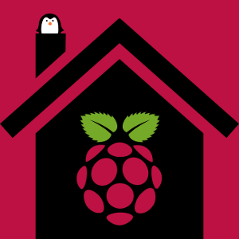

====================================================
There's no place like [a Raspberry Pi] Home [Server]
====================================================

:slug: raspberry-pi-home-server
:tags: raspberry pi, server, network, linux
:template: article-project
:modified: 2016-08-16 19:37:00

Running your own **Linux home server** is a fun learning experience about how networks work and using a `Raspberry Pi <http://www.circuidipity.com/tag-raspberry-pi.html>`_ is a cheap and cheerful way to get the job done!

Plus privacy may be important to you. Hosting your own server running your own services gives more control over your data.

Let's go!
=========

Install a stable, well-tested Linux distribution on these wee devices and provide services such as network printing and storage (NAS), perform backups, host web services and much more. Start with a minimal base configuration of **Debian** or **Ubuntu** and gain access to tens of thousands of packages ready to install.

0. `Host rootfs on external USB storage <http://www.circuidipity.com/raspberry-pi-usb-storage-v4.html>`_
--------------------------------------------------------------------------------------------------------

Running a Pi server with 24/7 uptime will enjoy more robust performance operating from a hard drive (vs SD card media). 

**... OR ...**

0.1 `New life for an old laptop <http://www.circuidipity.com/laptop-home-server.html>`_
---------------------------------------------------------------------------------------

**RPi alternative:** Second-hand laptops -  retired in favour of more current and powerful machines - can still deliver plenty of oomph for running a personal server. Frugal with power and come equipped with their own built-in UPS (battery)!

Services
========

1. `Secure remote access using SSH keys <http://www.circuidipity.com/secure-remote-access-using-ssh-keys.html>`_
----------------------------------------------------------------------------------------------------------------

Use cryptographic keys to secure access to your new home server.

2. `Multiple terminal windows using tmux <http://www.circuidipity.com/tmux.html>`_
----------------------------------------------------------------------------------

A *terminal multiplexor* for creating, detaching, re-attaching work areas.

3. `Backup home <http://www.circuidipity.com/incremental-backups-rsnapshot.html>`_
----------------------------------------------------------------------------------

Make incremental and automatic backups of a home folder using rsnapshot + cron.

4. `Network attached storage <http://www.circuidipity.com/nas-raspberry-pi-sshfs.html>`_
----------------------------------------------------------------------------------------

External USB storage + Pi turns any hard drive into a NAS.

5. `Access from anywhere in the world using dynamic DNS <http://www.circuidipity.com/ddns-openwrt.html>`_
---------------------------------------------------------------------------------------------------------

Use a DDNS service to automatically update an IP address.

6. `Web + database <http://www.circuidipity.com/php-nginx-postgresql.html>`_
----------------------------------------------------------------------------

Host web applications using PHP + Nginx + PostgreSQL.

7. `RSS reader <http://www.circuidipity.com/ttrss.html>`_
---------------------------------------------------------

Access news feeds over the web with Tiny Tiny RSS news reader.

**Happy hacking!**
