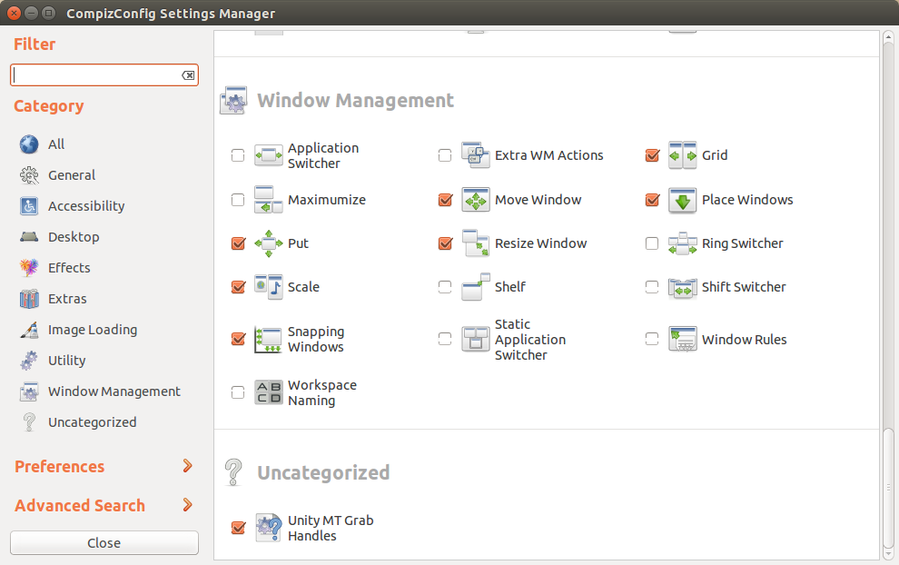
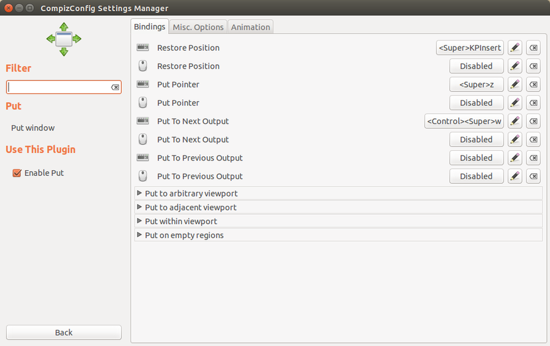

=========================
Ubuntu Keyboard Shortcuts
=========================

:date: 2015-02-25 19:47:00
:slug: ubuntu-keyboard-shortcuts
:tags: cheatsheet, ubuntu, linux

I am exploring **keyboard shortcuts** to improve workflow efficiency and happy to discover that Ubuntu's **Unity** desktop is configured very keyboard-friendly by default. Here are the Ubuntu/application key combos that I find most useful...

Launcher
========

``Super``
    open Dash

``Super(Hold)``
    display shortcuts

``Super-Tab``
    switch between Launcher applications

``Super-(1-9)``
    run application (1-9) on Launcher

``Alt-F2``
    run command

Switching
=========

``Alt-Tab``
    switch between running apps

``Control-Alt-Tab``
    switch between running apps from all workspaces

``Super-S``
    show and select workspaces

``Control-Alt-(Left,Right,Up,Down)``
    navigate between workspaces

Windows
=======

``Super-W``
    show windows in current workspace

``Shift-Super-W``
    show windows in all workspaces

``Control-Super-Up``
    maximize window

``Control-Super-Down``
    minimize window

``Alt-Space``
    open window menu

``Alt-F4``
    close window

Applications
============

Firefox
-------

``Control-T``
    open new tab

``Control-Tab``
    switch tab

``Shift-Control-Tab``
    switch tab backwards

``Control-W``
    close tab

``Control-L``
    enter new address/search

``F5``
    reload page

Gnome Terminal
--------------

``Shift-Control-T``
    open new tab

``Alt-(1-9)``
    switch to tab {1-9}

``Shift-Control-W``
    close tab

Bash 
----

``Control-A``
    move to the start of the line

``Control-E``
    move to the end of the line

``Alt-B``
    move back one word

``Alt-F``
    move forward one word

``Control-W``
    erase a word

``Control-U``
    erase a line

``Control-L``
    clear screen

``Control-R``
    reverse incremental search of history

Tmux
----

My `tmux cheatsheet <http://www.circuidipity.com/tmux.html>`_.

Gnome Screenshot
----------------

``PrtScr``
    screenshot

``Alt-PrtScr``
    window screenshot

``Shift-PrtScr``
    selected area screenshot

Custom
======

Move windows between displays
-----------------------------

At home I connect my `Ubuntubook <http://www.circuidipity.com/c720-lubuntubook.html>`_ to an external 24" display to form a combined desktop across the 2 devices. I use **Compiz** to create a ``Control-Super-W`` key combo to move windows back and forth between displays:

.. code-block:: bash

    $ sudo apt-get install compizconfig-settings-manager compiz-plugins-extra

Open the Dash and run ``compiz settings manager``. Enable and select the ``Window Management -> Put`` plugin and configure a key shortcut for ``Put to Next Output``.

Built-in screen ``(1366x768)`` and external display ``(1920x1080)`` form a combined desktop of different resolutions. Select ``Put -> Misc. Options -> Activate "Avoid Offscreen"`` to ensure maximized windows are properly resized when moved between displays.

Logout and back in to activate modifications.

Source: `Move windows between monitors <http://askubuntu.com/questions/141752/keyboard-shortcut-to-move-windows-between-monitors>`_

Chromebook keyboard shortcuts
-----------------------------

Top row on my Ubuntubook keyboard has a series of shortcut icons (brightness, volume, etc.) that identify in Linux as the ``F1-F10`` keys and the ``Search`` key (in the ``CapsLk`` position) acts as ``Super`` (Windows) modifier key.

Enable these keyboard shortcuts in Ubuntu by first installing:

* ``xbindkeys`` - associate keys to shell commands
* ``xbacklight`` - set backlight level using RandR
* ``pulseaudio-utils`` - manage sound with pactl
* ``xvkbd`` - send characters to another client

.. code-block:: bash

    $ sudo apt-get install xbindkeys xbacklight pulseaudio-utils xvkbd

See `Chromebook to (L)ubuntubook <http://www.circuidipity.com/c720-lubuntubook.html>`_ for a sample configuration.

Next thing is to start working on my touch-typing!
