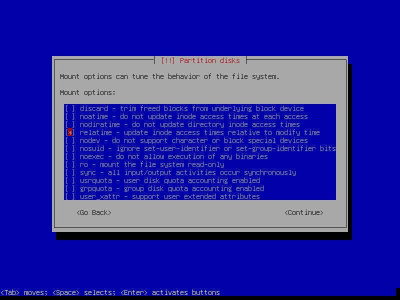
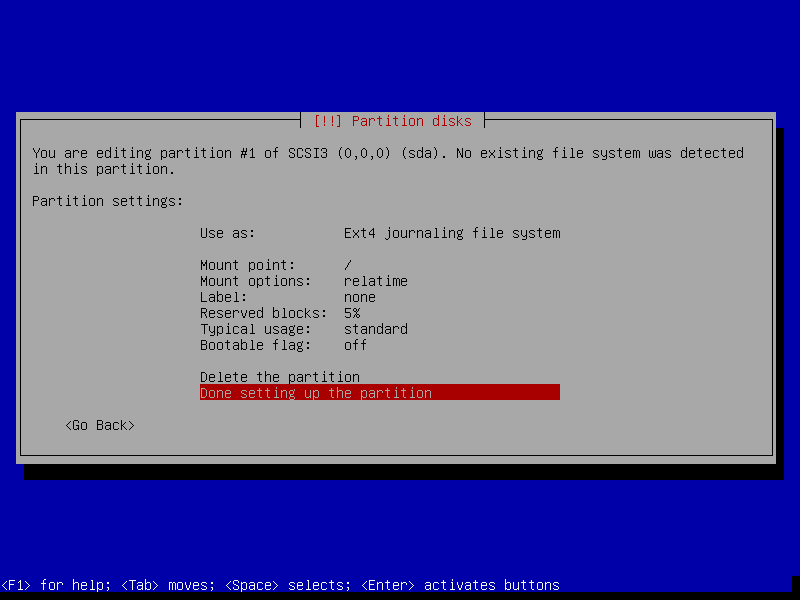

==============
Minimal Debian
==============

:date: 2015-07-07 15:43
:slug: minimal-debian
:tags: debian, linux
:modified: 2016-02-28 14:16:00

.. figure:: images/debianVader.png
    :alt: Debian Vader
    :width: 960px
    :height: 355px

    [Image courtesy `jschild <http://jschild.deviantart.com/art/Facebook-cover-debian-Darth-Vader-380351614>`_].

I like using Debian's minimal **mini.iso** installer to create **console-only base configurations** that can be customized for various tasks and `alternate desktops <http://www.circuidipity.com/i3-tiling-window-manager.html>`_.

Let's go!
=========

`Debian GNU/Linux <http://www.debian.org>`_ is an operating system created by volunteers of one of the largest and longest-running free software projects in the world. More than a hundred other Linux distributions like `Ubuntu <http://www.circuidipity.com/tag-ubuntu.html>`_ build their distributions on a solid Debian foundation.

There are 3 **release branches**: ``jessie/stable``, ``stretch/testing``, and ``sid/unstable``. Below is a visual walk-through of a sample Debian ``stable`` setup that makes use of an entire storage device divided into 3 partitions: a ``root`` partition, and `LUKS <https://en.wikipedia.org/wiki/Linux_Unified_Key_Setup>`_ encrypted ``swap`` + ``home`` partitions.

0. Prepare install media
------------------------

Download the `64-bit mini.iso <http://ftp.us.debian.org/debian/dists/stable/main/installer-amd64/current/images/netboot/mini.iso>`_ (`32bit <http://ftp.us.debian.org/debian/dists/stable/main/installer-i386/current/images/netboot/mini.iso>`_ for older machines) and `flash the image <https://www.debian.org/releases/stable/amd64/ch04s03.html.en>`_ to a USB stick. [1]_

Minimal installer (requires network connection) downloads all the latest packages during setup.

1. Launch
---------

.. image:: images/screenshot/debianInstall/01.1.png
    :align: center
    :alt: Install
    :width: 800px
    :height: 600px

.. image:: images/screenshot/debianInstall/02.png
    :align: center
    :alt: Select Language
    :width: 800px
    :height: 600px

.. image:: images/screenshot/debianInstall/03.png
    :alt: Select Location
    :align: center
    :width: 800px
    :height: 600px

.. image:: images/screenshot/debianInstall/04.png
    :alt: Configure Keyboard
    :align: center
    :width: 800px
    :height: 600px

.. image:: images/screenshot/debianInstall/05.png
    :alt: Hostname
    :align: center
    :width: 800px
    :height: 600px

.. image:: images/screenshot/debianInstall/06.png
    :alt: Domain
    :align: center
    :width: 800px
    :height: 600px

.. image:: images/screenshot/debianInstall/07.png
    :alt: Mirror Country
    :align: center
    :width: 800px
    :height: 600px

.. image:: images/screenshot/debianInstall/08.png
    :alt: Mirror archive
    :align: center
    :width: 800px
    :height: 600px

.. image:: images/screenshot/debianInstall/09.png
    :alt: Mirror Directory
    :align: center
    :width: 800px
    :height: 600px

.. image:: images/screenshot/debianInstall/10.png
    :alt: Proxy
    :align: center
    :width: 800px
    :height: 600px

Contents of the installer are now loaded into memory and the USB stick can safely be removed. [2]_

.. image:: images/screenshot/debianInstall/11.png
    :alt: Root password
    :align: center
    :width: 800px
    :height: 600px

.. image:: images/screenshot/debianInstall/12.png
    :alt: Verify password
    :align: center
    :width: 800px
    :height: 600px

.. image:: images/screenshot/debianInstall/13.png
    :alt: Full Name
    :align: center
    :width: 800px
    :height: 600px

.. image:: images/screenshot/debianInstall/14.png
    :alt: Username
    :align: center
    :width: 800px
    :height: 600px

.. image:: images/screenshot/debianInstall/15.png
    :alt: User password
    :align: center
    :width: 800px
    :height: 600px

.. image:: images/screenshot/debianInstall/16.png
    :alt: Verify password
    :align: center
    :width: 800px
    :height: 600px

.. image:: images/screenshot/debianInstall/17.png
    :alt: Select time zone
    :align: center
    :width: 800px
    :height: 600px

2. Partitions
-------------

In the example below I create 3 partitions [3]_ on the disk:

* sda1 is a 20GB ``root`` partition
* sda5 is a 1GB LUKS encrypted ``swap`` partition using a **random key**
* sda6 uses the remaining storage as a LUKS encrypted ``home`` partition using a **passphrase**

.. image:: images/screenshot/debianInstall/18.png
    :alt: Partitioning method
    :align: center
    :width: 800px
    :height: 600px

.. image:: images/screenshot/debianInstall/19.png
    :alt: Partition disks
    :align: center
    :width: 800px
    :height: 600px

.. image:: images/screenshot/debianInstall/20.png
    :alt: Partition table
    :align: center
    :width: 800px
    :height: 600px

.. image:: images/screenshot/debianInstall/21.png
    :alt: Free space
    :align: center
    :width: 800px
    :height: 600px

.. image:: images/screenshot/debianInstall/22.png
    :alt: New Partition
    :align: center
    :width: 800px
    :height: 600px

.. image:: images/screenshot/debianInstall/23.png
    :alt: Partition size
    :align: center
    :width: 800px
    :height: 600px

.. image:: images/screenshot/debianInstall/24.png
    :alt: Primary partition
    :align: center
    :width: 800px
    :height: 600px

.. image:: images/screenshot/debianInstall/25.png
    :alt: Beginning
    :align: center
    :width: 800px
    :height: 600px

Setting ``Mount options: relatime`` decreases write operations and boosts drive speed ...

.. image:: images/screenshot/debianInstall/25.1.png
    :alt: Mount options
    :align: center
    :width: 800px
    :height: 600px

.. image:: images/screenshot/debianInstall/27.png
    :alt: Free space
    :align: center
    :width: 800px
    :height: 600px

.. image:: images/screenshot/debianInstall/28.png
    :alt: New partition
    :align: center
    :width: 800px
    :height: 600px

.. image:: images/screenshot/debianInstall/29.png
    :alt: Partition size
    :align: center
    :width: 800px
    :height: 600px

.. image:: images/screenshot/debianInstall/30.png
    :alt: Logical partition
    :align: center
    :width: 800px
    :height: 600px

.. image:: images/screenshot/debianInstall/31.png
    :alt: Beginning
    :align: center
    :width: 800
    :height: 600px

.. image:: images/screenshot/debianInstall/31.1.png
    :alt: Use as
    :align: center
    :width: 800px
    :height: 600px

.. image:: images/screenshot/debianInstall/32.png
    :alt: Encrypt volume
    :align: center
    :width: 800px
    :height: 600px

.. image:: images/screenshot/debianInstall/32.1.png
    :alt: Encryption key
    :align: center
    :width: 800px
    :height: 600px

.. image:: images/screenshot/debianInstall/33.png
    :alt: Random key
    :align: center
    :width: 800px
    :height: 600px

If the hard disk has not been securely wiped prior to installing Debian (using a utility like `DBAN <http://www.circuidipity.com/multi-boot-usb.html>`_) you may want to configure ``Erase data: yes``. Note, however, depending on the size of the disk this operation can last several hours.

.. image:: images/screenshot/debianInstall/33.1.png
    :alt: Erase data
    :align: center
    :width: 800px
    :height: 600px

.. image:: images/screenshot/debianInstall/33.2.png
    :alt: Done setting up partition
    :align: center
    :width: 800px
    :height: 600px

.. image:: images/screenshot/debianInstall/34.png
    :alt: Free space
    :align: center
    :width: 800px
    :height: 600px

.. image:: images/screenshot/debianInstall/35.png
    :alt: New partition
    :align: center
    :width: 800px
    :height: 600px

.. image:: images/screenshot/debianInstall/36.png
    :alt: Partition size
    :align: center
    :width: 800px
    :height: 600px

.. image:: images/screenshot/debianInstall/30.png
    :alt: Logical partition
    :align: center
    :width: 800px
    :height: 600px

.. image:: images/screenshot/debianInstall/31.1.png
    :alt: Use as
    :align: center
    :width: 800px
    :height: 600px

.. image:: images/screenshot/debianInstall/38.png
    :alt: Encrypt volume
    :align: center
    :width: 800px
    :height: 600px

.. image:: images/screenshot/debianInstall/39.1.png
    :alt: Erase data
    :align: center
    :width: 800px
    :height: 600px

.. image:: images/screenshot/debianInstall/39.2.png
    :alt: Done setting up the partition
    :align: center
    :width: 800px
    :height: 600px

.. image:: images/screenshot/debianInstall/40.png
    :alt: Configure encrypted volumes
    :align: center
    :width: 800px
    :height: 600px

.. image:: images/screenshot/debianInstall/41.png
    :alt: Write changes to disk
    :align: center
    :width: 800px
    :height: 600px

.. image:: images/screenshot/debianInstall/42.png
    :alt: Create encrypted volumes
    :align: center
    :width: 800px
    :height: 600px

.. image:: images/screenshot/debianInstall/43.png
    :alt: Devices to encrypt
    :align: center
    :width: 800px
    :height: 600px

.. image:: images/screenshot/debianInstall/44.png
    :alt: Finish encrypt
    :align: center
    :width: 800px
    :height: 600px

.. image:: images/screenshot/debianInstall/45.png
    :alt: Encryption passphrase
    :align: center
    :width: 800px
    :height: 600px

.. image:: images/screenshot/debianInstall/46.png
    :alt: Verify passphrase
    :align: center
    :width: 800px
    :height: 600px

.. image:: images/screenshot/debianInstall/47.png
    :alt: Configure encrypted volume
    :align: center
    :width: 800px
    :height: 600px

.. image:: images/screenshot/debianInstall/48.png
    :alt: Mount point
    :align: center
    :width: 800px
    :height: 600px

.. image:: images/screenshot/debianInstall/48.1.png
    :alt: Mount home
    :align: center
    :width: 800px
    :height: 600px

.. image:: images/screenshot/debianInstall/49.png
    :alt: Mount options
    :align: center
    :width: 800px
    :height: 600px

**Reserved blocks** can be used by privileged system processes to write to disk - useful if a full filesystem blocks users from writing - and reduce disk fragmentation. On large, **non-root partitions** extra space can be gained by reducing the default 5% reserve set aside by Debian to 1% ...

.. image:: images/screenshot/debianInstall/49.1.png
    :alt: Reserved blocks
    :align: center
    :width: 800px
    :height: 600px

.. image:: images/screenshot/debianInstall/49.2.png
    :alt: Percent reserved
    :align: center
    :width: 800px
    :height: 600px

.. image:: images/screenshot/debianInstall/49.3.png
    :alt: Done setting up the partition
    :align: center
    :width: 800px
    :height: 600px

.. image:: images/screenshot/debianInstall/49.4.png
    :alt: Finish partitioning
    :align: center
    :width: 800px
    :height: 600px

.. image:: images/screenshot/debianInstall/50.png
    :alt: Write changes to disk
    :align: center
    :width: 800px
    :height: 600px

3. Install packages and finish up
---------------------------------

.. image:: images/screenshot/debianInstall/51.png
    :alt: Popularity-contest
    :align: center
    :width: 800px
    :height: 600px

Select only ``[*] standard system utilities`` if you wish to start with a minimal, console-only base configuration ready for further customization. [4]_
    
.. image:: images/screenshot/debianInstall/52.png
    :alt: Software selection
    :align: center
    :width: 800px
    :height: 600px

Packages are downloaded and the installer makes its finishing touches ...

.. image:: images/screenshot/debianInstall/53.png
    :alt: GRUB
    :align: center
    :width: 800px
    :height: 600px

.. image:: images/screenshot/debianInstall/54.png
    :alt: GRUB install
    :align: center
    :width: 800px
    :height: 600px

.. image:: images/screenshot/debianInstall/55.png
    :alt: Finish
    :align: center
    :width: 800px
    :height: 600px

4. First boot
-------------

.. image:: images/screenshot/debianInstall/56.png
    :alt: GRUB menu
    :align: center
    :width: 800px
    :height: 600px

System will display a passphrase prompt to unlock encrypted ``home`` partition ...

.. image:: images/screenshot/debianInstall/57.png
    :alt: Enter encrypt passphrase
    :align: center
    :width: 800px
    :height: 600px

.. image:: images/screenshot/debianInstall/58.png
    :alt: Login
    :align: center
    :width: 800px
    :height: 600px

Login as root ... then run ``timedatectl`` to confirm system time+date is properly set.

5. Network
----------

Check which network interfaces are detected and settings ...

.. code-block:: bash

    # ip a
    
**Wired** interfaces are usually auto-configured by default and assigned an IP address courtesy of DHCP.

To assign a **static** address, deactivate the wired interface and create a new entry in ``/etc/network/interfaces``. Sample entry for ``enp3s0`` ...

.. code-block:: bash

    # The primary network interface
    auto enp3s0
    #iface enp3s0 inet dhcp
    iface enp3s0 inet static
        address 192.168.1.88
        netmask 255.255.255.0
        gateway 192.168.1.1
        dns-nameservers 192.168.1.1

Bring up|down interface with ``if{up,down} enp3s0``.

Create a temporary **wireless** interface connection to WPA2 encrypted access points manually using ``wpa_supplicant`` + ``wpa_passphrase`` + ``dhclinet``. Sample setup of ``wlp1s0`` ...

.. code-block:: bash

    # ip link set wlp1s0 up             # bring up interface
    # iw dev wlp1s0 link                # get link status
    # iw dev wlp1s0 scan | grep SSID    # scan for access points
    # wpa_supplicant -i wlp1s0 -c<(wpa_passphrase "MY_SSID" "MY_PASSPHRASE")   # connect to WPA/WPA2 ... add '-B' to background process
    # dhclient wlp1s0                   # obtain IP address

More permanent configurations may be set in ``interfaces``. Sample setup [5]_ with a static IP address ...

.. code-block:: bash

    iface wlp1s0 inet static
        address 192.168.1.77
        netmask 255.255.255.0
        gateway 192.168.1.1                                                              
        wpa-ssid MY_SSID
        wpa-psk MY_PASSPHRASE
        dns-nameservers 8.8.8.8 8.8.4.4                                                  
                                                                                     
Alternative setup using DHCP ...

.. code-block:: bash               
                                                                                     
    allow-hotplug wlp1s0
    iface wlp1s0 inet dhcp
        wpa-ssid MY_SSID
        wpa-psk MY_PASSPHRASE                                       
        dns-nameservers 8.8.8.8 8.8.4.4

Once a link is established an optional network manager utility may be installed. Packages ``network-manager`` and ``network-manager-gnome`` provide the console ``nmcli`` and graphical ``nm-applet`` clients respectively ...

.. code-block:: bash

    # apt install network-manager 

Comment out (deactivate) any entries in ``interfaces`` that will be managed by ``network-manager``.

6. Where to go next ...
-----------------------

... is up to YOU. Yeehaw.

Happy hacking!

Notes
-----

.. [1] An alternative is adding the image to a `USB stick with multiple Linux installers <http://www.circuidipity.com/multi-boot-usb.html>`_.

.. [2] Recommended: Otherwise the partitioning tool may designate the USB device as primary (sda) storage.

.. [3] For storage devices >=128GB I create separate ``root`` + ``swap`` + ``home`` partitions. Smaller devices get ``boot`` + ``swap`` + ``root``  partitions and remember that encrypted ``root`` **requires** an unencrypted ``boot``.

.. [4] The task selection menu can be used post-install by running (as root) ``tasksel``.

.. [5] Multiple wireless static IP address setups can be created with ``iface wlp1s0_NAME inet static`` and [de]activated with ``if{up.down} wlp1s0=wlp1s0_NAME``.
