==============
Minimal Debian
==============

:date: 2015-07-07 15:43
:slug: minimal-debian
:tags: debian, linux, shell, programming

.. figure:: images/debianVader.png
    :alt: Debian Vader
    :width: 960px
    :height: 355px

    [Image courtesy `jschild <http://jschild.deviantart.com/art/Facebook-cover-debian-Darth-Vader-380351614>`_].

I use Debian's ``mini.iso`` installer to create a **lightweight base configuration** that can be customized for various tasks and desktops.

Let's go!
=========

`Debian GNU/Linux <http://www.debian.org>`_ is an operating system created by volunteers of one of the largest and longest-running free software projects in the world. More than a hundred other Linux distributions like `Ubuntu <http://www.circuidipity.com/tag-ubuntu.html>`_ build their distributions on solid Debian **awesomesauce**.

There are 3 **release branches**: ``jessie/stable``, ``stretch/testing``, and ``sid/unstable``. Below is a visual walk-through of a sample Debian ``stable`` setup that makes use of an entire storage device divided into 3 partitions: unencrypted ``root``, and `LUKS <https://en.wikipedia.org/wiki/Linux_Unified_Key_Setup>`_ encrypted ``swap`` + ``home``.

0. Prepare install media
========================

Download the `64-bit mini.iso <http://ftp.us.debian.org/debian/dists/stable/main/installer-amd64/current/images/netboot/mini.iso>`_ (`32bit <http://ftp.us.debian.org/debian/dists/stable/main/installer-i386/current/images/netboot/mini.iso>`_ for older machines) and `flash the image <https://www.debian.org/releases/stable/amd64/ch04s03.html.en>`_ to a USB stick. An alternative (my choice) is adding the image to a `USB stick with multiple Linux installers <http://www.circuidipity.com/multi-boot-usb.html>`_.

The minimal console installer (requires network connection) downloads all the latest packages during setup.

1. Launch
=========

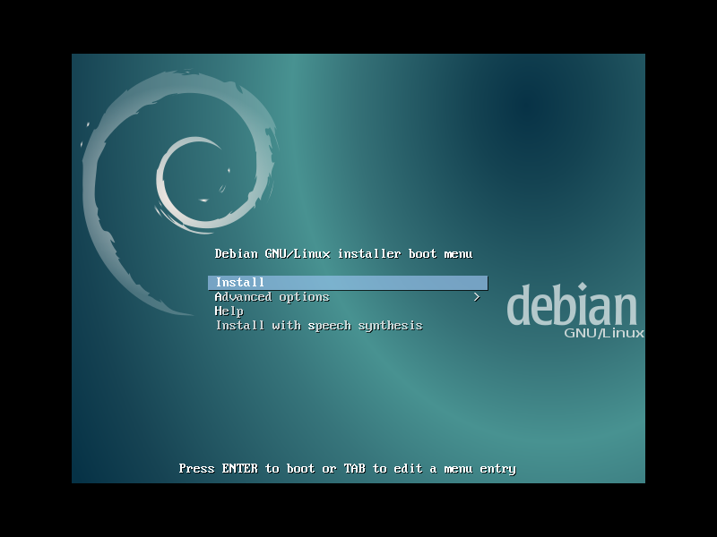

.. image:: images/screenshot/debianInstall/02.png
    :align: center
    :alt: Select Language
    :width: 800px
    :height: 600px

.. image:: images/screenshot/debianInstall/03.png
    :alt: Select Location
    :align: center
    :width: 800px
    :height: 600px

.. image:: images/screenshot/debianInstall/04.png
    :alt: Configure Keyboard
    :align: center
    :width: 800px
    :height: 600px

.. image:: images/screenshot/debianInstall/05.png
    :alt: Hostname
    :align: center
    :width: 800px
    :height: 600px

.. image:: images/screenshot/debianInstall/06.png
    :alt: Domain
    :align: center
    :width: 800px
    :height: 600px

.. image:: images/screenshot/debianInstall/07.png
    :alt: Mirror Country
    :align: center
    :width: 800px
    :height: 600px

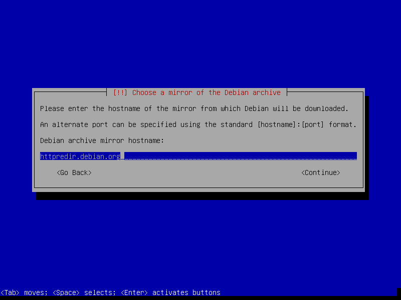

.. image:: images/screenshot/debianInstall/09.png
    :alt: Mirror Directory
    :align: center
    :width: 800px
    :height: 600px

.. image:: images/screenshot/debianInstall/10.png
    :alt: Proxy
    :align: center
    :width: 800px
    :height: 600px

.. image:: images/screenshot/debianInstall/11.png
    :alt: Root password
    :align: center
    :width: 800px
    :height: 600px

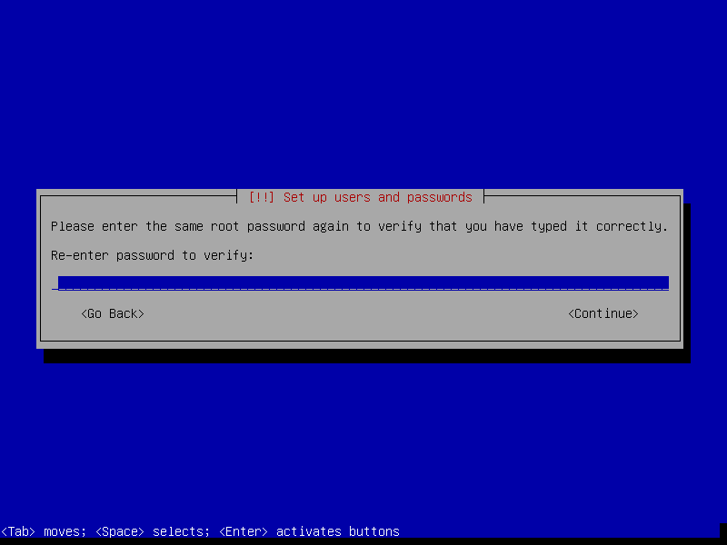

.. image:: images/screenshot/debianInstall/13.png
    :alt: Full Name
    :align: center
    :width: 800px
    :height: 600px

.. image:: images/screenshot/debianInstall/14.png
    :alt: Username
    :align: center
    :width: 800px
    :height: 600px

.. image:: images/screenshot/debianInstall/15.png
    :alt: User password
    :align: center
    :width: 800px
    :height: 600px

.. image:: images/screenshot/debianInstall/16.png
    :alt: Verify password
    :align: center
    :width: 800px
    :height: 600px

.. image:: images/screenshot/debianInstall/17.png
    :alt: Select time zone
    :align: center
    :width: 800px
    :height: 600px

2. Partitions
=============

In the example below I create 3 partitions on the disk:

* ``sda1`` configured as 20GB ``root``
* ``sda5`` configured as 1GB LUKS encrypted ``swap`` with ``random key``
* ``sda6`` uses remaining space as LUKS encrypted ``home`` with ``passphrase``

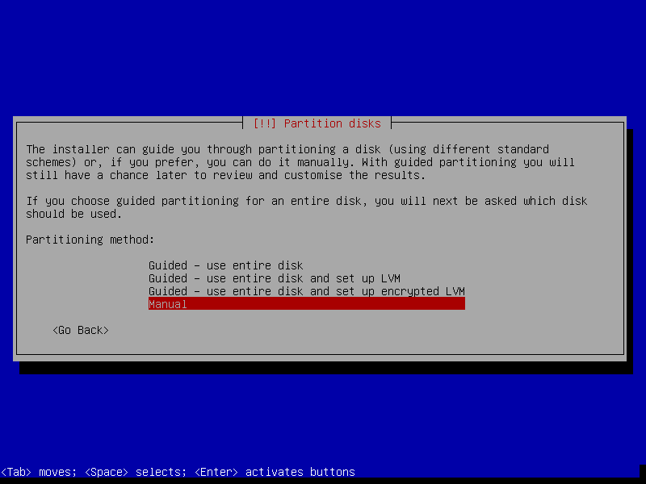

.. image:: images/screenshot/debianInstall/19.png
    :alt: Partition disks
    :align: center
    :width: 800px
    :height: 600px

.. image:: images/screenshot/debianInstall/20.png
    :alt: Partition table
    :align: center
    :width: 800px
    :height: 600px

.. image:: images/screenshot/debianInstall/21.png
    :alt: Free space
    :align: center
    :width: 800px
    :height: 600px

.. image:: images/screenshot/debianInstall/22.png
    :alt: New Partition
    :align: center
    :width: 800px
    :height: 600px

.. image:: images/screenshot/debianInstall/23.png
    :alt: Partition size
    :align: center
    :width: 800px
    :height: 600px

.. image:: images/screenshot/debianInstall/24.png
    :alt: Primary partition
    :align: center
    :width: 800px
    :height: 600px

.. image:: images/screenshot/debianInstall/25.png
    :alt: Beginning
    :align: center
    :width: 800px
    :height: 600px

Setting **Mount options** to ``noatime`` decreases write operations and boosts drive speed.

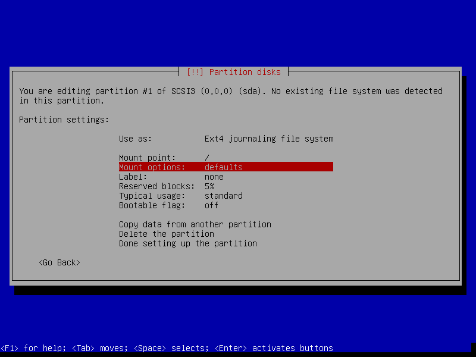

.. image:: images/screenshot/debianInstall/25.2.png
    :alt: noatime
    :align: center
    :width: 800px
    :height: 600px

.. image:: images/screenshot/debianInstall/26.png
    :alt: Done setting up partition
    :align: center
    :width: 800px
    :height: 600px

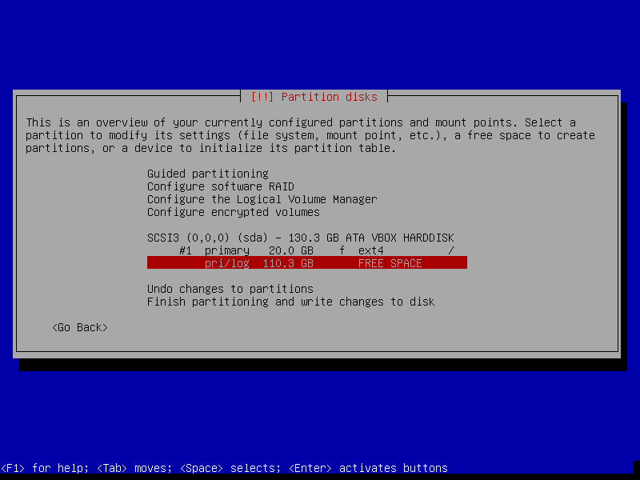

.. image:: images/screenshot/debianInstall/28.png
    :alt: New partition
    :align: center
    :width: 800px
    :height: 600px

.. image:: images/screenshot/debianInstall/29.png
    :alt: Partition size
    :align: center
    :width: 800px
    :height: 600px

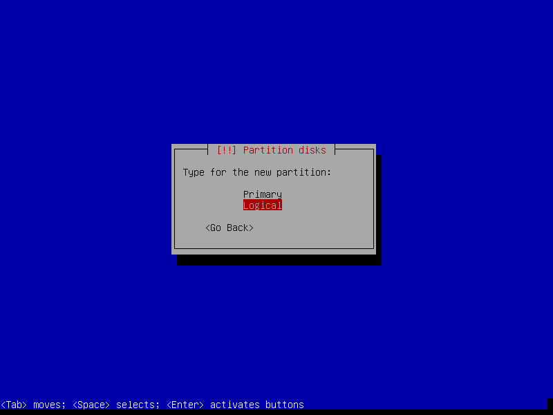

.. image:: images/screenshot/debianInstall/31.png
    :alt: Beginning
    :align: center
    :width: 800
    :height: 600px

.. image:: images/screenshot/debianInstall/31.1.png
    :alt: Use as
    :align: center
    :width: 800px
    :height: 600px

.. image:: images/screenshot/debianInstall/32.png
    :alt: Encrypt volume
    :align: center
    :width: 800px
    :height: 600px

.. image:: images/screenshot/debianInstall/32.1.png
    :alt: Encryption key
    :align: center
    :width: 800px
    :height: 600px

.. image:: images/screenshot/debianInstall/33.png
    :alt: Random key
    :align: center
    :width: 800px
    :height: 600px

If the hard disk has not been securely wiped prior to installing Debian (using a utility like `DBAN <http://www.circuidipity.com/multi-boot-usb.html>`_) you may want to set ``Erase data`` to ``yes``. Depending on the size of the disk this operation can last several hours.

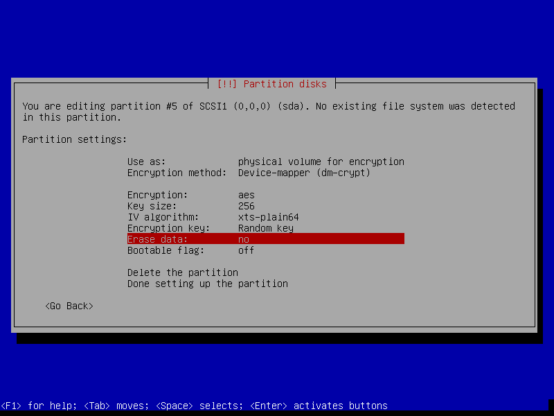

.. image:: images/screenshot/debianInstall/33.2.png
    :alt: Done setting up partition
    :align: center
    :width: 800px
    :height: 600px

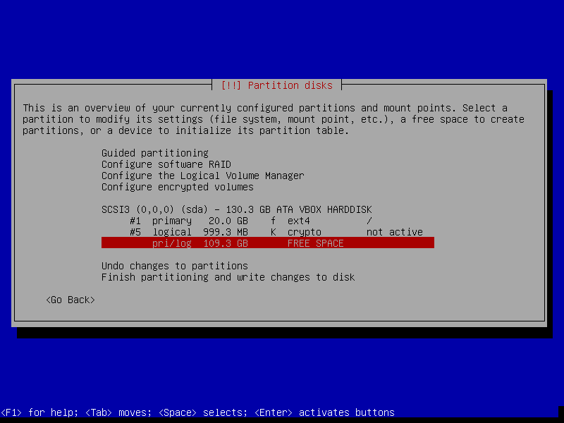

.. image:: images/screenshot/debianInstall/35.png
    :alt: New partition
    :align: center
    :width: 800px
    :height: 600px

.. image:: images/screenshot/debianInstall/36.png
    :alt: Partition size
    :align: center
    :width: 800px
    :height: 600px

.. image:: images/screenshot/debianInstall/31.1.png
    :alt: Use as
    :align: center
    :width: 800px
    :height: 600px

.. image:: images/screenshot/debianInstall/38.png
    :alt: Encrypt volume
    :align: center
    :width: 800px
    :height: 600px

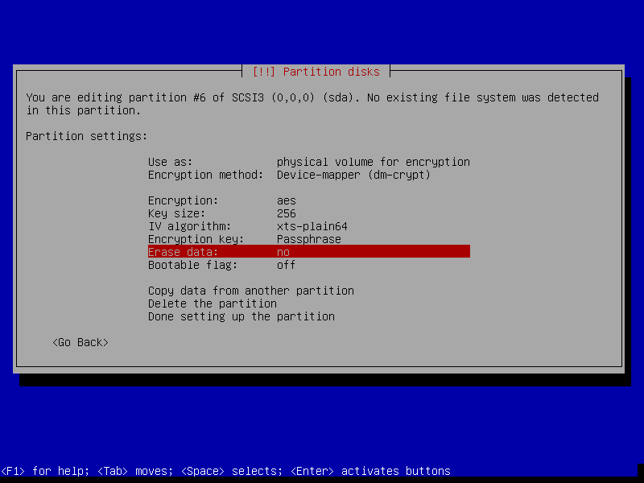

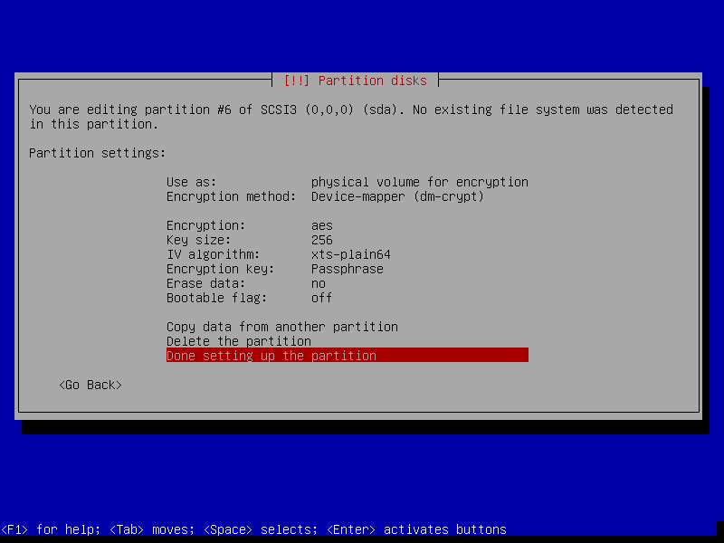

.. image:: images/screenshot/debianInstall/40.png
    :alt: Configure encrypted volumes
    :align: center
    :width: 800px
    :height: 600px

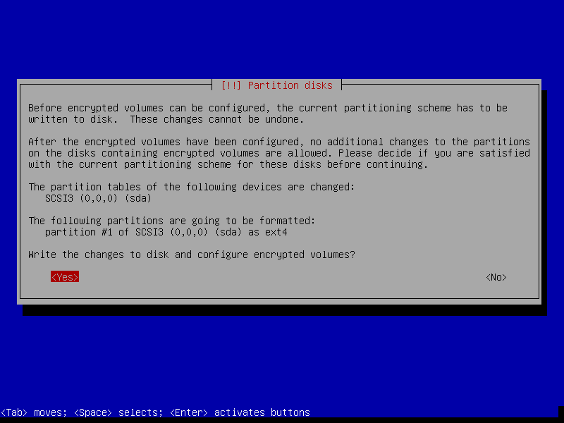

.. image:: images/screenshot/debianInstall/42.png
    :alt: Create encrypted volumes
    :align: center
    :width: 800px
    :height: 600px

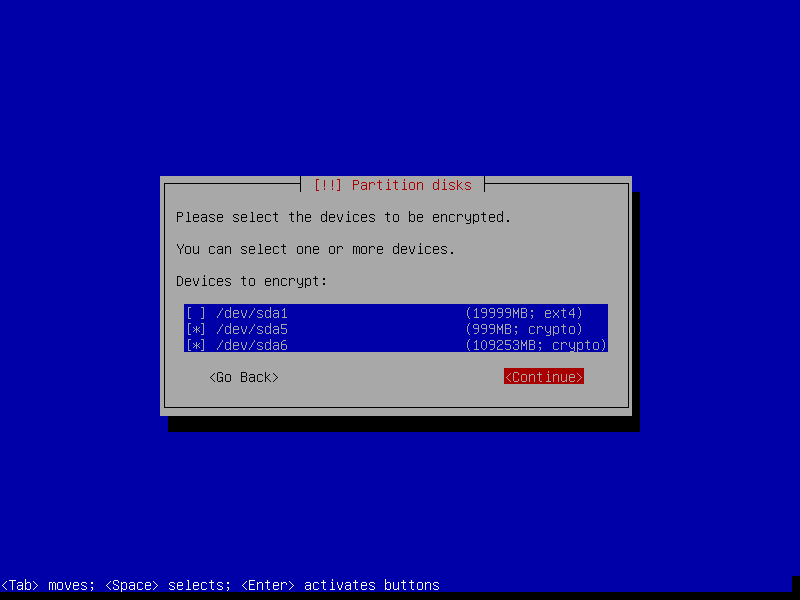

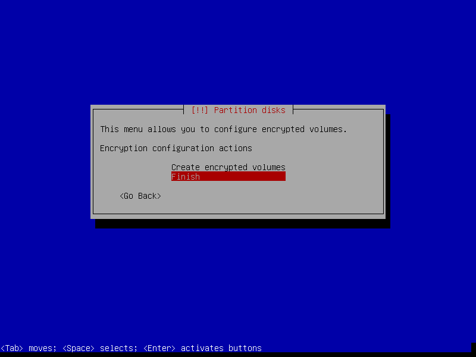

.. image:: images/screenshot/debianInstall/46.png
    :alt: Verify passphrase
    :align: center
    :width: 800px
    :height: 600px

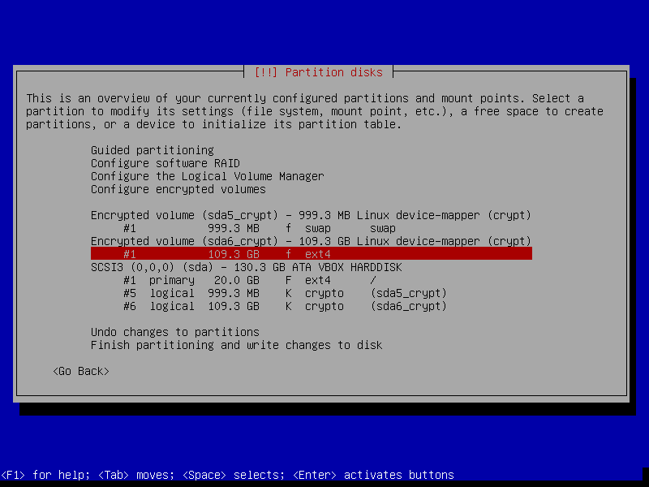

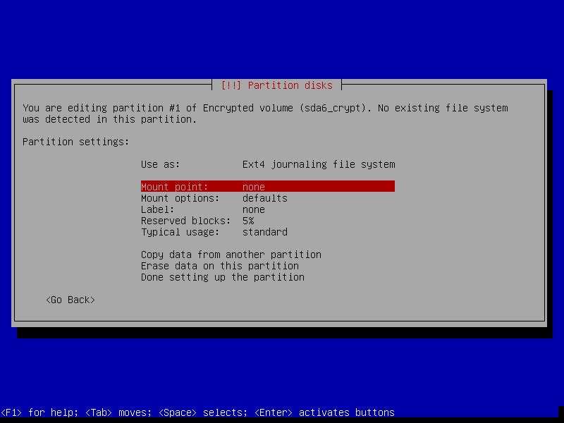

.. image:: images/screenshot/debianInstall/48.1.png
    :alt: Mount home
    :align: center
    :width: 800px
    :height: 600px

.. image:: images/screenshot/debianInstall/49.png
    :alt: Mount options
    :align: center
    :width: 800px
    :height: 600px

.. image:: images/screenshot/debianInstall/25.2.png
    :alt: noatime
    :align: center
    :width: 800px
    :height: 600px

**Reserved blocks** can be used by privileged system processes to write to disk - useful if a full filesystem blocks users from writing - and reduce disk fragmentation. On large, non-root partitions extra space can be gained by reducing the default 5% reserve set aside by Debian to 1%.

.. image:: images/screenshot/debianInstall/49.1.png
    :alt: Reserved blocks
    :align: center
    :width: 800px
    :height: 600px

.. image:: images/screenshot/debianInstall/49.2.png
    :alt: Percent reserved
    :align: center
    :width: 800px
    :height: 600px

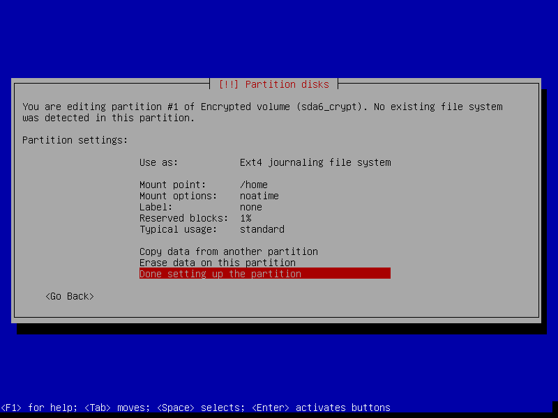

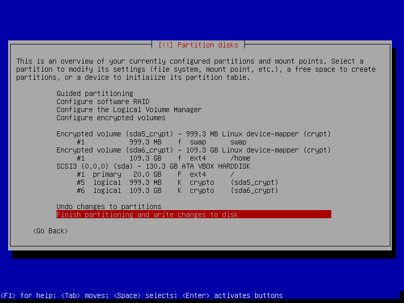

.. image:: images/screenshot/debianInstall/50.png
    :alt: Write changes to disk
    :align: center
    :width: 800px
    :height: 600px

3. Install packages and finish up
=================================

.. image:: images/screenshot/debianInstall/51.png
    :alt: Popularity-contest
    :align: center
    :width: 800px
    :height: 600px

Select only ``[*] standard system utilities`` if you wish to start with a minimal, console-only base configuration ready for further customization. Task menu can be accessed post-install by running ``tasksel``.
    
.. image:: images/screenshot/debianInstall/52.png
    :alt: Software selection
    :align: center
    :width: 800px
    :height: 600px

.. image:: images/screenshot/debianInstall/53.png
    :alt: GRUB
    :align: center
    :width: 800px
    :height: 600px

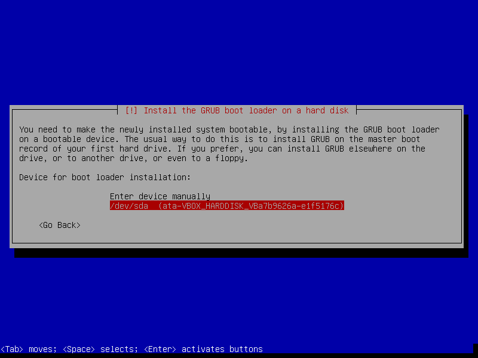

.. image:: images/screenshot/debianInstall/55.png
    :alt: Finish
    :align: center
    :width: 800px
    :height: 600px

.. image:: images/screenshot/debianInstall/56.png
    :alt: GRUB menu
    :align: center
    :width: 800px
    :height: 600px

If an encrypted home partition was created in Step 2 the system will display a passphrase prompt to unlock the partition.

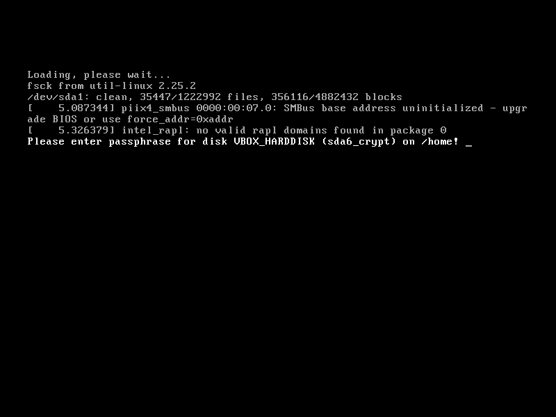

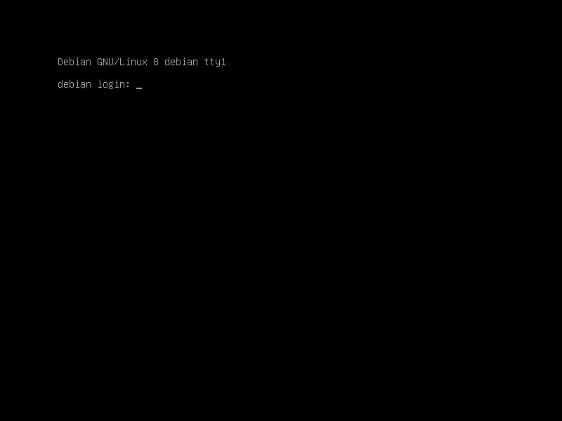

4. Post-install
===============

I created a `post-install shell script <https://github.com/vonbrownie/linux-post-install/blob/master/scripts/debian-post-install.sh>`_ to configure or upgrade (to ``testing`` or ``sid``) a fresh setup.

Happy hacking!
