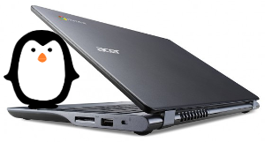

========================
Chromebook to Jessiebook
========================

:date: 2015-07-08 10:45:00
:slug: c720-chromebook-to-jessiebook
:tags: chromebook, debian, linux
:modified: 2017-05-12 00:10:00

Replace ChromeOS permanently with **Debian** on the **Acer C720 Chromebook**.

Let's go!
=========

Running a full-featured Linux on this little laptop is a delight: lightweight, several hours battery life, inexpensive, and snappy performance. I started with Debian, followed by `Lubuntu <http://www.circuidipity.com/c720-lubuntubook.html>`_, `Arch <http://www.circuidipity.com/arch-install-encrypt.html>`_, `Ubuntu <http://www.circuidipity.com/c720-ubuntubook.html>`_, and have now returned to the latest Debian ``jessie/stable`` release.

This device is available in a few different configurations. Mine is the non-touchscreen model ``C720-2848`` with (non-expandable) 2GB RAM and a (user-replaceable) 16GB SSD.

0. Recovery Image
-----------------

Create a recovery image of Chrome OS (my C720 is model ``PEPPY C6A-N3C-A7O``) to enable restoring the Chromebook to its default configuration. [1]_ This will require a spare USB stick of 2GB or better:

* Log into the Chromebook and let it auto update, as there sometimes are firmware updates... check the updating status in the browser at ``chrome://help``
* Insert the USB stick, enter ``chrome://imageburner`` and follow the directions to generate a recovery image

1. Prepare install media
------------------------

Download the `64-bit minimal installer <http://ftp.us.debian.org/debian/dists/stable/main/installer-amd64/current/images/netboot/mini.iso>`_ and `flash the image <https://www.debian.org/releases/stable/amd64/ch04s03.html.en>`_ to a USB stick. An alternative (my choice) is adding the image to a `USB stick with multiple Linux installers <http://www.circuidipity.com/multi-boot-usb.html>`_. Using the minimal console installer (requires network connection) downloads all the latest packages during setup.

2. SeaBIOS
----------

`SeaBIOS <http://www.coreboot.org/SeaBIOS>`_ in combination with **Coreboot** provides an open-source legacy BIOS that enables access to the MBR and the ability to install an alternative OS on the Chromebook. All this good stuff involves jumping through a few simple hoops and not trembling in fear at the "scary white screen" that pops up at power up stating that the boot loader detects something is **very very wrong** with the Chromebook and helpfully suggests pressing the spacebar to begin recovery. **Do not press the spacebar** or the Debian installation will be wiped from disk!

There are 2 different methods for configuring SeaBIOS in preparation for installing Debian. First method uses a few simple commands in the Chrome OS shell to place the Chromebook into **developer mode** and allow booting the USB install media and replacing Chrome OS with Debian. The drawback is that scary screen appears at every boot and you must press ``CTRL+L`` to boot to legacy-mode and onward to GRUB and Debian (and **ignore** the helpful prompt to press spacebar and inadvertently begin the adventure of wiping clean the SSD).

Second method involves setting new flags for the write-protected **Google Binary Block** (GBB) in the device firmware. Delay at the boot screen can be reduced to a one second timeout and the legacy-mode BIOS set as the system default (no key combo required). Pressing the spacebar is disabled from doing any harm to Debian (the Chromebook just beeps). The drawback is that it involves the (very simple) removal of the device's bottom cover and the temporary removal of the **write-protect screw** from the motherboard to permit flashing new flags to the GBB... and this may void the Chromebook's warranty (one of the case screws lies underneath a sticker declaring the warranty void if disturbed).

Experimenting with alternate OS installs on the Chromebook I first employed the developer mode method followed by the write-protect screw removal. I prefer configuring the device to default to legacy-mode BIOS but I have employed both methods successfully and describe their respective steps below.

2.1 Write-Protect Screw Method
------------------------------

Disconnect power. Turn the Chromebook over facing bottom up and remove the 13 screws (not missing the one hidden under the warranty sticker). Gently pry the case off starting with the seam where the display connects to device. It comes away pretty easy.

This is what you see ...

.. figure:: images/c720-chromebook-annotated-innards.png
    :alt: C720 annotated innards
    :width: 800px
    :height: 558px

    [ Image: [2]_ The battery lock screw is #6 and the write-protect screw is #7 ].

.. role:: warning

:warning:`WARNING!` This will **wipe out** whatever is installed on the SSD:

* Remove the write-protect screw
* Close back cover using only the battery lock screw to hold in place
* Re-connect power, boot Chromebook and wait until it displays ...

.. code-block:: bash
    
    Chrome OS is missing or damaged.                                            
    Please insert a recovery USB stick or SD card.                              

* Insert USB recovery media prepared in Step 0 and it will proceed to restore Chrome OS and reboot
* At default Chrome OS "Welcome!" screen open a terminal ``CTRL+ALT+F2`` (Right-arrow)
* Login as ``chronos`` (no password), then enter ``sudo su`` for superuser access

Set new GBB flags [3]_ using the ``set_gbb_flags.sh`` script in Chrome OS. Enable short **developer mode** screen (1 second timeout) followed by **default legacy mode** boot by using these flags ...

.. code-block:: bash

    GBB_FLAG_DEV_SCREEN_SHORT_DELAY 0×00000001
    GBB_FLAG_FORCE_DEV_SWITCH_ON 0×00000008
    GBB_FLAG_FORCE_DEV_BOOT_LEGACY 0×00000080
    GBB_FLAG_DEFAULT_DEV_BOOT_LEGACY 0×00000400

... which adds up to running in the shell ...

.. code-block:: bash

    /usr/share/vboot/bin/set_gbb_flags.sh 0x489

Shutdown ...

.. code-block:: bash

    # shutdown -h now

... and disconnect the power:

* Remove the bottom cover again and reinstall the write-lock screw to protect the BIOS
* Close cover and reinstall all the case screws

Re-connect power, insert USB stick prepared in Step 1, and power up Chromebook. [4]_

2.2 Developer Mode Method
-------------------------

The alternative to removing the write-protect screw above is to place the Chromebook into developer mode [5]_ using the Chrome OS shell before booting the USB install media:

* With the Chromebook off... Hold down ``ESC+F3`` (Refresh) keys and power on the device
* Invoke Recovery, and at the Recovery screen press ``Ctrl+D``
* Device will prompt for confirmation, press ``ENTER`` and the system reboots into developer mode
* Scary white boot screen appears and you need to press ``Ctrl+D`` to continue boot

Enable the **USB Boot** and **Legacy BIOS** modes by opening the shell with ``Ctrl+Alt+T`` and enter ``shell``. Set ``dev_boot_usb`` and ``dev_boot_legacy`` to active:

.. code-block:: bash

    $ sudo crossystem dev_boot_usb=1
    $ sudo crossystem dev_boot_legacy=1

Insert USB stick prepared in Step 1, reboot the Chromebook and press ``CTRL+L`` at the boot screen to enter legacy boot mode. [6]_

3. Install Debian
-----------------

My `visual screenshot tour <http://www.circuidipity.com/minimal-debian.html>`_ installing the Debian stable release.

4. Touchpad
-----------

Debian ``jessie/stable`` installs Linux kernel 3.16 with backported support for Chromebook touchpad. Per-session modifications of touchpad settings can be made using ``synclient`` ...

.. code-block:: bash

    $ synclient                 ## display current settings
    $ synclient TapButton3=2    ## 3-finger tap = middle-click

Make any desired touchpad settings permanent by creating ``/etc/X11/xorg.conf.d/50-c720-touchpad.conf`` ...

.. code-block:: bash

    $ sudo mkdir /etc/X11/xorg.conf.d
    $ sudo cp /usr/share/X11/xorg.conf.d/50-synaptics.conf /etc/X11/xorg.conf.d/50-c720-touchpad.conf

Modify to adjust timeouts, add tap-mouse actions (2-finger tap = right-click, 3-finger tap = middle-click), and 2-finger scrolling. [7]_

Example ...

.. code-block:: bash

    Section "InputClass" 
        Identifier      "touchpad peppy cyapa" 
        MatchIsTouchpad "on" 
        MatchDevicePath "/dev/input/event*" 
        MatchProduct    "cyapa" 
        Option          "FingerLow" "5" 
        Option          "FingerHigh" "5"
        Option          "VertEdgeScroll" "0"
        Option          "VertTwoFingerScroll" "1"
        Option          "HorizTwoFingerScroll" "1"
        Option          "AreaRightEdge" "850"
        Option          "AreaLeftEdge" "50"
        Option          "TapButton1" "1"
        Option          "TapButton2" "3"
        Option          "TapButton3" "2"
    EndSection

Link: `50-c720-touchpad.conf <https://github.com/vonbrownie/linux-post-install/blob/master/config/c720_jessiebook/etc/X11/xorg.conf.d/50-c720-touchpad.conf>`_

5. SSD
------

`Swappiness <https://en.wikipedia.org/wiki/Swappiness>`_ parameter controls the preference of the kernel to move processes out of physical memory to the swap partition. Range is **0-100**, default is set to **60** and lower values cause the kernel to avoid swapping and higher values prompt more frequent swap use.

Check current swappiness value ...

.. code-block:: bash

    $ cat /proc/sys/vm/swappiness

Reduce SSD writes by setting a low value of ``vm.swappiness=1`` in ``/etc/sysctl.conf``.

**TRIM** optimizes SSD performance [8]_ and is enabled by adding the ``discard`` option to ``/etc/crypttab`` and ``/etc/fstab``.

Example ``crypttab`` ...

.. code-block:: bash

    sda2_crypt /dev/sda2 /dev/urandom cipher=aes-xts-plain64,size=256,discard,swap
    sda3_crypt UUID=<STRING> none luks,discard

Example ``fstab`` ...

.. code-block:: bash

    # <file system> <mount point>   <type>  <options>       <dump>  <pass>
    /dev/mapper/sda3_crypt /               ext4    noatime,discard,errors=remount-ro 0       1
    UUID=<STRING> /boot                    ext4    noatime,discard         0       2
    /dev/mapper/sda2_crypt none            swap    sw,discard              0       0

Update ``/boot/initrd.img-*`` ...

.. code-block:: bash
 
    $ sudo update-initramfs -u -k all                                                      

6. Suspend
----------

**Problem:** Suspend-and-resume generates a stream of errors ...

.. code-block:: bash

    ehci-pci 0000:00:1d.0: port 1 resume error -19
    ehci-pci 0000:00:1d.0: port 2 resume error -19
    usb usb3-port1: over-current condition
    usb usb3-port1: connect-debounce failed
    usb usb3-port2: over-current condition
    usb usb3-port2: connect-debounce failed

... and blocks Jessiebook from executing a proper restart/shutdown.

**FIX:** [9]_ Create ``/lib/systemd/system-sleep/ehci-pci.sh`` ...

.. code-block:: bash

    #!/bin/bash

    case $1/$2 in
        pre/*)
        # Unbind ehci for preventing error
        echo -n "0000:00:1d.0" | tee /sys/bus/pci/drivers/ehci-pci/unbind
        ;;
        post/*)
        # Bind ehci for preventing error
        echo -n "0000:00:1d.0" | tee /sys/bus/pci/drivers/ehci-pci/bind
        ;;
    esac

Make the script executable ...
                                                                                    
.. code-block:: bash                                                                
                                                                                    
    $ sudo chmod 755 /lib/systemd/system-sleep/ehci-pci.sh           
                                                                                    
Configure boot options in ``/etc/default/grub`` ...                                    
                                                                                
.. code-block:: bash                                                            
                                                                                
    GRUB_CMDLINE_LINUX_DEFAULT="tpm_tis.force=1" 
                                                                                
Update GRUB ...

.. code-block:: bash                                                            
                                                                                
    $ sudo update-grub                                                          

Link: `ehci-pci.sh <https://github.com/vonbrownie/linux-post-install/blob/master/config/c720_jessiebook/lib/systemd/system-sleep/ehci-pci.sh>`_

7. Keyboard Shortcuts
---------------------

Top row on the keyboard with the shortcut icons (``Brightness``, ``Volume``, etc.) identify in Linux as ``F1-F10`` keys and the ``Search`` key (in ``CapsLk`` position) acts as ``Super`` (Windows) modifier key.

Create keyboard shortcuts by installing ...

* ``xbindkeys`` - associate keys to shell commands
* ``xbacklight`` - set backlight level using RandR
* ``pulseaudio-utils`` - manage sound with ``pactl``
* ``xvkbd`` - send characters to another client 

.. code-block:: bash

    $ sudo apt-get install xbindkeys xbacklight pulseaudio-utils xvkbd

7.1 Direction, Brightness, Volume, Page Keys
--------------------------------------------

.. code-block:: bash

    $ xbindkeys -k

Enable function keys to modify sound and brightness settings by creating ``~/.xbindkeysrc``.

Example ...

.. code-block:: bash

    # backward/forward
    "xvkbd -xsendevent -text "\A\[Left]""
    F1 

    "xvkbd -xsendevent -text "\A\[Right]""
    F2 

    # screenshots
    # desktop
    "scrot '%Y-%m-%dT%H%M%S.png' -e 'mv $f ~/Downloads && eog ~/Downloads/$f'"
    Alt + F4
    # active Window
    "scrot -d 4 -u -z '%Y-%m-%dT%H%M%S.png' -e 'mv $f ~/Downloads && eog ~/Downloads/$f'"
    Control + F4

    # backlight decrease/increase
    "xbacklight -dec 10"
    F6
    "xbacklight -inc 10"
    F7

    # volume mute/decrease/increase
    # paVolume - https://github.com/vonbrownie/homebin/blob/master/paVolume
    "paVolume -m"
    F8
    "paVolume -d"
    F9
    "paVolume -u"
    F10

    # page up/down, home, end
    "xvkbd -xsendevent -text '\[Page_Up]'"
    Alt + Up

    "xvkbd -xsendevent -text '\[Page_Down]'"
    Alt + Down

    "xvkbd -xsendevent -text '\[Home]'"
    Alt + Left

    "xvkbd -xsendevent -text '\[End]'"
    Alt + Right

Enable new key shortcuts ...

.. code-block:: bash

    $ xbindkeys

Place ``xbindkeys`` in ``~/.xinitrc`` to load configuration at ``startx``. [10]_

Links: `.xbindkeysrc <https://github.com/vonbrownie/dotfiles/blob/master/.xbindkeysrc>`_ and `.xinitrc <https://github.com/vonbrownie/dotfiles/blob/master/.xinitrc>`_

7.2 Power Key
-------------

Power key in upper-right corner ignores any configuration in the window manager and triggers poweroff without delay when pressed (easy to do by accident as its positioned next to ``backspace``).

If you want to disable the power key edit ``/etc/systemd/logind.conf`` and set ``HandlePowerKey=ignore``.

8. Wireless
-----------

There are a few settings to modify to improve performance of Chromebook's wireless chipset. [11]_ Identify the card and parameters ...

.. code-block:: bash

    $ lspci | grep -i net
    01:00.0 Network controller: Qualcomm Atheros AR9462 Wireless Network Adapter (rev 01)
    $ modinfo ath9k | grep parm
    parm:           debug:Debugging mask (uint)
    parm:           nohwcrypt:Disable hardware encryption (int)
    parm:           blink:Enable LED blink on activity (int)
    parm:           btcoex_enable:Enable wifi-BT coexistence (int)
    parm:           bt_ant_diversity:Enable WLAN/BT RX antenna diversity (int)
    parm:           ps_enable:Enable WLAN PowerSave (int)
    parm:           use_chanctx:Enable channel context for concurrency (int)

Create ``/etc/modprobe.d/ath9k.conf`` ...

.. code-block:: bash
  
    options ath9k bt_ant_diversity=1 ps_enable=0

Link: `ath9k.conf <https://github.com/vonbrownie/linux-post-install/blob/master/config/c720_jessiebook/etc/modprobe.d/ath9k.conf>`_

9. Microphone
-------------

Confirm the microphone is un-muted in ``alsamixer``. Create ``/etc/modprobe.d/snd-hda-intel.conf`` ...

.. code-block:: bash

    options snd_hda_intel model=,alc283-dac-wcaps                                        
                                                                                       
... and restart (I couldn't get the module to unload). Give it a try ...

.. code-block:: bash

    $ arecord -d 5 chr-mic.wav
    $ aplay chr-mic.wav 

10. Helpful!
------------

* Specs: output of `lshw <https://github.com/vonbrownie/linux-post-install/blob/master/config/c720_jessiebook/doc/lshw.txt>`_, `lspci <https://github.com/vonbrownie/linux-post-install/blob/master/config/c720_jessiebook/doc/lspci.txt>`_, and `lsusb <https://github.com/vonbrownie/linux-post-install/blob/master/config/c720_jessiebook/doc/lsusb.txt>`_
* Arch Linux C720 installation with useful `post-install details <https://wiki.archlinux.org/index.php/Acer_C720_Chromebook>`_
* Turn Chromebooks into `Ubuntu-based code learning machines for kids <http://blog.codestarter.org/how-we-turn-199-chromebooks-into-ubuntu-based/>`_
* My earlier install and configuration of `Lubuntu 14.04 LTS <http://www.circuidipity.com/c720-lubuntubook.html>`_ under ``upstart`` (vs ``systemd`` in Debian) 
* Lightweight `i3 tiling window manager <http://www.circuidipity.com/i3-tiling-window-manager.html>`_ is snappy on the Chromebook's modest hardware

Happy hacking!

Notes
+++++

.. [1] Create a Chromebook `recovery image <https://support.google.com/chromebook/answer/1080595?hl=en>`_.

.. [2] Image courtesy of `Chromium <http://www.chromium.org/chromium-os/developer-information-for-chrome-os-devices/acer-c720-chromebook#TOC-Firmware>`_.

.. [3] Useful `GBB flags <http://www.coreboot.org/pipermail/coreboot/2014-January/077083.html>`_ for `another new free software machine <https://blogs.fsfe.org/the_unconventional/2014/04/20/c720-debian/>`_.

.. [4] Whenever you remove battery power to the Chromebook (like opening up the case) the hardware clock on the motherboard resets to a future year (mine travelled to 2040). Providing a network connection is up during the Debian installation the system should fetch a correct time from a NTP server. Otherwise fix the `fallout from an incorrect clock <https://blogs.fsfe.org/the_unconventional/2014/04/20/c720-debian/>`_ by re-mounting partitions read-only and correct filesystem timestamps using ``fsck``.

.. [5] Switching between developer and normal (non-developer) modes will remove user accounts and their associated information from the Chromebook.

.. [6] `Chromium OS <http://www.chromium.org/chromium-os>`_ developer information for the `Acer C720 Chromebook <http://www.chromium.org/chromium-os/developer-information-for-chrome-os-devices/acer-c720-chromebook>`_

.. [7] Entries for `Touchpad Synaptics <https://wiki.archlinux.org/index.php/Touchpad_Synaptics>`_ and the `C720 Chromebook <https://wiki.archlinux.org/index.php/Acer_C720_Chromebook#configuration>`_ on `ArchWiki <https://wiki.archlinux.org/>`_

.. [8] `TRIM configuration on solid-state drives <http://www.linuxjournal.com/content/solid-state-drives-get-one-already>`_

.. [9] Some HOWTOs talk about adding ``modprobe.blacklist=ehci_hcd,ehci_pci``.

.. [10] `Xbindkeys <https://wiki.archlinux.org/index.php/Xbindkeys>`_, and another sample `Chromebook-friendly xbindkeysrc <https://github.com/alexpatel/dotfiles/blob/master/xbindkeysrc>`_

.. [11] Wireless `ath9k driver <http://wireless.kernel.org/en/users/Drivers/ath9k>`_ and `bluetooth coexistence <http://wireless.kernel.org/en/users/Drivers/ath9k/btcoex>`_                                                      
