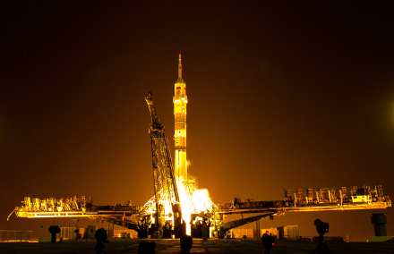

=================================
I would rather be ashes than dust
=================================

:date: 2015-08-13 15:12:00
:slug: rather-ashes-than-dust
:tags: quotes

**Jack London (1876-1916):**

    | I would rather be ashes than dust;
    | I would rather that my spark should
    | burn out in a brilliant blaze than it
    | should be stifled by dry-rot; I would
    | rather be in a superb meteor; every
    | atom of me in a magnificent glow
    | than in a sleepy and permanent
    | planet; the proper function of man is
    | to live, not to exist; I shall not waste
    | my days in trying to prolong them;
    | I shall USE my time.
