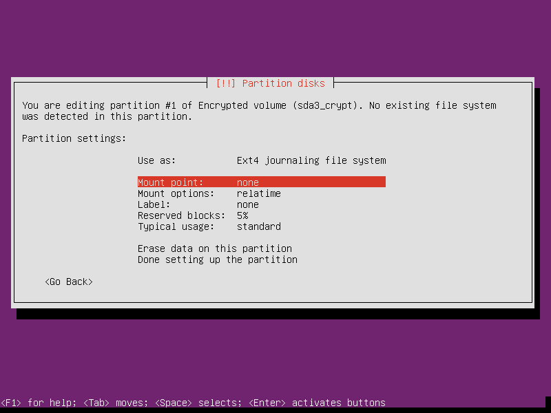
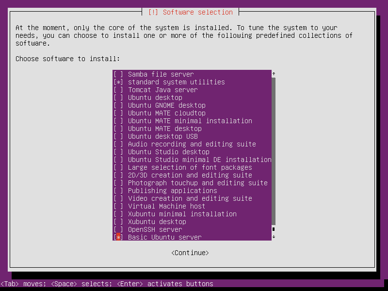

=================================================
New life for an old laptop as a Linux home server
=================================================

:date: 2016-08-16 21:47:00
:tags: server, network, ubuntu, linux
:slug: laptop-home-server

`Home Server Project #0.1 .: <http://www.circuidipity.com/raspberry-pi-home-server.html>`_ **Netbooks** ... remember those small, (a few) Linux-powered laptops from several years ago? I dusted off my old **Asus 900HA** netbook and put it to work as a `home server <http://www.circuidipity.com/tag-server.html>`_. Good times!

Running your own home server is a fun learning experience and offers several advantages.

Second-hand laptops -  retired in favour of more current and powerful machines - can still deliver plenty of oomph for running a personal server. Frugal with power and come equipped with their own built-in UPS (battery)!

Install a stable, well-tested Linux distribution and provide services such as network printing and `storage (NAS) <http://www.circuidipity.com/nas-raspberry-pi-sshfs.html>`_, perform `backups <http://www.circuidipity.com/incremental-backups-rsnapshot.html>`_, host `web services <http://www.circuidipity.com/php-nginx-postgresql.html>`_ and much more. Start with a minimal base configuration of `Ubuntu <http://www.circuidipity.com/tag-ubuntu.html>`_ and gain access to tens of thousands of packages ready to install.

Privacy may be important to you. Hosting your own server running your own services gives more control over your data.

Let's go!
=========

**Hardware:** Asus 900HA netbook with 10" display, 1GB RAM, a 500GB hard drive (very easy replacement of original drive - just unscrew the netbook's bottom panel), built-in ethernet/wifi, webcam, and a host of ports (3xUSB2, VGA, sound, SD card slot). Neat and compact device!

0. Install Ubuntu
-----------------

My `visual screenshot tour <http://www.circuidipity.com/ubuntu-trusty-install.html>`_ of installing Ubuntu 16.04 - a `Long Term Support (LTS) <https://wiki.ubuntu.com/Releases>`_ release. Ubuntu's **minimal install image** (32bit for the netbook) makes it easy to create a console-only base configuration that can be later customized for various tasks. 

I make a few modifications to my usual desktop install routine that are more appropriate for configuring a home server ...

**Storage:** I divide the netbook's internal storage into 3 partitions ...

* sda1 is a 24GB ``root`` partition 
* sda2 is a 2GB LUKS encrypted ``swap`` partition using a **random key**
* sda3 uses the remaining space as a **unmounted** encrypted partition (setup post-install)

I don't want an unattended server halting in the boot process waiting for a passphrase for ``sda3_crypt`` or any necessary mountpoints to reside on that partition. After a successful first boot I configure the encrypted partition to be mounted manually to ``/media``.

**Updates:** I like to select ``Install security updates automatically`` for a device running unattended with long uptimes ...
                                                                                   
.. image:: images/screenshot/ubuntuInstall/300-1.png                               
    :alt: Install security updates                                                 
    :align: center                                                                 
    :width: 800px                                                                  
    :height: 600px                                                                 
                                                                                   
**Tasks:** Select ``[*] standard system utilities``  and the few extras included in ``[*] Basic Ubuntu server`` ...

Finish up and reboot!

1. Static network address
-------------------------

Login to the new home server and check which network interfaces are detected and settings ...                    
                                                                                
.. code-block:: bash                                                            
                                                                                
    $ ip a                                                                      
                                                                                
**Wired** interfaces are usually auto-configured by default and assigned an IP address courtesy of DHCP.
                                                                                
To assign the server a **static** address (recommended), deactivate the wired interface and create a new entry in ``/etc/network/interfaces``. Sample entry for ``enp3s0`` ...
                                                                                
.. code-block:: bash                                                            
                                                                                
    # The primary network interface                                             
    auto enp3s0                                                                 
    #iface enp3s0 inet dhcp                                                     
    iface enp3s0 inet static                                                    
        address 192.168.1.88                                                    
        netmask 255.255.255.0                                                   
        gateway 192.168.1.1                                                     
        dns-nameservers 192.168.1.1                                             
                                                                                
Bring up|down interface with ``sudo if{up,down} enp3s0``.

2. SSH
------

`Install OpenSSH, create crypto keys, and disable password logins <http://www.circuidipity.com/secure-remote-access-using-ssh-keys.html>`_ to boost server security.

3. Encrypted storage
--------------------

Configure the encrypted partition created by Ubuntu during the install to be mounted by a user, starting with the creation of a mountpoint in ``/media`` for the storage ...

.. code-block:: bash

	$ sudo mkdir /media/sda3_crypt

Unlock the partition with the passphrase created during the install ...

.. code-block:: bash

	$ sudo cryptsetup open /dev/sda3 sda3_crypt

Modify ``/etc/fstab`` by creating a consistent mountpoint for the partition ... 

.. code-block:: bash

	/dev/mapper/sda3_crypt /media/sda3_crypt        ext4    relatime,noauto,user       0       0

Mount the partition ...

.. code-block:: bash

	$ mount /media/sda3_crypt

4. Services
-----------

What to do next? `Some of the services I use ... <http://www.circuidipity.com/raspberry-pi-home-server.html>`_

Happy hacking!
