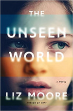

================
The Unseen World
================

:date: 2017-01-07 07:56:00
:slug: unseen-world
:tags: books

**The Unseen World** *by Liz Moore* (ISBN: 0393241688) .: The first book I read in 2017 has been doing a slow burn in my head these past few days. Ada Sibelius is the only child of David, a computer scientist and artificial intelligence pioneer at a thinly-disguised 1980s-era MIT. Homeschooled by her father and with his fellow researchers as her only childhood friends, Ada is forced to grow up in a hurry when David's health begins a downward spiral. She is placed in the care of one of her father's colleagues and finds herself not only in new surroundings but embroiled in a growing mystery about her father's true identity.

What does it mean to possess a *self*, either biological or digital? One moment to the next I feel attached to a particular identity though I understand that everything is in flux. Years from now (hopefully!) there will be a person that makes the claim to being me. Will that be true? *Unseen* is a story about the accretion of memory, its fabrication, transmission, dissolution, and as a means to immortality.
