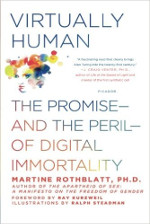

=============== 
Virtually Human
===============

:date: 2017-01-14 08:50:00
:slug: virtually-human
:tags: books

| **Virtually Human: The Promise - And the Peril - of Digital Immortality**
| *by Martine Rothblatt* (ISBN: 978-1-250-04663-5)

Cybernetic consciousness has been imagined as a deliberate creation of AI researchers or perhaps an unintended 'waking up' moment for globs of increasing complexity such as the Internet. **Mind-uploading** envisions a future with the capability of performing a one-to-one duplication of an individual's biological neuron to digital form, achieving a **substrate-independent existence**.

Martine Rothblatt writes about another path to intellectual continuity via digital clones. A record of thoughts, recollections, feelings, beliefs, preferences are collected in a **mindfile**, processed by **mindware** that generates a **mindclone**. Maybe put more thought in some of those emails and social media posts? :-)

But is it, you know, *you*? **Continuum of consciousness** is the idea that consciousness is not a binary state, 0 or 1, on and off sort of thing but is present in greater or lesser degrees in things that demonstrate self-awareness, sentience, morality, autonomy, and transcendence. A related idea is **panpsychism** which explores the possibility that mind is present in *all things* in greater and lesser degrees.

Alan Turing's famous insight that lives on as the **Turing Test** was that software was humanly conscious if - in a blind test - it successfully passed itself off as conscious to humans. Turing's biographer Andrew Hodges states ...

    To avoid philosophical discussions of what 'mind' or 'thought' or 'free will' were supposed to be, he favoured the idea of judging a machine's mental capacity simply by comparing its performance with that of a human being. It was an *operational* definition of 'thinking', rather as Einstein had insisted on operational definitions of time and space in order to liberate his theory from *a priori* assumptions ... If a machine appeared to be doing as well as a human being, then it *was* doing as well as a human being.

Hard-line **essentialists** believe that consciousness is a unique biological property of humans. **Materialists** believe in an empirical source, that consciousness is a pattern that emerges from the myriad connections of information stored either in wetware (brains) or any other substrate that passes a certain threshold of complexity. A blending of the two positions would be the idea of consciousness as an emergent property that relies on the unique biology, chemistry, and architecture of human (and possibly certain animal) brains (an idea that Rothblatt rejects).

Then there are the mystics but ... let's not go there!

The philosopher David Chalmers has described there being a 'hard problem' and 'easy problem' about the nature of consciousness. The hard problem is how a substrate of neurons give rise to subjective feelings ("the redness of red"), and the easy problem is how electrons and neurochemistry result in simulations of physical reality. A *philosophical zombie* is a thought experiment about an entity that solves the easy part but not the hard part of consciousness. Check out Peter Watts' novel `Blindsight <http://www.rifters.com/real/Blindsight.htm>`_ (one of my favourites!) for a thorough exploration of alien intelligence without consciousness and the idea of consciousness (all the so-called "good parts" of being human) as a rare and perhaps not very useful evolutionary *aberration*.

Hmm. Well, zombies are not the focus of attention for Rothblatt. Its about getting mindclones up-and-running ...

    If human consciousness is to arise in software we must do three things: first, explain how the easy problem is solved in neurons; second, explain how the hard problem is solved in neurons; and third, explain how the solution in neurons is replicable in information technology. The key to all three explanations is the relational-database concept. With the relational database an inquiry (or a sensory input for the brain) triggers a number of related responses. Each of these responses is, in turn, a stimulus for a further number of related responses. An output response is triggered when the strength of a stimulus, such as the number of times it was triggered, is greater than a set threshold.

..

    [ ... ]

..

    Is a second, independent consciousness with similar memories and preferences to the first a separate being or an extended manifestation of a single being? This depends upon one's definition of "being". If a "being" is a body, or a platform, then we are talking about separate beings. But if a "being" is a consciousness with an idiosyncratic set of memories and preferences, then we are talking about a single being. I am certain we really mean consciousness, memories, and preferences by "being". Therefore, I'm confident that those who create mindclones will experience the profound, life-altering event of having redefined themselves as a dual-platform consciousness ... [Its] not about being accurate in every [detail] as to a biological original. It is, instead, about feeling that there is oneness that comes from a preponderance of common memories, emotions, and patterns of thinking, selecting and forgetting.

What weaves through the book is a (biological) mind-expanding consideration of what non-human, but *strangely familiar*, conscious entities will mean for the future of our species. If mindclones are brought to life Rothblatt outlines possible civil, religious, and personal responses that run the gamut from love at first sight to cybernetic slavery and extermination. Picking fights with immortals is not recommended!
