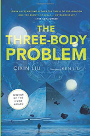

======================
The Three-Body Problem
======================

:date: 2017-01-28 22:43:00
:slug: three-body-problem
:tags: books

| **The Three-Body Problem** *by Cixin Liu, translated by Ken Liu*
| (ISBN: 978-0765382030)

During the Cultural Revolution in China a secret military project is undertaken to search for extraterrestrial intelligence. An alien civilization learns of Earth's location and dispatches an invasion fleet to occupy the Solar System and exterminate humanity. Jump to the present era and various factions struggle amongst themselves as the world faces the prospect of annihilation. Some prepare for war, others hope to cut deals with the superior alien power. Some view the aliens as saviours for a fallen humanity. Others believe human civilization to be intrinsically evil and beyond redemption and welcome the coming doomsday battle.

Maybe the galaxy isn't empty after all. Its occupants just has a good reason to stay *very very quiet*.

This was the first piece of science fiction by a Chinese author I have read, and a story about alien first contact transforms into a cool way to look at an unfamiliar culture as noted by the translator ...

    The best translations into English do not, in fact, read as if they were originally written in English. The English words are arranged in such a way that the reader sees a glimpse of another culture's patterns of thinking, hears an echo of another language's rhythms and cadences, and feels a tremor of another people's gestures and movements.

*Three-Body* is the first volume in a trilogy and now I am diving right into the second and third books!
