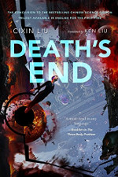

=============================== 
The Dark Forest and Death's End
===============================

:date: 2017-02-04 20:53:00
:slug: deaths-end
:tags: books

| **The Dark Forest** and **Death's End** *by Cixin Liu, translated by Ken Liu*
| (ISBN: 978-0765377081 and 978-0765377104)

A few nights ago I finished reading the final volume - *Death's End* - in Liu Cixin's *Three-Body Problem* trilogy and was so agitated and overwhelmed by the author's vision I had to go out in the dark in the snow and cold on the local wilderness trail and walk it off! Its the first work of Chinese science fiction I have read and the three volumes take the reader from the 1960s Cultural Revolution to the end of this Universe.

The first volume - `The Three-Body Problem <http://www.circuidipity.com/three-body-problem.html>`_ - has a politically persecuted scientist reveal Earth's location to an alien civilization, which dispatches an invasion fleet to conquer the Solar System. Volume II - *The Dark Forest* - reveals *dark forest strategy* in a universe filled with hunters silently hunting other hunters, the worst-case scenario of possible universes. The first two books are good but the third volume ... wow. What should we value when everything is ground to dust by Time? How can Nature produce creatures that can contemplate such things? How can Nature produce creatures that can view black scratches on white backgrounds, bound between covers, and think and feel things that are entirely beyond anything of personal experience?

