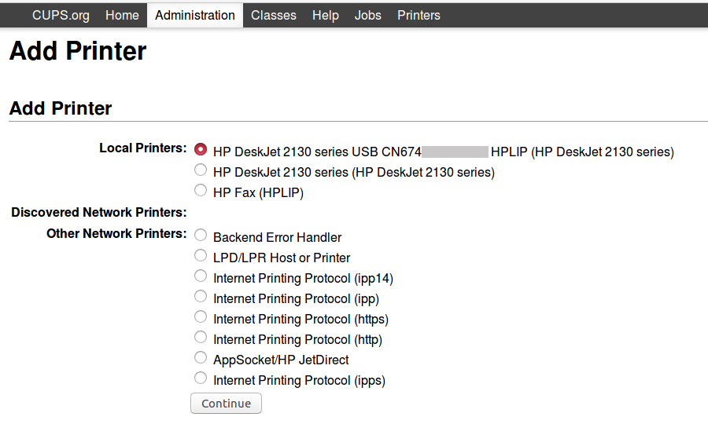
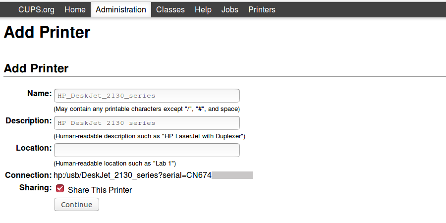
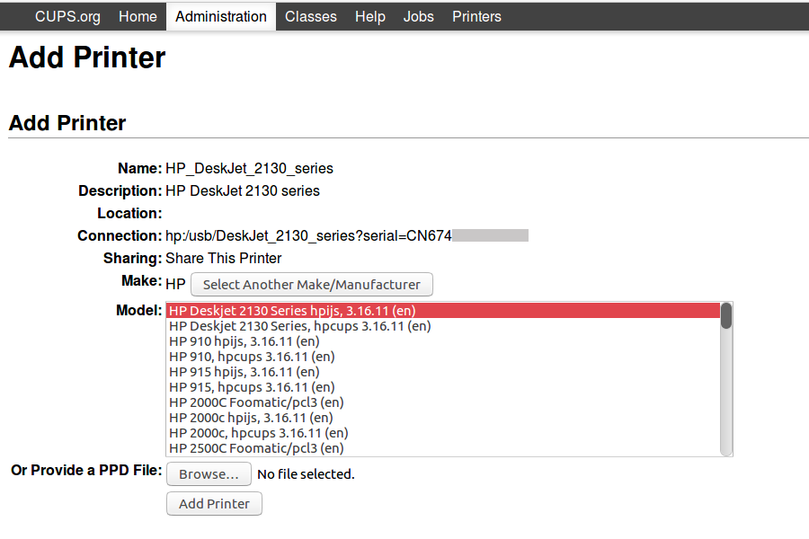
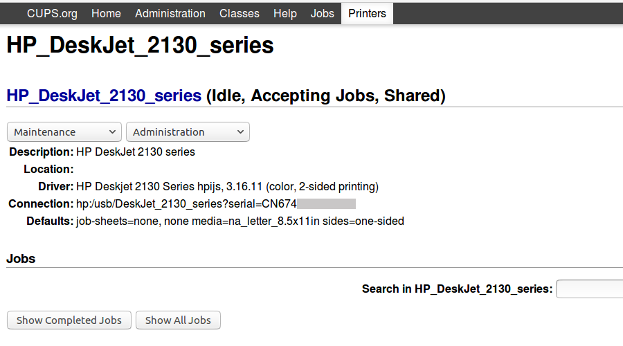

=========================
Network printer + scanner
=========================

:date: 2017-05-27 19:10:00
:slug: network-printer-scanner
:tags: printer, network, debian, linux

`PROJECT: Home Server #9 .: <http://www.circuidipity.com/home-server.html>`_ Configure a printer + scanner to receive jobs across the local network.

Let's go!
=========

Multi-purpose printer is an **HP Deskjet 2130** connected to a **home server running Debian** at IP address ``192.168.1.88``.

0. Printer and scanner packages
-------------------------------

Install a complete set of CUPS (printer) and SANE (scanner) packages on the server and grant (example) username ``foo`` admin privileges ...
                                                                                    
.. code-block:: bash                                                                
    
    # apt install task-print-server
    # adduser foo lp                                                      
    # adduser foo lpadmin                                                 
    # adduser foo scanner

1. Device drivers and firmware
------------------------------

Attach the printer to server ...
 
.. code-block:: bash

    $ lsusb
    [...]
    Bus 002 Device 004: ID 03f0:e111 Hewlett-Packard

Some printers require additional drivers and firmware from the vendor. Libre software **HPLIP** adds support for the Deskjet and is packaged for Debian/Ubuntu ...

.. code-block:: bash

    $ apt install hplip printer-driver-hpijs

Link: `HP Linux Imaging and Printing <http://hplipopensource.com/hplip-web/about.html>`_

2. Web admin remote access
--------------------------

Primary configuration of CUPS is done in ``/etc/cups/cupsd.conf`` and a web interface is provided for administration. Modify default settings that permit only localhost access to the admin panel to allow access to all machines on local network ``192.168.1.*`` ... 

.. code-block:: bash

    [...]
    
    # Only listen for connections from the local machine.
    #Listen localhost:631
    # Listen for connections from local and remote machines.
    Port 631

    # Show shared printers on the local network.
    Browsing On
    BrowseLocalProtocols dnssd
    
    [...]
    
    # Web interface setting...
    WebInterface Yes
    
    # Restrict access to the server...
    <Location />
    Order allow,deny
    Allow from 192.168.1.*
    </Location>

    # Restrict access to the admin pages...
    <Location /admin>
    Order allow,deny
    Allow from 192.168.1.*
    </Location>

    # Restrict access to configuration files...
    <Location /admin/conf>
    AuthType Default
    Require user @SYSTEM
    Order allow,deny
    Allow from 192.168.1.*
    </Location>

    # Restrict access to log files...
    <Location /admin/log>
    AuthType Default
    Require user @SYSTEM
    Order allow,deny
    Allow from 192.168.1.*
    </Location>

Restart CUPS ...

.. code-block:: bash

    # systemctl restart cups.service

**Example:** Server at address ``192.168.1.88`` has admin functions available via browser at ``https://192.168.1.88:631/admin`` (Firefox warns *Your connection is not secure* on first connect; add an exception for the CUPS ssl certificate). 

.. image:: images/cups-admin.png
    :alt: CUPS Admin
    :width: 900px
    :height: 304px
    :align: center

3. Add the printer
------------------

Select ``Administration->Printers->Add Printer`` and login with the username assigned previously to the ``lpadmin`` group.

Test the configuration by selecting ``Maintenance->Print Test Page``.

Printer settings are saved to ``/etc/cups/printers.conf``. On the command line, check printer status with ``lpstat`` ...

.. code-block:: bash

    $ lpstat -t
    scheduler is running
    no system default destination
    device for HP_DeskJet_2130_series: hp:/usb/DeskJet_2130_series?serial=CN674...
    HP_DeskJet_2130_series accepting requests since Sat 27 May 2017 11:16:37 AM EDT
    printer HP_DeskJet_2130_series is idle.  enabled since Sat 27 May 2017 11:16:37 AM EDT

4. Access printer from a Linux client
-------------------------------------

Client machines can dispense with running a local CUPS server and its helper tools. To connect directly with the network printer, download ...

.. code-block:: bash

    # apt install cups-client

Create ``client.conf`` in ``$HOME`` ...

.. code-block:: bash

    $ mkdir ~/.cups
    $ touch ~/.cups/client.conf

... and add the address of the server hosting the scanner to the file ...

.. code-block:: bash

    ServerName 192.168.1.88

**Alternative:** If the Linux client machine regularly connects to printers on different networks it might prove convenient to download a more complete suite of CUPS packages - ``apt install cups`` - and add the network printer via the web interface address ``localhost:631`` or via the native printer config utility included with some desktop environments.

Link: `Printing Without a Local CUPS Server <https://wiki.debian.org/PrintQueuesCUPS#Printing_Without_a_Local_CUPS_Server>`_

5. Add the scanner
------------------

Detect attached device on the server using ``sane-find-scanner`` and ``scanimage`` ...

.. code-block:: bash

    $ sane-find-scanner
    [...]
    found USB scanner (vendor=0x03f0 [HP], product=0xe111 [DeskJet 2130 series]) at libusb:002:004
    $ scanimage -L
    device `hpaio:/usb/DeskJet_2130_series?serial=CN674...' is a Hewlett-Packard DeskJet_2130_series all-in-one

Run a test ...

.. code-block:: bash

    $ scanimage > test.ppm

... and retrieve the (grayscale) image from the server and verify the scanner is working on the local server connection (before enabling remote access to client machines).

Modify ``/etc/sane.d/saned.conf`` to share the scanner over the local network ...

.. code-block:: bash

    ## Access list
    192.168.1.0/24

Setup SANE in **systemd** and check status ...

.. code-block:: bash

    # systemctl enable saned.socket
    # systemctl start saned.socket
    $ systemctl status saned.socket

6. Access scanner from a Linux client
-------------------------------------

Install scanner tools on the client machine ...

.. code-block:: bash

    # apt install sane-utils

Modify ``/etc/sane.d/net.conf`` to point the client towards the address of the server hosting the scanner ...

.. code-block:: bash

    connect_timeout = 60
    192.168.1.88                                                                

Verify the remote scanner is visible to the client ...

.. code-block:: bash

    $ scanimage -L
    device `net:192.168.1.88:hpaio:/usb/DeskJet_2130_series?serial=CN674...' is a Hewlett-Packard DeskJet_2130_series all-in-one

**Note:** If the client fails to find the remote scanner, reboot the server and try again.

Run a test ...

.. code-block:: bash

    $ scanimage > test2.ppm

For a simple, graphical scanner program give **simple-scan** a try.

Happy hacking!
