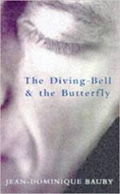

=================================
The Diving-Bell and the Butterfly
=================================

:date: 2017-06-09 07:30:00
:slug: diving-bell-and-the-butterfly
:tags: books

| **The Diving-Bell and the Butterfly** *by Jean-Dominique Bauby*
| (ISBN: 1857027795)

On December, 1995 the 42-year-old author, editor-in-chief of *Elle* magazine in Paris, suffered a massive brain-stem stroke. When he awoke from a coma three weeks later his mind made a rapid recovery but his body lay broken. His condition is known as "locked-in syndrome" and he was paralyzed from head to toe with the exception of (a later) slight movement of the neck and the ability to blink his left eyelid.

But what an eye! With one blink for yes, two for no, a system for translating blinks to alphabetic characters and a patient transcriber, he narrates this story of holding on to humanity with humour and of an imagination that can still roam free. Do we need to suffer tragedy before we can learn to be courageous and grateful and kind? *"Regret for a vanished past, and above all remorse for lost opportunities ... the women we were unable to love, the chances we failed to seize, the moments of happiness we allowed to drift away. Today it seems to me that my whole life was nothing but a string of those small near misses. A race whose result we know beforehand, but in which we fail to bet on the winner."*
