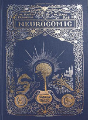

==========
Neurocomic
==========

:date: 2017-06-16 09:38:00
:slug: neurocomic
:tags: books

| **Neurocomic** *by Dr. Matteo Farinella and Dr. Hana Ros*
| (ISBN: 9781907704703)

A wonderful graphic novel sponsored by the Wellcome Trust that takes an expedition through the human brain and where we meet explorers along the way: `Santiago Ramón y Cajal <https://en.wikipedia.org/wiki/Santiago_Ram%C3%B3n_y_Cajal>`_ and `Camillo Golgi <https://en.wikipedia.org/wiki/Camillo_Golgi>`_ in the neural forest, `Charles Scott Sherrington <https://en.wikipedia.org/wiki/Charles_Scott_Sherrington>`_ and `Bernard Katz <https://en.wikipedia.org/wiki/Bernard_Katz>`_ down in the synaptic control room readying a release of vesicles, paratrooping neurotransmitters, fending off giant squid with `Alan Hodgkin <https://en.wikipedia.org/wiki/Alan_Lloyd_Hodgkin>`_ and `Andrew Huxley <https://en.wikipedia.org/wiki/Andrew_Huxley>`_, `Eric Kandel <https://en.wikipedia.org/wiki/Eric_Kandel>`_ and `Pavlov (not) feeding the dog <https://en.wikipedia.org/wiki/Classical_conditioning>`_, `Hans Berger <https://en.wikipedia.org/wiki/Hans_Berger>`_ atop the mountain, finally pushing on to face our (false?) sense of self in the Castle of Consciousness.

I am really intrigued by Berger's invention of the **electroencephalogram** in 1924 and what reading the electrical activity of the brain actually represents, and how we could possibly tease more data out of the patterns. It sounds like the kind of **affordable and noninvasive** (bonus!) tech that lends itself to happy hacking!

