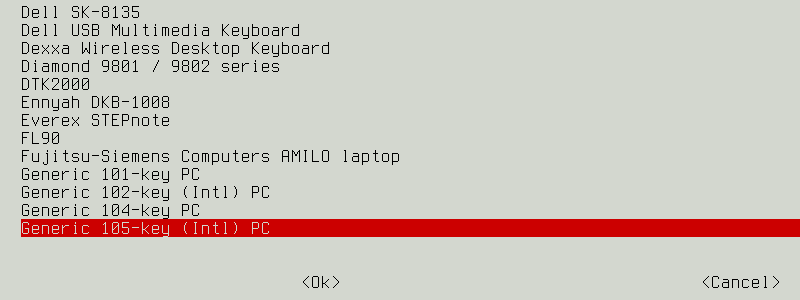
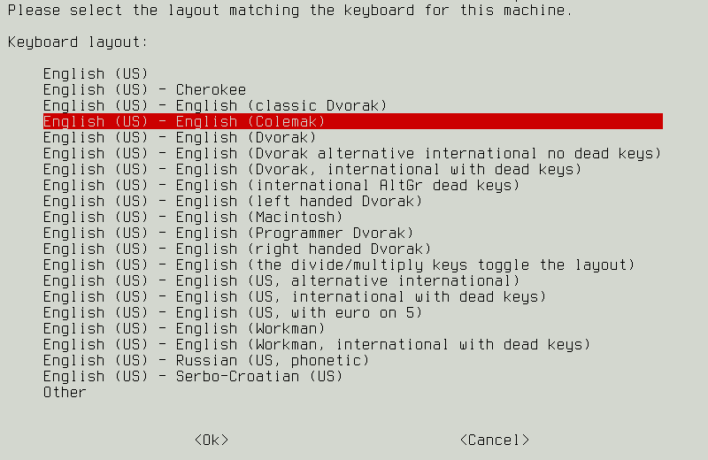
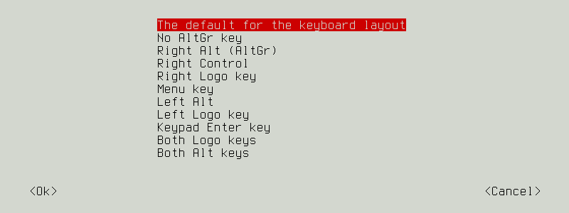
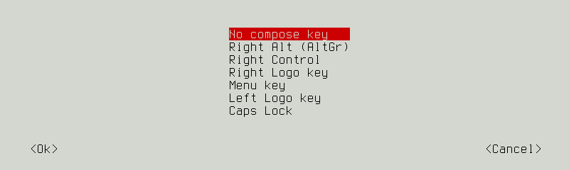
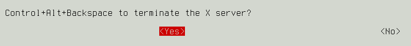

=================================
Colemak keyboard layout on Debian
=================================

:date: 2017-06-29 09:50:00
:slug: colemak-debian
:tags: colemak, keyboard, debian, linux

Change a default QWERTY keyboard layout to **Colemak** on Debian.

Let's go!
=========

I am a recent convert to (slow) touch typing, and - surprise - it turns out we have learned new things about making keyboards since QWERTY made its appearance in the 19th century! `Colemak <https://colemak.com/>`_ is an alternative keyboard layout that - by changing the location of less than 20 keys - significantly reduces finger movement and makes typing feel much more comfortable!

No need to throw out your keyboard. It is easy to remap the keys for different layouts and toggle back and forth between mappings.

Try out Colemak
---------------

Colemak is already installed in Debian. Display current settings in X and switch to Colemak using the ``setxkbmap`` command ...

.. code-block:: bash

    $ setxkbmap -query
    rules:      evdev
    model:      pc105
    layout:     us
    $ setxkbmap us -variant colemak
    $ setxkbmap -query
    rules:      evdev
    model:      pc105
    layout:     us
    variant:    colemak

When I first started using Colemak my friend `Giles <http://gilesorr.com/>`_ (longtime Dvorak user) suggested creating these easy-to-remember **aliases** in `~/.bashrc <https://github.com/vonbrownie/dotfiles/blob/master/.bashrc>`_ to toggle between keyboard mappings ...

.. code-block:: bash

    alias arst="setxkbmap us && ~/bin/keyboardconf"
    alias asdf="setxkbmap us -variant colemak && ~/bin/keyboardconf"

My shell script `keyboardconf <https://github.com/vonbrownie/homebin/blob/master/keyboardconf>`_ loads appropriate `~/.xbindkeysrc <http://www.circuidipity.com/xbindkeysrc.html>`_ and `~/.xmodmap <http://www.circuidipity.com/xmodmap.html>`_ files for different keyboard types that I use. These configuration files must be reloaded when changing a keyboard mapping.

Colemak as default layout
-------------------------

Install some keyboard config tools ...

.. code-block:: bash

    $ sudo apt install console-setup keyboard-configuration

Default keyboard layout in Debian is configured in ``/etc/default/keyboard`` and is shared between X and the command line ...

.. code-block:: bash

    $ cat /etc/default/keyboard
    [...]
    XKBMODEL="pc105"
    XKBLAYOUT="us"
    XKBVARIANT=""
    XKBOPTIONS=""

    BACKSPACE="guess"

Set Colemak as the new default by either manually editing this file, or run ...

.. code-block:: bash

    $ sudo dpkg-reconfigure keyboard-configuration

Keyboard Model
``````````````



Keyboard layout
```````````````



Key to function as AltGr
````````````````````````



Compose key
```````````



Control+Alt+Backspace
`````````````````````



View changes ...

.. code-block:: bash

    $ cat /etc/default/keyboard 
    [...]
    XKBMODEL="pc105"
    XKBLAYOUT="us"
    XKBVARIANT="colemak"
    XKBOPTIONS="terminate:ctrl_alt_bksp"

    BACKSPACE="guess"

Activate changes in X ...

.. code-block:: bash

    $ sudo udevadm trigger --subsystem-match=input --action=change
    
Activate changes in the console ...

.. code-block:: bash

    $ sudo setupcon
    
... or reboot.

Bootup
------

Set the keyboard to Colemak at bootup by modifying ``/etc/initramfs-tools/initramfs.conf`` to read the keyboard mapping ...

.. code-block:: bash

    # Load a keymap during the initramfs stage.
    #
    KEYMAP=y
    
Whenever modifying initramfs it is necessary to rebuild to apply changes ...

.. code-block:: bash

    $ sudo update-initramfs -u
    
Links: `wiki.debian.org/Keyboard <https://wiki.debian.org/Keyboard>`_ and `man 5 keyboard <https://manpages.debian.org/stretch/keyboard-configuration/keyboard.5.en.html>`_

Happy hacking!
