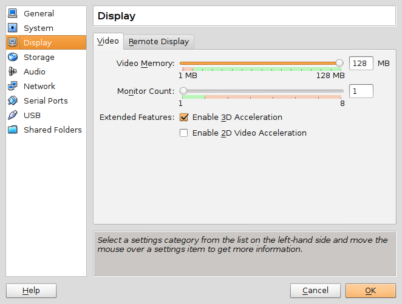
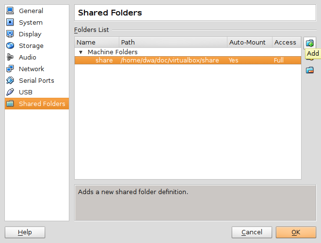

============================
Virtualbox on Debian Stretch
============================

:date: 2017-07-15 14:21:00
:slug: virtualbox-debian-stretch
:tags: virtualbox, debian, linux

`Virtualbox <https://www.virtualbox.org/>`_ is virtualization software that allows a Linux user to host multiple guest operating systems as **virtual machines (VMs)**. It is a cool tool for playing with different Linux distros and experimenting with configurations.

Let's go!
=========

In this HOWTO I install Virtualbox on a `Debian <http://www.circuidipity.com/tag-debian.html>`_ ``stable/stretch`` HOST and create a Debian GUEST virtual machine.

0. Install VirtualBox on HOST
-----------------------------

Kernel modules for Virtualbox are built via `Dynamic Kernel Module Support (DKMS) <http://en.wikipedia.org/wiki/Dynamic_Kernel_Module_Support>`_. After installing Virtualbox the ``vbox`` modules should be auto-built and -loaded. Install a few tools ...

.. code-block:: bash

	$ sudo apt install dkms module-assistant linux-headers-$(uname -r)

Virtualbox packages have been removed from the latest Debian stable release (still available in unstable/sid). I choose to retrieve Virtualbox directly from Oracle and their third-party Debian package repository.

Create the ``virtualbox.list`` file in ``/etc/apt/sources.list.d`` ...

.. code-block:: bash

    $ sudo sh -c 'echo "deb http://download.virtualbox.org/virtualbox/debian stretch contrib" > /etc/apt/sources.list.d/virtualbox.list

Add Oracle's Virtualbox public key ...

.. code-block:: bash

    $ wget https://www.virtualbox.org/download/oracle_vbox_2016.asc
    $ sudo mv oracle_vbox_2016.asc /etc/apt/trusted.gpg.d
    $ apt-key list
    [...]
    /etc/apt/trusted.gpg.d/oracle_vbox_2016.asc
    -------------------------------------------
    pub   rsa4096 2016-04-22 [SC]
    B9F8 D658 297A F3EF C18D  5CDF A2F6 83C5 2980 AECF
    uid           [ unknown] Oracle Corporation (VirtualBox archive signing key) <info@virtualbox.org>
    sub   rsa4096 2016-04-22 [E]

Install Virtualbox ...

.. code-block:: bash

	$ sudo apt update && sudo apt install virtualbox-5.1
    
Add my USERNAME to the ``vboxusers`` group ...

.. code-block:: bash

    $ sudo adduser USERNAME vboxusers

1. Create a Debian GUEST VM
---------------------------

**Default Machine Folder** where Virtual Machine (VM) images are stored is ``~/Virtualbox VMs`` (this can be modified in ``File->Preferences->General``).

See the `User Manual <http://www.virtualbox.org/manual/UserManual.html>`_ for creating a GUEST VM. I use the Debian ``netinst`` installer to create a new virtual machine with a `minimal system configuration <http://www.circuidipity.com/minimal-debian.html>`_.

2. Guest additions
------------------

Enable extra features such as the ability to tweak display settings and add a shared folder between HOST and GUEST machines.

Launch the new Debian GUEST and install ...

.. code-block:: bash

    # apt update && apt install build-essential module-assistant linux-headers-$(uname -r) dkms
    # m-a prepare

Download the ``VBoxGuestAdditions_VERSION.iso`` ...   

.. code-block:: bash

    $ wget -c http://download.virtualbox.org/virtualbox/5.1.22/VBoxGuestAdditions_5.1.22.iso
    
In the GUEST window menu, select ``Devices > Insert Guest Additions CD image`` to make the image accessible to the VM. Inside the VM: **mount** the image; **run** the install script; **add** user to the ``vboxsf`` group; **reboot** the VM ...

.. code-block:: bash

    # mount /media/cdrom
    # sh /media/cdrom/VBoxLinuxAdditions.run
    # adduser USERNAME vboxsf
    # reboot

If the virtualbox modules need to be rebuilt for any reason for the running kernel ...

.. code-block:: bash

    $ uname -r | sudo xargs -n1 /usr/lib/dkms/dkms_autoinstaller start

3. Display
----------

Tweak display settings by going to the Virtualbox ``Machine->Settings...->Display`` setting and move the slider to add more video memory and enable 3D acceleration.



With VirtualBox guest additions the display and resolution can be changed when running a graphical environment. If the GUEST VM does not use a graphical login manager to launch its desktop, then modify ``~/.xinitrc`` to start **VBoxClient** services ...

.. code-block:: bash

    VBoxClient --clipboard &
    VBoxClient --display &
    VBoxClient --seamless &

4. Console
----------

Debian GUEST in console mode defaults to a small 80x40 window. Resize by rebooting the GUEST and configuring **Grub** ...

* Grub boot screen: hit ``c`` to enter command mode
* At the prompt ``grub>``: run ``vbeinfo`` to display supported resolutions (example: ``1152x864``)
* Modify the config ``/etc/default/grub``: add ...
    * ``GRUB_CMDLINE_LINUX_DEFAULT="nomodeset"``
    * ``GRUB_GFXMODE=1152x864``
    * ``GRUB_GFXPAYLOAD_LINUX=keep`` (`Helpful! <https://askubuntu.com/a/887785>`_)
* Save changes: run ``sudo update-grub`` and reboot

5. Shared folder
----------------

Create a shared folder on HOST. Make it accessible to GUEST by going to ``Machine->Settings...->Shared Folders`` and click ``Add Shared Folder`` and ``Auto-Mount``.



6. SSH from HOST to GUEST
-------------------------

`Host-only networking with Virtualbox <http://christophermaier.name/blog/2010/09/01/host-only-networking-with-virtualbox>`_ was a big help getting this properly configured.
                                                                                     
**Scenario:** I want to SSH from my HOST to GUEST. Default configuration supplies GUEST with a NAT interface for internet access but no HOST<->GUEST connectivity. A solution for local access is creating a **host-only adapter**.

HOST
````
                                                                                     
Navigate to Virtualbox's ``File->Preferences->Network``, select ``Host-only Networks``, click ``Adds new host-only network`` to create ``vboxnet0``. Default setup is interface address ``192.168.56.1`` with DHCP enabled.

Select the GUEST VM and in ``Machine->Settings->Network`` click on ``Adapter 2``, enable network adapter attached to ``Host-only Adapter``, and select ``vboxnet0``.

GUEST
`````
                                                                                     
Boot the VM and confirm the new interface has been created. Add the interface to ``/etc/network/interfaces`` (example: ``enp0s8``) ...

.. code-block:: bash

    # Host-only interface
    auto enp0s8                                                                          
    iface enp0s8 inet dhcp                                                               

Install the SSH server ...

.. code-block:: bash
                                                                                     
    $ sudo apt install openssh-server                                                         
                                                                                     
Reboot GUEST. The second interface has been assigned address ``192.168.56.101`` by DHCP and can now be accessed from HOST via SSH.
                                                                                     
**Optional:** Assign GUEST a static address outside the range of the Virtualbox DHCP server (101-254 by default) ...

.. code-block:: bash

    # Host-only interface
    auto enp0s8
    iface enp0s8 inet static
    address 192.168.56.50
    netmask 255.255.255.0
    network 192.168.56.0
    broadcast 192.168.56.255

... and modify ``/etc/hosts`` on HOST by adding the VM static address.

Happy hacking!
